Chapter 10 - Exercise
================
Corrie
November 17, 2018

Easy.
-----

**10E1.** If an event has probability 0.35, what are the log-odds of this event?

``` r
log( 0.35 / (1 - 0.35))
```

    [1] -0.6190392

**10E2.** If an event has log-odds 3.2, what is the probabiity of this event?

``` r
1 / (1 + exp(-3.2))
```

    [1] 0.9608343

**10E3.** A coefficient in a logistic regression has value 1.7. What does this imply about the proportional change in odds of the outcome?

``` r
exp(1.7)
```

    [1] 5.473947

For a change from 0 to 1 in variable for this coefficient would mean that there would be a proportional increase of 5.47 in the odds of the outcome. That is, the odds would increase by 447%.

**10E4.** Why do Poisson regressions sometimes require the use of an *offset*? If the measurements are over different time intervals then an offset is necessary to align all observations with each other.

For example, if we want to compare two different call centers regarding the number of support calls they receive. Now call center A might register the calls per hour while call center B could register the calls per day. For each observation (i.e. the registered number of phone calls) of call center A, the exposure time is then one hour while for call center B it is 24 hours. The offset is then the log of the exposure time. A linear model could look as follows:

 \\
\log(\lambda) &= \log(exposure_i) + \alpha + \beta Center_i
\end{align*}")

Medium.
-------

**10M1.** Binomial data can be organized in aggregated and disaggregated forms, without any impact on inference. But the likelihood of the data does change when the data are converted between the two formats. Why?

Let's look at the `chimpanzees` data again and compare the same model, one time using aggregated and one time disaggregated data.

``` r
library(rethinking)
data(chimpanzees)
d <- chimpanzees
d.aggregated <- aggregate( d$pulled_left,
                           list(prosoc_left=d$prosoc_left,
                                condition=d$condition,
                                actor=d$actor),
                           sum)
```

First, the disaggregated model:

``` r
m10.disaggregated <- map(
  alist(
    pulled_left ~ dbinom(1, p),
    logit(p) <- a + (bp + bpC*condition)*prosoc_left,
    a ~ dnorm(0, 10),
    bp ~ dnorm(0, 10),
    bpC ~ dnorm(0, 10)
  ),
  data=d
)
precis(m10.disaggregated)
```

         Mean StdDev  5.5% 94.5%
    a    0.05   0.13 -0.15  0.25
    bp   0.61   0.23  0.25  0.97
    bpC -0.10   0.26 -0.53  0.32

And then the aggregated model:

``` r
m10.aggregated <- map(
  alist(
    x ~ dbinom( 18, p ), # 18 = the number of trials per row
    logit(p) <- a + (bp + bpC*condition)*prosoc_left,
    a ~ dnorm(0, 10),
    bp ~ dnorm(0, 10),
    bpC ~ dnorm(0, 10)
  ),
  data = d.aggregated
)
precis(m10.aggregated)
```

         Mean StdDev  5.5% 94.5%
    a    0.05   0.13 -0.15  0.25
    bp   0.61   0.23  0.25  0.97
    bpC -0.10   0.26 -0.53  0.32

Both models give the same estimates, the same standard deviation, and the same credible intervals.

``` r
logLik(m10.disaggregated)
```

    'log Lik.' -338.1697 (df=3)

``` r
logLik(m10.aggregated)
```

    'log Lik.' -128.0794 (df=3)

The likelihood (and thus also the log likelihood) differ though. To better see, why they differ, let's calculate the likelihood manually and then check at which step in the computation they differ. First, we compute it for the disaggregated version:

``` r
theta.disagg <- coef(m10.disaggregated)
p.disagg <- logistic(theta.disagg[1] + 
                       (theta.disagg[2] + theta.disagg[3]*d$condition)*d$prosoc_left )
loglkhd.disagg <- sum(
  dbinom(d$pulled_left,
         size=1,
         prob=p.disagg,
         log=TRUE)
)
loglkhd.disagg
```

    [1] -338.1697

And for the aggregated version:

``` r
theta.agg <- coef(m10.aggregated)
p.aggregated <- logistic(theta.agg[1] + 
                           (theta.agg[2] + theta.agg[3]*d.aggregated$condition)*d.aggregated$prosoc_left)
loglkhd.aggregated <- sum(
  dbinom(d.aggregated$x,
         size=18,
         prob= p.aggregated ,
         log = TRUE)
)
loglkhd.aggregated
```

    [1] -128.0794

If we compute the likelihood for a single experiment (that is, 18 observations in the disaggregated data or 1 observation in the aggregated data), we see one first difference:

``` r
exp1.disagg <- dplyr::filter(d, condition==0 & actor==1 & prosoc_left==0)
exp1.disagg$x <- exp1.disagg$pulled_left      # align notation
p.disagg <- logistic(theta.disagg[1] + 
                       (theta.disagg[2] + theta.disagg[3]*exp1.disagg$condition)*exp1.disagg$prosoc_left)
p.disagg
```

     [1] 0.5119271 0.5119271 0.5119271 0.5119271 0.5119271 0.5119271 0.5119271
     [8] 0.5119271 0.5119271 0.5119271 0.5119271 0.5119271 0.5119271 0.5119271
    [15] 0.5119271 0.5119271 0.5119271 0.5119271

``` r
exp1.agg <- d.aggregated[1,]
p.agg <- logistic(theta.agg[1] + 
                    (theta.agg[2] + theta.agg[3]*exp1.agg$condition)*exp1.agg$prosoc_left)
p.agg
```

            a 
    0.5119271 

Since both times we have the same predictor values, the computed probabilities are the same, only for the disaggregated data, we get 18 values (one for each observation).

We can go one step further and calculate the likelihood by hand, using the formula for the density of the binomial distribution:

 = {n \choose x} p^x (1-p)^{n-x}.")

 If we only have one observation (as in the case of the aggregated data) then this is the likelihood for one experiment. In the case of the disaggregated data, we get the likelihood for one experiment by multiplying the likelihood of each observation:

 = \prod_{i=1}^{18} {n \choose x_i} p^{x_i} (1-p)^{1-x_i} .")

 In the case of the log-likelihood, we take the sum instead of the product. Now these likelihoods are the same except for the factor . To see why, consider the following: In the disaggregated case, we have 18 observations  such that  where  is the value used in the aggregated case. As we've seen above, the value for  is the same in both cases. We thus get:

^{1-x_i} \\
&= p^{x_1}(1-p)^{1-x_1}p^{x_2}(1-p)^{1-x_2}...p^{x_18}(1-p)^{1-x_{18}} \\
&=p^{x_1 +x_2 + ... + x_n}(1-p)^{1-x_1 + 1-x_2 + ... + 1-x_{18}} \\
&= p^x (1-p)^{18-x}
\end{align*}")

 Thus, the only way the two likelihoods differ, is by the factor of .

Since  is either 0 or 1 in the aggregated case,  is always 1. In the aggregated case, this factor can be much larger:

``` r
choose(18, exp1.agg$x)
```

    [1] 18564

We thus get the following likelihoods for the first experiment: In the aggregated case, we have

``` r
log( choose(18, exp1.agg$x) * p.agg^exp1.agg$x * (1 - p.agg)^(18 - exp1.agg$x) ) 
```

            a 
    -2.795944 

and in the disaggregated case

``` r
sum( 
  log( choose( 1, exp1.disagg$x) * p.disagg^exp1.disagg$x * (1 - p.disagg)^(1 - exp1.disagg$x) ) 
  )
```

    [1] -12.62492

If we omit the binomial factor, we get the same value for both cases:

``` r
log( p.agg^exp1.agg$x * (1-p.agg)^(18 - exp1.agg$x) ) 
```

            a 
    -12.62492 

``` r
sum( 
  log(  p.disagg^exp1.disagg$x * (1-p.disagg)^(1 - exp1.disagg$x) ) 
  )
```

    [1] -12.62492

**10M2.** If a coefficient in a Poisson regression has value 1.7, what does this imply about the change in the outcome?

If the predictor variable associated with this coefficient goes up by one unit, then the rate  is multiplied by `exp(1.7)`, that is about 5.5. This means, there are on average 5.5 times more events happening in the same time interval.

**10M3.** Why is the logit link appropriate for a binomial generalized linear model?

The binomial generalized linear model has as its main parameter a probability. The logit link maps a probability (i.e. a value between 0 and 1) onto the real line . The mapped value can then be used for a linear model.

**10M4.** Why is the log link appropriate for a Poisson generalized linear model?

The Poisson generalized linear model has as only parameter the rate  which gives the average number of events per time interval. Hence,  is constrained to be positive. The log function maps positive value onto  and thus the function links count values (positive values) to a linear model.

**10M5.** What would it imply to use a logit link for the mean of a Poisson generalized linear model?

Using a logit link for the parameter  in a Poisson model would imply that  is constrained to be between 0 and 1. If  is between 0 and 1, then there are on average less than one event per time interval. This could be useful in cases where there would be at maximum one event per interval.

**10M6.** What are the constraints for which the binomial and Poisson distribution have maximum entropy?

Both the binomial distribution and the Poisson distribution have maximum entropy when

-   each trial results in one of two events and
-   the expected value is constant.

The Poisson distribution is mathematically a special case of the Binomial and thus it has maximum entropy under the same constraints. Practically, it is used for counts that never get close to any theoretical maximum.

Hard.
-----

**10H1.** Use `map()` to construct a quadratic approximate posterior distribution for the chimpanzee model that includes a unique intercept for each actor and compare the quadratic approximation to the posterior produced from MCMC.

``` r
data("chimpanzees")
d <- chimpanzees
d2 <- d
d2$recipient <- NULL  # remove NA values
```

``` r
m10.4 <- map(
  alist(
    pulled_left ~ dbinom(1, p),
    logit(p) <- a[actor] + (bp + bpC*condition)*prosoc_left,
    a[actor] ~ dnorm(0, 10),
    bp ~ dnorm(0, 10),
    bpC ~ dnorm(0, 10)
  ),
  data=d2
)
precis(m10.4, depth = 2)
```

          Mean StdDev  5.5% 94.5%
    a[1] -0.73   0.27 -1.16 -0.30
    a[2]  6.67   3.61  0.90 12.45
    a[3] -1.03   0.28 -1.48 -0.59
    a[4] -1.03   0.28 -1.48 -0.59
    a[5] -0.73   0.27 -1.16 -0.30
    a[6]  0.21   0.27 -0.21  0.64
    a[7]  1.75   0.38  1.14  2.37
    bp    0.82   0.26  0.40  1.24
    bpC  -0.13   0.30 -0.61  0.34

``` r
m10.4stan <- map2stan(
  alist(
    pulled_left ~ dbinom(1, p),
    logit(p) <- a[actor] + (bp + bpC*condition)*prosoc_left,
    a[actor] ~ dnorm(0, 10),
    bp ~ dnorm(0, 10),
    bpC ~ dnorm(0, 10)
  ),
  data=d2, chains=2, iter=2500, warmup=500
)
```

``` r
precis(m10.4stan, depth=2)
```

          Mean StdDev lower 0.89 upper 0.89 n_eff Rhat
    a[1] -0.74   0.27      -1.17      -0.31  2364    1
    a[2] 10.74   5.26       3.40      18.35  1287    1
    a[3] -1.05   0.29      -1.52      -0.61  2993    1
    a[4] -1.05   0.28      -1.50      -0.58  3083    1
    a[5] -0.75   0.28      -1.21      -0.32  3315    1
    a[6]  0.21   0.28      -0.25       0.65  1709    1
    a[7]  1.81   0.39       1.19       2.40  3147    1
    bp    0.85   0.27       0.42       1.27  1780    1
    bpC  -0.14   0.29      -0.59       0.34  2985    1

While the estimates for `bp` and `bpC` are pretty much the same for both the `map` and the MCMC model, the estimates for actor 2 are very different:

``` r
plot( coeftab( m10.4, m10.4stan))
```

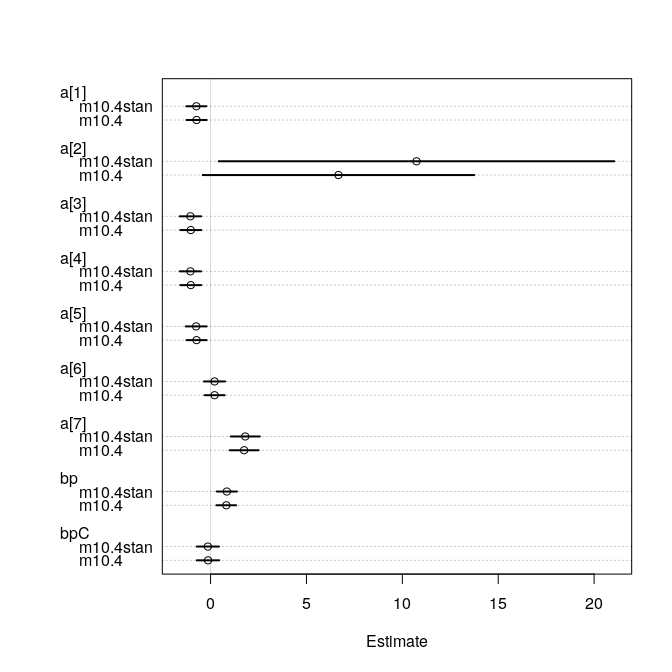

We can compare the posterior distribution for the parameter for actor 2 under the two models:

``` r
post <- extract.samples(m10.4)
post.stan <- extract.samples(m10.4stan)

par(mfrow=c(1,2))
dens( post$a[,2], main="Quadratic Approximation for Actor 2")
dens( post.stan$a[,2], main="MCMC Approximation for Actor 2")
```


The quadratic approximation gives some weight to negative values which doesn't match with the observed outcomes for actor 2: Actor 2 always pulled left, i.e. each trial was successful. The MCMC approximation on the other hand only puts weight on positive values with a right-skewed distribution (that is, small weight on very high values).

Since all other parameters have a Gaussian distribution, their estimates are the same in both posterior approximations. Since the distribution for actor 2 is highly non-Gaussian but `map()` assumes Gaussian distributions for all parameters, the estimate differs.

**10H2.** Use WAIC to compare the chimpanzee model that includes a unique intercept for each actor to the simpler models fit in the same section.

``` r
# only an intercept
m10.1 <- map2stan(
  alist(
    pulled_left ~ dbinom(1, p),
    logit(p) <- a,
    a ~ dnorm(0, 10)
  ), data=d2, iter=2500, warmup=500, chains=4
)
```

    Warning: There were 1 divergent transitions after warmup. Increasing adapt_delta above 0.8 may help. See
    http://mc-stan.org/misc/warnings.html#divergent-transitions-after-warmup

    Warning: Examine the pairs() plot to diagnose sampling problems

``` r
m10.2 <- map2stan(
  alist(
    pulled_left ~ dbinom(1, p),
    logit(p) <- a + bp*prosoc_left,
    a ~ dnorm(0, 10),
    bp ~ dnorm(0, 10)
  ), data=d2, iter=2500, warmup=500, chains=4
)

m10.3 <- map2stan(
  alist(
    pulled_left ~ dbinom(1, p),
    logit(p) <- a + ( bp + bpC*condition)*prosoc_left,
    a ~ dnorm(0, 10),
    c(bp, bpC) ~ dnorm(0, 10)
  ), data=d2, iter=2500, warmup=500, chains=4
)
```

    Warning: There were 1 divergent transitions after warmup. Increasing adapt_delta above 0.8 may help. See
    http://mc-stan.org/misc/warnings.html#divergent-transitions-after-warmup

    Warning: Examine the pairs() plot to diagnose sampling problems

``` r
m10.4 <- map2stan(
  alist(
    pulled_left ~ dbinom(1, p),
    logit(p) <- a[actor] + ( bp + bpC*condition)*prosoc_left,
    a[actor] ~ dnorm(0, 10),
    c(bp, bpC) ~ dnorm(0, 10)
  ), data=d2, iter=2500, warmup=500, chains=4
)
```

    Warning: There were 8 divergent transitions after warmup. Increasing adapt_delta above 0.8 may help. See
    http://mc-stan.org/misc/warnings.html#divergent-transitions-after-warmup

    Warning: Examine the pairs() plot to diagnose sampling problems

    Warning in map2stan(alist(pulled_left ~ dbinom(1, p), logit(p) <- a[actor] + : There were 8 divergent iterations during sampling.
    Check the chains (trace plots, n_eff, Rhat) carefully to ensure they are valid.

``` r
( comp <- compare( m10.1, m10.2, m10.3, m10.4) )
```

           WAIC pWAIC dWAIC weight    SE   dSE
    m10.4 529.7   8.3   0.0      1 19.94    NA
    m10.2 680.6   2.0 150.9      0  9.38 19.21
    m10.3 682.3   3.0 152.6      0  9.43 19.16
    m10.1 688.0   1.0 158.3      0  7.11 19.92

``` r
plot(comp)
```


Even though the fourth model with the unique intercepts has much more parameters than the other three models (9 parameter versus 1 - 3 parameter), it performs much better and also gets the full Akaike weight.

**10H3.** The `eagles` data from the library `MASS` are records of salmon pirating attempts by Bald Eagles in Washington State. While one eagle feeds, sometimes another will swoop in and try to steal the salmon from it. Call the feeding eagle the "victim" and the thief the "pirate". Use the available data to build a binomial GLM of successful pirating attempts.

1.  Consider the following model:

     \\
      \log \frac{p_i}{1-p_i} &= \alpha + \beta_P P_i + \beta_V V_i + \beta_A A_i \\
      \alpha &\sim \text{Normal}(0, 10) \\
      \beta_P &\sim \text{Normal}(0, 5) \\
      \beta_V &\sim \text{Normal}(0, 5) \\
      \beta_A &\sim \text{Normal}(0, 5) 
      \end{align*}")

     where  is the number of successful attempts,  is the total number of attempts,  is a dummy variable indicating whether or not the pirate had large body size,  is a dummy variable indicating whether or not the victim had large body size, and finally  is a dummy variable indicating whether or not the pirate was an adult.

Fit the model using both `map()` and `map2stan()`. Is the quadratic approximation okay?

``` r
library(MASS)
data(eagles)
d <- eagles
str(d)
```

    'data.frame':   8 obs. of  5 variables:
     $ y: int  17 29 17 20 1 15 0 1
     $ n: int  24 29 27 20 12 16 28 4
     $ P: Factor w/ 2 levels "L","S": 1 1 1 1 2 2 2 2
     $ A: Factor w/ 2 levels "A","I": 1 1 2 2 1 1 2 2
     $ V: Factor w/ 2 levels "L","S": 1 2 1 2 1 2 1 2

First, we'll need to transform the factor variables to dummy variables containing only 0 or 1 values.

``` r
d$pirate <- ifelse(d$P == "L", 1, 0)
d$adult <- ifelse(d$A == "A", 1, 0)
d$victim <- ifelse(d$V == "L", 1, 0)
```

Next, we build the model and fit is using both `map()` and `map2stan()`:

``` r
m.eagle1 <- map(
  alist(
    y ~ dbinom( n, p),
    logit(p) <- a + bp*pirate + ba*adult + bv*victim,
    a ~ dnorm(0, 10),
    c(bp, ba, bv) ~ dnorm(0, 5)
  ), data=d
)

m.eagle1stan <- map2stan(m.eagle1, iter=2500, chains=4, warmup=500)
```

Let's check the estimates for the coefficients:

``` r
plot( coeftab(m.eagle1, m.eagle1stan) )
```

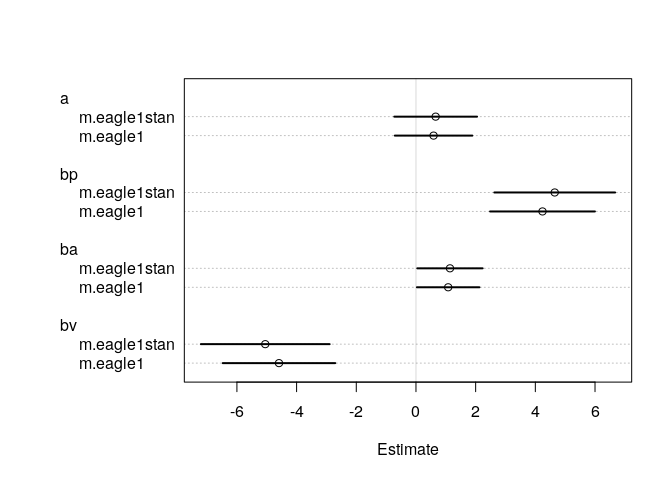

The estimates do differ slightly, in particular for the parameter `bv` and `bp`, but they look close enough. Let's check the pair plots for both models as well.

``` r
pairs(m.eagle1, main="Model fit with map()")
```

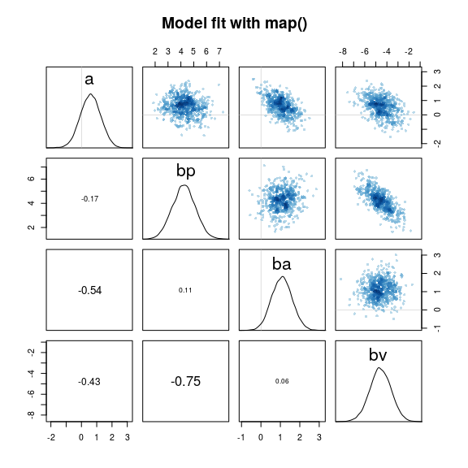 The parameters for the pirate and the victim variable are negatively correlated: A high parameter value for the pirate variable implies a lower parameter value for the victim variable.

``` r
pairs(m.eagle1stan, main="Model fit with map2stan()")
```

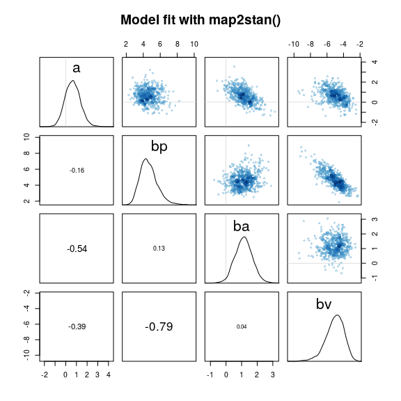

We can see in the pair plot that there is some correlation between `bp` and `bv` and that both parameters are skewed in opposite directions. This suggests that the quadratic approximation is not a good approximation of the posterior and thus from now on, we'll only use the Stan model.

1.  Interpret the estimates. Plot the posterior predictions. Compute and display both (1) the predicted **probability** of success and its 89% interval for each row (*i*), as well as (2) the predicted success **count** and its 89% interval.

What different information does each type of posterior prediction provide?

``` r
 precis(m.eagle1stan)
```

        Mean StdDev lower 0.89 upper 0.89 n_eff Rhat
    a   0.66   0.71      -0.46       1.76  3558    1
    bp  4.65   1.03       3.01       6.16  2812    1
    ba  1.14   0.56       0.24       1.99  4298    1
    bv -5.05   1.10      -6.62      -3.27  2523    1

``` r
post <- extract.samples(m.eagle1stan)
```

The intercept is at 0.65, meaning that if all other predictor variables are 0 (that is, the pirate did not have a large body, the victim did not have a large body and the pirate was not an adult) then the probability of a successful attempt is `logistic(0.65)`, that is

``` r
mean(logistic(post$a))
```

    [1] 0.643395

If the pirating eagle is large, then this probability increases to almost 100%:

``` r
dens(logistic(post$a + post$bp), xlim=c(0,1))
```


Similarly, if the pirating eagle is an adult, the probability of a successful attempt is quite high with a mean of about 85%:

``` r
dens(logistic(post$a + post$ba), xlim=c(0,1))
```

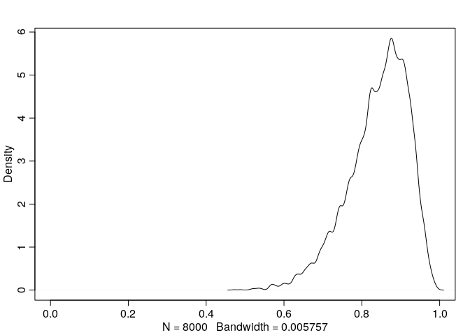

If the pirating eagle is large, then it doesn't matter much if the eagle is an adult or not, the distribution for the probablity now puts even more weight closer to 1, but the mean doesn't change much.

``` r
dens(logistic(post$a + post$ba + post$bp), xlim=c(0,1))
```

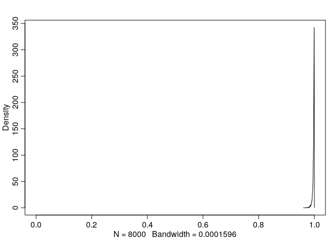

If on the other hand the victim has a large body (and the attacker is neither adult nor big), then the probability decreases to almost 0:

``` r
dens(logistic(post$a + post$bv), xlim=c(0,1))
```


If the victim eagle is large, then it also doesn't improve the chances much when the pirating eagle is an adult. While higher than before, it is still mostly below 10%:

``` r
dens(logistic(post$a + post$bv + post$ba), xlim=c(0,1))
```


It becomes interesting when both the pirating and the victim eagle are large. The probability is then almost 50% with a very slight advantage for the pirating eagle. It appears, as if the two events large pirate and large victim cancel each other out but if we compare it to the base case (neither large pirate nor victim and non-adult pirate), then we see that a large victim still has better chances than a victim in the base case:

``` r
dens(logistic(post$a + post$bv + post$bp), xlim=c(0,1))
dens(logistic(post$a), col="blue", add=T)
legend("topleft", col=c("black", "blue"), 
       lty=c(1,1), bty="n",
       legend = c("large pirat; large victim", "base case"))
```


If the pirating eagle is large and an adult, then chances are in his favor even if the victim eagle is large.

``` r
dens(logistic(post$a + post$ba), col="blue", xlim=c(0,1))
dens(logistic(post$a + post$bv + post$bp + post$ba), add=T)
legend("topleft", col=c("black", "blue"), 
       lty=c(1,1), bty="n",
       legend = c("large, adult pirat; large victim", "adult pirat"))
```


1.  Predicted **probability** of success:

``` r
d$prop <- d$y / d$n
p.link <- link(m.eagle1stan)
p.mean <- apply(p.link, 2, mean)
p.HPDI <- apply(p.link, 2, HPDI, prob=0.89)
```

``` r
o <- order(p.mean)
dotchart(p.mean[o], main="Success probability",
         labels=paste0("       ", d$pirate, "/", d$adult, "/", d$victim, "         ")[o])
mtext("pirate/adult/victim", side=2, adj=0.5, padj=-11.5, las=1)
for (i in 1:nrow(d)){
  j <- o[i]
  points( d$prop[j], i, col="midnightblue" , pch=19)
  lines( p.HPDI[,j], rep(i, 2))
}
```

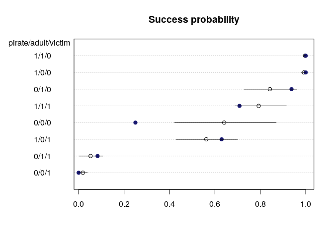

Blue points show the observed proportions whereas the estimates probability and 89% percent interval are shown in black. Except for the case 0/0/0 (small, immature pirate and small victim), all observed proportions of success are within the 89% interval for the predicted probabilities.

1.  Predicted **success count**

``` r
eagle.sim <- sim(m.eagle1stan)
eagle.med <- apply(eagle.sim, 2, median)
eagle.HPDI <- apply(eagle.sim, 2, HPDI)
```

``` r
dotchart(eagle.med[o], main="Success count",
         labels=paste0("       ", d$pirate, "/", d$adult, "/", d$victim, "         ")[o])
mtext("pirate/adult/victim", side=2, adj=0.5, padj=-11.5, las=1)
for (i in 1:nrow(d)){
  j <- o[i]
  points( d$y[j], i, col="midnightblue" , pch=19)
  points( d$n[j], i, col="gray", pch=3 )
  lines( eagle.HPDI[,j], rep(i, 2))
}
```

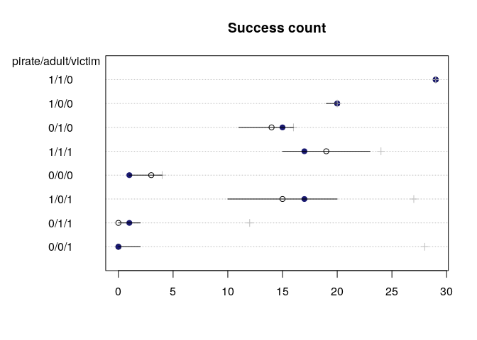

Even though the predicted probability interval for the base case 0/0/0 did not contain the observed proportions of success, the observed number of successful attempts is contained in its 89% interval for the predicted success count.

Since there are different number of total attempts (depicted as gray crosses in the plot) for each case, there is also a different ordering for the predicted counts than for the predicted probabilities. The plot for the predicted counts in some sense also makes it harder to compare the uncertainty: while the case 1/0/1 has a higher uncertainty compared to the base case 0/0/0 for the predicted counts, it is the opposite way when we compare their uncertainties for the probability. The case 0/0/0 has had fewer total attempts and thus its uncertainty interval covers relatively more of the possible outputs than for case 1/0/1.

1.  Try to improve the model. Consider an interaction between the pirate's size and age (immature or adult). Compare this model to the previous one, using WAIC.

``` r
m.eagle2 <- map2stan(
  alist(
    y ~ dbinom( n, p),
    logit(p) <- a + bp*pirate + ba*adult + bv*victim + bap*adult*pirate,
    a ~ dnorm(0, 10),
    c(bp, ba, bv, bap) ~ dnorm(0, 5)
  ), data=d, iter=2500, chains=4, warmup=500
)
```

``` r
pairs(m.eagle2)
```


As before, we have some correlations between the coefficients: `bap` and `ba`, as well as `bap` and `bp` are negatively correlated. `bp` and `ba`are now positively correlated and `bp` and `bv` are again negatively correlated but slightly less than in the model without interaction.

Let's now compare the WAIC for the two models:

``` r
( comp <- compare(m.eagle1stan, m.eagle2) )
```

                 WAIC pWAIC dWAIC weight   SE  dSE
    m.eagle2     93.9   4.7     0   0.92 12.7   NA
    m.eagle1stan 98.9   4.2     5   0.08 13.4 4.72

Almost all the Akaike weight is on the interaction model but there is a relatively high standard error for both the WAIC and the difference. We can compute the probability that the first model has a lower WAIC then the interaction model as follows:

``` r
diff <- rnorm(1e5, 5, 4.72)
mean(diff < 0)
```

    [1] 0.14517

There is a probability of 14% that the model without the interaction has the better WAIC.

``` r
plot(comp)
```

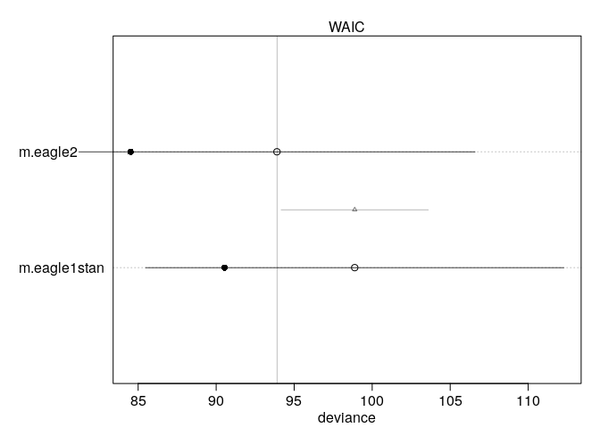

Let's compare the coefficients for the two models:

``` r
plot( coeftab( m.eagle2, m.eagle1stan ))
```


All coefficients increased in magnitude in the new model. In particular, the coefficients for the Adult variable and the Pirate variable increased quite a bit. The coefficient for the new interaction variable on the other hand has a relatively large negative value. The coefficient for the intercept turned negative in the new model.

Let's check how the interaction variable changes the probability distribution for each case:

``` r
p2.link <- link(m.eagle2)
p2.mean <- apply(p2.link, 2, mean)
p2.HPDI <- apply(p2.link, 2, HPDI, prob=0.89)
```

``` r
# the plot
o <- order(p2.mean)
dotchart(p2.mean[o], main="Success probability",
         labels=paste0("       ", d$pirate, "/", d$adult, "/", d$victim, "         ")[o])
mtext("pirate/adult/victim", side=2, adj=0.5, padj=-11.5, las=1)
for (i in 1:nrow(d)){
  j <- o[i]
  points( d$prop[j], i, col="midnightblue" , pch=19)
  points(p.mean[j], i-0.2, col="gray", pch=1, cex=0.8)
  lines(p.HPDI[,j], rep(i-0.2, 2), col="gray")
  lines( p2.HPDI[,j], rep(i, 2))
}
```

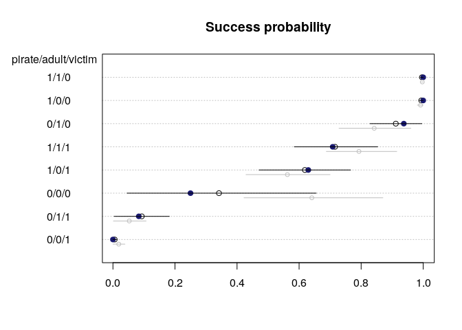

The probability estimates and the uncertainty estimates for the model without the interaction are shown in grey. The observed values are again in blue. The most notable change is for the base case 0/0/0, that is a small, immature pirating eagle and a small victim. The success probability for this case decreased from around 65% to about 35% Before, the observed proportions where not contained in the estimated 89% probability interval whereas now, all observed proportions are contained in the estimated probability interval.

``` r
eagle2.sim <- sim(m.eagle2)
eagle2.med <- apply(eagle2.sim, 2, median)
eagle2.HPDI <- apply(eagle2.sim, 2, HPDI)
```

``` r
dotchart(eagle2.med[o], main="Success counts",
         labels=paste0("       ", d$pirate, "/", d$adult, "/", d$victim, "         ")[o])
mtext("pirate/adult/victim", side=2, adj=0.5, padj=-11.5, las=1)
for (i in 1:nrow(d)){
  j <- o[i]
  points( d$y[j], i, col="midnightblue" , pch=19)
  points( d$n[j], i, col="gray", pch=3 )
  points(eagle.med[j], i-0.2, col="gray", pch=1, cex=0.8)
  lines(eagle.HPDI[,j], rep(i-0.2, 2), col="gray")
  lines( eagle2.HPDI[,j], rep(i, 2))
}
```

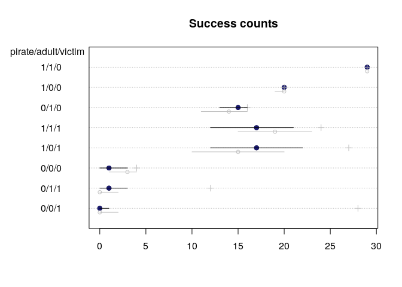

For almost all cases, the predicted success counts are now even equal to the observed counts.

**10H4.** The data contained in `data(salamanders)` are counts of salamanders from 47 different 49m² plots in northern California. The column `SALAMAN` is the count in each plot, and the columns `PCTCOVER` and `FORESTAGE` are percent of ground cover and age of trees in the plot respectively. Model `SALAMAN` as a Poisson variable.

1.  Model the relationship between density and percent cover. Use a log-link, weakly informative priors and check the quadratic approximation. Plot the expected counts and their 89% interval against percent cover. In which ways does the model do a good job and in which ways a bad job?

``` r
data("salamanders")
d <- salamanders
d$PCTCOVER_c <- d$PCTCOVER - mean(d$PCTCOVER)
str(d)
```

    'data.frame':   47 obs. of  5 variables:
     $ SITE      : int  1 2 3 4 5 6 7 8 9 10 ...
     $ SALAMAN   : int  13 11 11 9 8 7 6 6 5 5 ...
     $ PCTCOVER  : int  85 86 90 88 89 83 83 91 88 90 ...
     $ FORESTAGE : int  316 88 548 64 43 368 200 71 42 551 ...
     $ PCTCOVER_c: num  26 27 31 29 30 ...

As priors, we'll use as prior a normal distribution with mean zero and standard deviation of 50 for the intercept. That is, if there is no ground covered, we expect up 100 salamander in one plot. As I don't know much about salamander, this is a rather conservative prior, and a glimpse on the salamander count in the first rows suggests it is likely much lower.

The ground cover is given in percentage points between 0 and 100, so we'll use as prior a normal distribution with mean 0 and standard deviation of 1, so that a one percent point increase in covering could mean up to two more salamanders.

``` r
m.salam1 <- map(
  alist(
    SALAMAN ~ dpois( lambda ),
    log(lambda) <- a + bc*PCTCOVER_c,
    a ~ dnorm(0, 50),
    bc ~ dnorm(0, 1)
  ),
  data=d
)

m.salam1stan <- map2stan(m.salam1, chains=2)
```

``` r
 coeftab( m.salam1, m.salam1stan ) 
```

         m.salam1 m.salam1stan
    a       0.43     0.39     
    bc      0.03     0.03     
    nobs      47       47     

``` r
plot( coeftab( m.salam1, m.salam1stan))
```

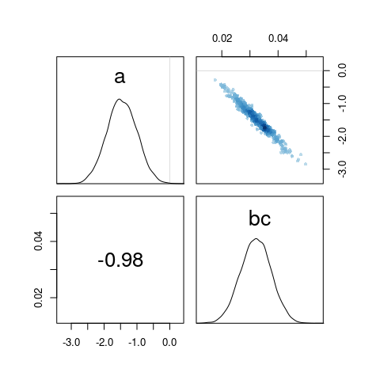

The estimates seem to be quite similar, only the intercept differs a bit. Let's check the pair plots:

``` r
pairs( m.salam1 )
```

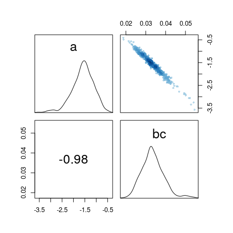

Even after centering the predictor, there is still a strong negative correlation between the intercept and the parameter for the covering.

``` r
pairs(m.salam1stan)
```

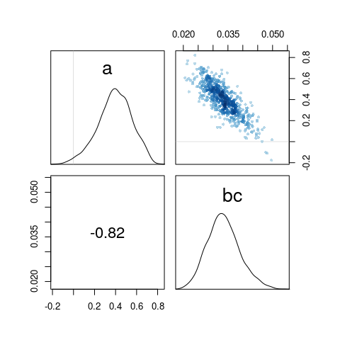

The posterior distributions are both skewed in opposite directions. The quadratic approximation thus is not a good approximation for the posterior and we'll use the Stan model from now on.

``` r
# sequence of percent ground cover
cover.seq <- seq(from=0, to=100, length.out=100)

d.pred <- data.frame(
  PCTCOVER = cover.seq,
  PCTCOVER_c = cover.seq - mean(d$PCTCOVER)
)

lambda.pred <- link(m.salam1stan, data=d.pred)
lambda.med <- apply(lambda.pred, 2, median)
lambda.PI <- apply(lambda.pred, 2, PI, prob=0.89)
```

``` r
# raw data plot
plot( d$PCTCOVER, d$SALAMAN,
      xlab="Percent ground cover", 
      ylab="Salamander count",
      col="steelblue", pch=16,
      main="Posterior prediction for salamander counts")

lines( cover.seq, lambda.med, col="steelblue")
shade( lambda.PI, cover.seq, col=col.alpha("steelblue", 0.2))
```


If there is little or no covered ground, then there are only a handful of salamanders. Once the covered ground is more than 80%, the salamander count rises. This behaviour is well captured by the model. For high covered ground plots though, there is a much wider range of possible salamander counts than is estimated by our model. This indicates that some important factor is still missing in the model.

1.  Can you improve the model by using the other predictor `FORESTAGE`? Can you explain why it helps or does not help with prediction?

Forest age ranges from very young forests of just a few years to some very old forests. The distribution is skewed in that most forests are younger than 100 years but a few forests are older than 500 years. It thus makes sense to use the log of forest age.

``` r
hist(d$FORESTAGE, breaks = 10,
     main="Histogram of Forest age", xlab="Forest age")
```


``` r
plot(d$PCTCOVER, d$FORESTAGE)
```


``` r
library(tidyverse)
```

    ── Attaching packages ──────────────────────────────────────────────────────────────────────────────────────────────────────────── tidyverse 1.2.1 ──

    ✔ tibble  2.0.1       ✔ purrr   0.3.0  
    ✔ tidyr   0.8.2       ✔ dplyr   0.8.0.1
    ✔ readr   1.3.1       ✔ stringr 1.4.0  
    ✔ tibble  2.0.1       ✔ forcats 0.4.0  

    ── Conflicts ─────────────────────────────────────────────────────────────────────────────────────────────────────────────── tidyverse_conflicts() ──
    ✖ tidyr::extract() masks rstan::extract()
    ✖ dplyr::filter()  masks stats::filter()
    ✖ dplyr::lag()     masks stats::lag()
    ✖ purrr::map()     masks rethinking::map()
    ✖ dplyr::select()  masks MASS::select()

``` r
d %>%
  filter(PCTCOVER > 75) %>%
  ggplot(aes(y=SALAMAN, x=FORESTAGE, col=PCTCOVER)) + geom_point()
```

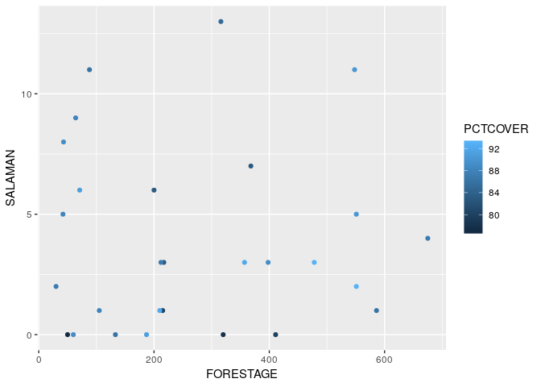

``` r
d$logFORESTAGE <- log(d$FORESTAGE + 1 )
d$logFORESTAGE_c <- d$logFORESTAGE - mean(d$logFORESTAGE)
m.salam2 <- map2stan(
  alist(
    SALAMAN ~ dpois( lambda ),
    log(lambda) <- a + bc*PCTCOVER_c +bf*logFORESTAGE_c,
    a ~ dnorm(0, 50),
    bc ~ dnorm(0, 1),
    bf ~ dnorm(0, 1)
  ),
  data=d, chains=2
)
```

``` r
precis(m.salam2, digits = 5)
```

           Mean  StdDev lower 0.89 upper 0.89 n_eff    Rhat
    a   0.39249 0.16772    0.12055    0.65583   779 1.00209
    bc  0.03557 0.00692    0.02480    0.04684   784 1.00201
    bf -0.05811 0.10142   -0.20926    0.11064   964 0.99978

``` r
plot(precis(m.salam2, digits=5))
```

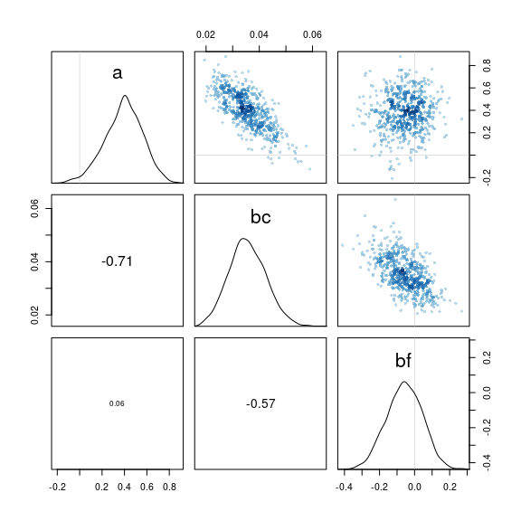

`FORESTAGE` has a very small negative coefficient but with a relatively high standard deviation: the 89% percent interval for the parameter includes 0. This supports the hypothesis that the forest age doesn't add meaningful information to the model.

Checking the parameters, we see that the parameter `a` and `bc` again have a relatively high correlation, though a bit less than in the model before.

``` r
pairs(m.salam2)
```


One reason why forest age doesn't improve the model can be that forest age and the coverage are strongly correlated:

``` r
plot(PCTCOVER ~ FORESTAGE, data=d, log="x",
     main="Correlation between Forest age and Coverage")
```

    Warning in xy.coords(x, y, xlabel, ylabel, log): 1 x value <= 0 omitted
    from logarithmic plot

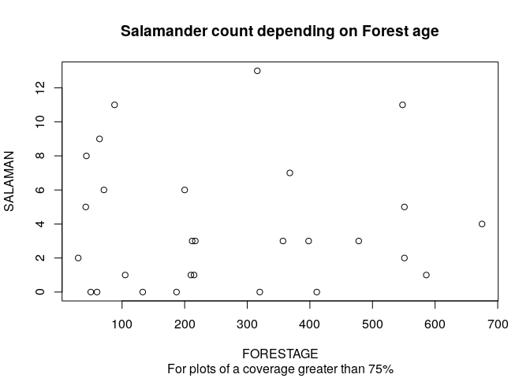

The model before failed in particular for plots where the ground coverage was above 75%. If we have a look at the salamander count depending on forest age for plots that have a coverage greater than 75%, we further see, that forest age does not add any information:

``` r
plot(SALAMAN ~ FORESTAGE, data=d[d$PCTCOVER > 75,],
     main="Salamander count depending on Forest age",
     sub="For plots of a coverage greater than 75%")
```


In summary, the older a forest is, the more likely it has a high ground coverage. If the ground coverage is high, then the age of the forest doesn't add any additional information that help predict the salamder count.

We can also check the WAIC of the two models:

``` r
set.seed(2405)
(cmp <- compare(m.salam1stan, m.salam2 ) )
```

                  WAIC pWAIC dWAIC weight    SE  dSE
    m.salam1stan 213.3   4.7   0.0   0.89 26.48   NA
    m.salam2     217.6   7.7   4.2   0.11 27.79 2.53

``` r
plot(cmp)
```

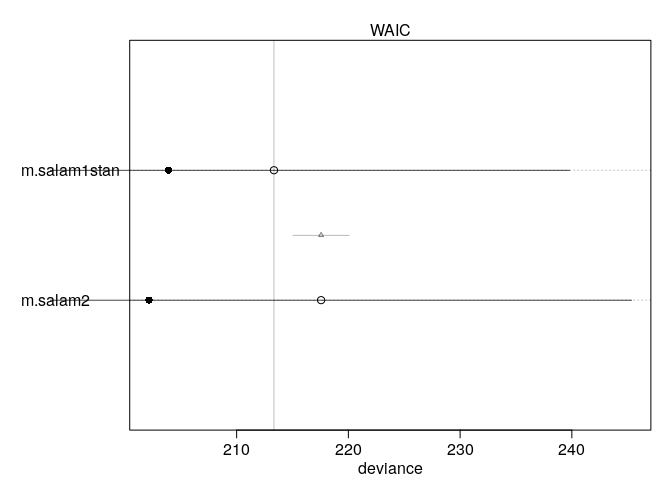

Almost all Akaike weight is on the first, simpler model. We can compute the proability that the second model would have a lower WAIC:

``` r
diff <- rnorm(1e5, 4.5, 2.45)
mean(diff < 0)
```

    [1] 0.03261

The probability that the second model has a lower WAIC is only 3%. It is thus recommended to use the first model without the predictor forest age.

Since forest age and ground cover are strongly correlated, how would a model perform where we use only forest age as a predictor? Could this model perform as good or better than the model using the ground coverage?

``` r
m.salam3 <- map2stan(
  alist(
    SALAMAN ~ dpois( lambda ),
    log(lambda) <- a + bf*logFORESTAGE_c,
    a ~ dnorm(0, 50),
    bf ~ dnorm(0, 1)
  ),
  data=d, chains=2
)
```

Let's check how the parameter compare:

``` r
coeftab(m.salam1stan, m.salam2, m.salam3)
```

         m.salam1stan m.salam2 m.salam3
    a       0.39         0.39     0.71 
    bc      0.03         0.04       NA 
    bf        NA        -0.06     0.38 
    nobs      47           47       47 

The intercept is higher in the third model and `bf` is now positive and quite large, whereas before in model 2 it was close to 0.

``` r
plot(coeftab(m.salam1stan, m.salam2, m.salam3))
```


let's check correlations between the parameters:

``` r
pairs(m.salam3)
```

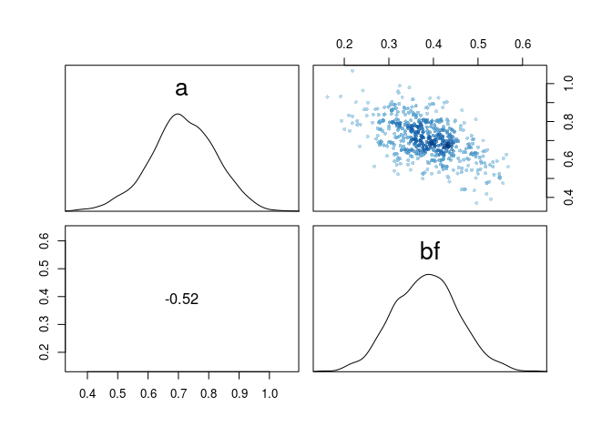

The model has less correlation between its two parameters.

We can compare all three models using WAIC:

``` r
(cmp <- compare(m.salam1stan, m.salam2, m.salam3) )
```

                  WAIC pWAIC dWAIC weight    SE   dSE
    m.salam1stan 213.3   4.7   0.0   0.89 26.48    NA
    m.salam2     217.6   7.7   4.2   0.11 27.79  2.53
    m.salam3     248.1   6.1  34.8   0.00 32.23 18.87

The first model still performs best, whereas the model using only forest age performs much worse than the other two models.

``` r
plot(cmp)
```


