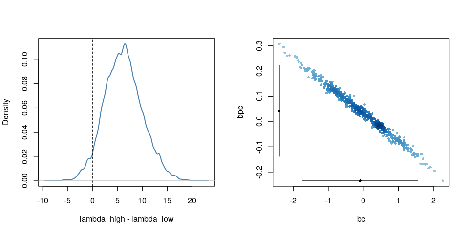

Poisson Regression
================
Corrie
October 28, 2018

Poisson Regression
------------------

### Oceanic Tools

A binomial distriution with many trials (that is  large) and a small probability of an event ( small) approaches a Poisson distribution where both the mean and the variance are equal:

``` r
y <- rbinom(1e5, 1000, 1/1000)
c(mean(y), var(y))
```

    [1] 0.996090 1.000805

A Poisson model allows us to model binomial events for which the number of trials  is unknown.

We work with the `Kline` data, a dataset about Oceanic societies and the number of found tools. We will analyse the number of found tools in dependance of the population size and contact rate. The hypothesis is, that a society with a large population has a larger number of tools and further that a high contact rate to other societies increases the effect of population size.

``` r
library(rethinking)
data(Kline)
d <- Kline
knitr::kable(d)
```

| culture    |  population| contact |  total\_tools|  mean\_TU|
|:-----------|-----------:|:--------|-------------:|---------:|
| Malekula   |        1100| low     |            13|       3.2|
| Tikopia    |        1500| low     |            22|       4.7|
| Santa Cruz |        3600| low     |            24|       4.0|
| Yap        |        4791| high    |            43|       5.0|
| Lau Fiji   |        7400| high    |            33|       5.0|
| Trobriand  |        8000| high    |            19|       4.0|
| Chuuk      |        9200| high    |            40|       3.8|
| Manus      |       13000| low     |            28|       6.6|
| Tonga      |       17500| high    |            55|       5.4|
| Hawaii     |      275000| low     |            71|       6.6|

The data looks rather small, it has only 10 rows.

``` r
d$log_pop <- log(d$population)
d$contact_high <- ifelse( d$contact == "high", 1, 0)
```

We will use the following model:

 \\
\log \lambda_i &= \alpha + \beta_P \log P_i + \beta_C C_i + \beta_{PC}C_i \log P_i \\
\alpha &\sim \text{Normal}(0, 100) \\
\beta_P &\sim \text{Normal}(0, 1) \\
\beta_C &\sim \text{Normal}(0, 1) \\
\beta_{PC} &\sim \text{Normal}(0, 1)
\end{align*}")

 where  is `population`,  is `contact_high`, and the  is `total_tools`.

``` r
m10.10 <- map(
  alist(
    total_tools ~ dpois( lambda ),
    log(lambda) <- a + bp*log_pop + 
                    bc*contact_high + bpc*contact_high*log_pop,
    a ~ dnorm( 0, 100),
    c(bp, bc, bpc) ~ dnorm(0, 1)
  ), data=d
)
precis(m10.10, corr=TRUE)
```

         Mean StdDev  5.5% 94.5%     a    bp    bc   bpc
    a    0.94   0.36  0.37  1.52  1.00 -0.98 -0.13  0.07
    bp   0.26   0.03  0.21  0.32 -0.98  1.00  0.12 -0.08
    bc  -0.09   0.84 -1.43  1.25 -0.13  0.12  1.00 -0.99
    bpc  0.04   0.09 -0.10  0.19  0.07 -0.08 -0.99  1.00

``` r
plot( precis( m10.10 ))
```


It appears as if the contact rate, as well as its interaction with population, has no influence on the number of tools. But the table is misleading. Let's compute some counterfactual predictions. Consider two islands, both with log-population of 8 but one with high and the other with low contact rate.

``` r
post <- extract.samples(m10.10 )
lambda_high <- exp( post$a + post$bc + (post$bp + post$bpc)*8 ) 
lambda_low <- exp( post$a + post$bp*8 )
diff <- lambda_high - lambda_low
sum(diff > 0) / length(diff)
```

    [1] 0.9573

There is a 95% probability that the high-contact island has more tools than the island with low-contact.

``` r
par(mfrow=c(1,2))
dens( diff , col="steelblue", lwd=2, 
      xlab="lambda_high - lambda_low")
abline(v = 0, lty=2)
abline(h=0, col="grey", lwd=1)

pr <- attr(precis(m10.10, prob=0.95), "output")
bc <- post$bc[1:500]
bpc <- post$bpc[1:500]
plot( bc, bpc, col=densCols(bc, bpc), pch=16, cex=0.7 )
lines( pr["bc", 3:4], rep(min(bpc), 2))
lines( rep(min(bc), 2),  pr["bpc", 3:4])
points(c( pr["bc", 1], min(bc) ), c(min(bpc), pr["bpc", 1] ), 
       pch=16, cex=0.7 )
```



The reason for this behaviour lies in the strong correlation in the uncertainty of the two parameters. It is important to not just inspect the *marginal* uncertainty in each parameter, but also the *joint* uncertainty.

A better way to assess whether a predictor is expected to improve prediction is to use model comparison. We will compare 5 models.

A model that omits the interaction:

``` r
# no interaction
m10.11 <- map(
  alist(
    total_tools ~ dpois( lambda ),
    log(lambda) <- a + bp*log_pop + bc*contact_high,
    a ~ dnorm(0, 100),
    c(bp, bc) ~ dnorm(0, 1)
  ), data=d
)
```

Two more models, each with only one of the predictors:

``` r
# one predictor
m10.12 <- map(
  alist(
    total_tools ~ dpois( lambda ),
    log(lambda) <- a + bp*log_pop,
    a ~ dnorm(0, 100),
    bp ~ dnorm(0, 1)
  ), data=d
)
m10.13 <- map(
  alist(
    total_tools ~ dpois( lambda ),
    log(lambda) <- a + bc*contact_high,
    a ~ dnorm(0, 100),
    bc ~ dnorm( 0, 1)
  ), data=d
)
```

A "null" model with only the intercept:

``` r
# no predictor
m10.14 <- map(
  alist(
    total_tools ~ dpois( lambda ),
    log(lambda) <- a,
    a ~ dnorm(0, 100)
  ), data=d
)
```

We compare all models using WAIC:

``` r
( islands.compare <- compare( m10.10, m10.11, m10.12, m10.13, m10.14, n=1e4) )
```

            WAIC pWAIC dWAIC weight    SE   dSE
    m10.11  78.9   4.1   0.0   0.62 11.10    NA
    m10.10  80.1   4.8   1.2   0.34 11.29  1.24
    m10.12  84.6   3.9   5.7   0.04  8.86  8.30
    m10.14 141.6   8.4  62.7   0.00 31.60 34.44
    m10.13 149.9  16.7  71.0   0.00 43.98 45.96

``` r
plot( islands.compare )
```


The top two models include both predictors but the top model excludes the interaction. However, a lot of model weight is assigned to both models. This suggests that the interactionis probably overfit but the model set is decent evidence that contact rate matters.

Let's plot some counterfactual predictions.

``` r
# different plot markers for high/low contact
pch <- ifelse( d$contact_high==1, 16, 1)
plot( d$log_pop, d$total_tools, col="steelblue", pch=pch,
      xlab="log-population", ylab="total tools")

# sequence of log-population sizes to compute over
log_pop.seq <- seq(from=6, to=13, length.out = 30)

# compute trend for high contact islands
d.pred <- data.frame(
  log_pop = log_pop.seq,
  contact_high = 1
)

lambda.pred.h <- ensemble( m10.10, m10.11, m10.12, data=d.pred)
lambda.med <- apply( lambda.pred.h$link, 2, median )
lambda.PI <- apply( lambda.pred.h$link, 2, PI )

# plot predicted trend for high contact islands
lines( log_pop.seq, lambda.med, col="steelblue")
shade( lambda.PI, log_pop.seq, col=col.alpha("steelblue", 0.2))

# compute trend for low contact islands
d.pred <- data.frame(
  log_pop = log_pop.seq,
  contact_high = 0
)

lambda.pred.l <- ensemble( m10.10, m10.11, m10.12, data=d.pred)
lambda.med <- apply( lambda.pred.l$link, 2, median )
lambda.PI <- apply( lambda.pred.l$link, 2, PI )

# plot predicted trend for high contact islands
lines( log_pop.seq, lambda.med, lty=2)
shade( lambda.PI, log_pop.seq, col=col.alpha("black", 0.1 ))
```


Next, we'll check if the MAP estimates accurately describe the shape of the posterior.

``` r
m10.10stan <- map2stan( m10.10, iter=3000, warmup=1000, chains=4)
```

``` r
precis( m10.10stan)
```

         Mean StdDev lower 0.89 upper 0.89 n_eff Rhat
    a    0.94   0.36       0.35       1.51  3258    1
    bp   0.26   0.03       0.21       0.32  2812    1
    bc  -0.10   0.85      -1.56       1.17   251    1
    bpc  0.04   0.09      -0.10       0.20   254    1

The estimates and intervals are the same as before. However, if we look at the pairs plot

``` r
pairs(m10.10stan)
```


we see that there is a very high correlation between the parameters `a` and `bp` and between `bc` and `bpc`. Hamiltonian Monte Carlo can handle these correlations, however, it would still be better to avoid them. We can center the predictors to reduce the correlation:

``` r
d$log_pop_c <- d$log_pop - mean(d$log_pop)

m10.10stan.c <- map2stan(
  alist(
    total_tools ~ dpois( lambda ),
    log(lambda) <- a + bp*log_pop_c + bc*contact_high +
                    bcp*log_pop_c*contact_high,
    a ~ dnorm(0, 10),
    bp ~ dnorm(0, 1),
    bc ~ dnorm(0, 1),
    bcp ~ dnorm(0, 1)
  ), 
  data=d, iter=3000, warmup=1000, chains=4
)
```

``` r
precis(m10.10stan.c)
```

        Mean StdDev lower 0.89 upper 0.89 n_eff Rhat
    a   3.31   0.09       3.18       3.46  3777    1
    bp  0.26   0.04       0.21       0.32  4845    1
    bc  0.28   0.12       0.10       0.47  4030    1
    bcp 0.07   0.17      -0.21       0.33  6567    1

The estimates look different because of the centering, but the predictions remain the same. If we look at the pairs plot now, we see that the strong correlations are gone:

``` r
pairs(m10.10stan.c)
```


The Markov Chain has also become more efficient which we can see at the increased number of effective samples.

### Examples with different exposure Time

When the length of observation varies, the counts we observe also vary. We can handle this by adding an *offset* to the linear model.

As in the previous example, we have a monastery that completes about 1.5 manuscripts per day, that is .

``` r
num_days <- 30
y <- rpois( num_days, 1.5)
```

Now `y` holds 30 days of simulated counts of completed manuscripts. Next, we consider to buy another monastery which unfortunately doesn't keep daily records but weekly records instead. Let's assume this monastery has a real daily rate of . To simulate data on a weekly basis, we just multiply this average by 7, the exposure:

``` r
num_weeks <- 4
y_new <- rpois( num_weeks, 0.5*7 )
```

So `y_new` holds four weeks of counts of completed manuscripts.

``` r
y_all <- c(y, y_new)
exposure <- c( rep(1, 30), rep(7, 4) )
monastery <- c(rep(0, 30), rep(1, 4))
d <- data.frame(y=y_all, days=exposure, monastery=monastery)
knitr::kable( head(d) )
```

|    y|  days|  monastery|
|----:|-----:|----------:|
|    0|     1|          0|
|    3|     1|          0|
|    0|     1|          0|
|    3|     1|          0|
|    2|     1|          0|
|    1|     1|          0|

Next, we fit a model to estimate the rate of manuscript production at each monastery.

``` r
d$log_days <- log(d$days)

m10.15 <- map(
  alist(
    y ~ dpois( lambda ),
    log(lambda) <- log_days + a + b*monastery,
    a ~ dnorm(0, 100),
    b ~ dnorm(0, 1)
  ), data=d
)
```

``` r
post <- extract.samples(m10.15 )
lambda_old <- exp( post$a )
lambda_new <- exp( post$a + post$b)
precis( data.frame( lambda_old, lambda_new))
```

               Mean StdDev |0.89 0.89|
    lambda_old 1.52   0.23  1.15  1.86
    lambda_new 0.69   0.16  0.45  0.93

The estimates are indeed very close to the real values.
