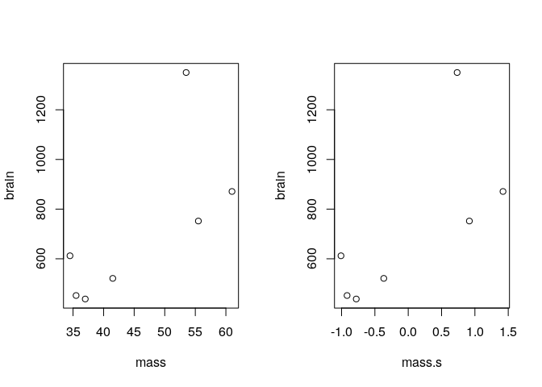
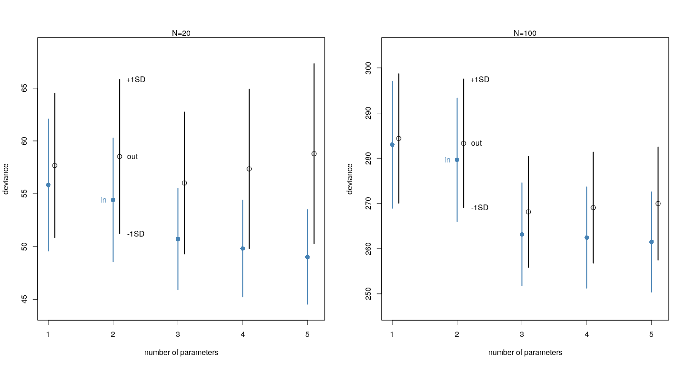
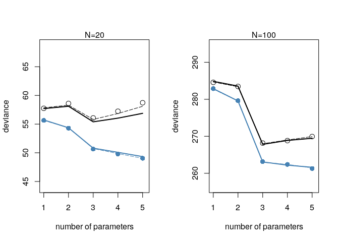
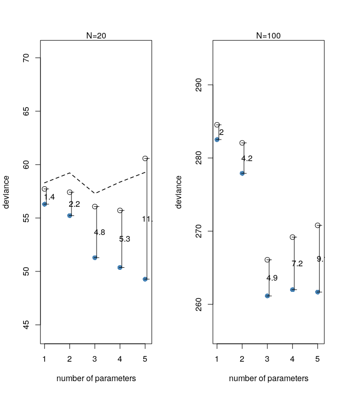
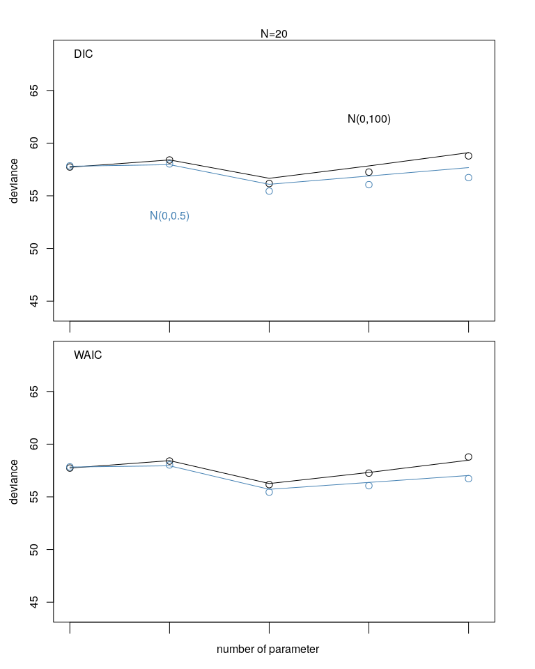

Information Theory and Model Performance
================
Corrie
July 2, 2018

Entropy
=======

``` r
p <- c( 0.3, 0.7)
-sum( p*log(p) )
```

    ## [1] 0.6108643

compare this with:

``` r
p <- c(0.01, 0.99)
-sum( p*log(p) )    # contains much less information
```

    ## [1] 0.05600153

Kullback-Leibler Divergence
===========================

``` r
p <- c(0.3, 0.7)
q1 <- seq(from=0.01, to=0.99, length.out = 100)
q <- data.frame(q1 = q1, q2 = 1 - q1)

kl_divergence <- function(p, q) {
  sum( p* log( p/ q) )
}

kl <- apply(q, 1, function(x){kl_divergence(p=p, q=x)} )
plot( kl ~ q1, type="l", col="steelblue", lwd=2)
abline(v = p[1], lty=2)
text(0.33 ,1, "p=q")
```


Direction matters when computing divergence:

``` r
p <- c(0.01, 0.99)
q1 <- seq(from=0.01, to=0.99, length.out = 100)
q <- data.frame(q1=q1, q2= 1 - q1 )
kl <- apply(q, 1, function(x) {kl_divergence(p=p, q=x)})
plot(kl ~ q1, type="l", col="steelblue", lwd=2)
abline(v=p[1], lty=2)
text(0.05, 1, "p=q")
```


Intuition: If you use a distribution with very low entropy (i.e. little information) to approximate a usual one (rather high information), you'd be more surprised than the other way round. For example, if you try to predict the amount of water on Mars (very dry, close to no water) using the Earth (two-thirds are water), you'd not be very surprised if you land on dry ground on Mars. The other way round, if you fly from Mars to Earth and predict amount of Water on Earth using the Mars, you'd be very surprised if you land on water.

``` r
mars <- c(0.01, 0.99)
earth <- c(0.7, 0.3)
kl_divergence(mars, earth)    # predicting water on Mars using Earth
```

    ## [1] 1.139498

``` r
kl_divergence(earth, mars)    # predicting water on Earth using Mars
```

    ## [1] 2.61577

Deviance
========

Load data:

``` r
sppnames <- c("afarensis", "africanus", "habilis", "boisei", 
              "rudolfensis", "ergaster", "sapiens")
brainvolcc <- c( 438, 452, 612, 521, 752, 871, 1350 )
masskg <- c( 37.0, 35.5, 34.5, 41.5, 55.5, 61.0, 53.5 )
d <- data.frame( species=sppnames, brain=brainvolcc, mass=masskg)
```

Fit the model:

``` r
m6.1 <- lm( brain ~ mass, d)
```

and compute deviance (by cheating):

``` r
(-2) * logLik(m6.1)
```

    ## 'log Lik.' 94.92499 (df=3)

To compute the deviance (yourself):

``` r
library(rethinking)
# standardize the mass before fitting
d$mass.s <- (d$mass - mean(d$mass)) / sd(d$mass)
m6.8 <- map(
  alist(
    brain ~ dnorm( mu, sigma),
    mu <- a + b*mass.s
  ), 
  data=d,
  start=list(a=mean(d$brain), b=0, sigma=sd(d$brain)),
  method="Nelder-Mead"
)

# extract MAP estimates
theta <- coef(m6.8)

# compute deviance
dev <- (-2)*sum( dnorm(
  d$brain,
  mean=theta[1] + theta[2]*d$mass.s,
  sd=theta[3],
  log=TRUE
))
```

compare results:

``` r
dev
```

    ## [1] 94.92499

``` r
-2* logLik(m6.8)
```

    ## 'log Lik.' 94.92499 (df=3)

Note:

``` r
library(assertthat)
are_equal( dev, (-2*logLik(m6.8))[1] ) 
```

    ## [1] TRUE

``` r
are_equal( dev, (-2*logLik(m6.1))[1] , tol=0.0000001)
```

    ## [1] TRUE

The only difference between m6.8 and m6.1 is the use of scaling and centralizing of the predictor variable mass. Thus scaling and centralizing has no influence on the deviance (makes sense)

``` r
par(mfrow=c(1,2))
plot( brain ~ mass, data=d)
plot( brain ~ mass.s, data=d)
```



Thought experiment
==================

Let's compute (simulate) the following data generating model:

 \\
\mu &= 0.15x_1 - 0.4x_2
\end{align*}")

We try to fit the data using models with increasing number of parameters (up to 5), first with  observations:

``` r
N <- 20
kseq <- 1:5
dev <- sapply( kseq, function(k) {
  print(k);
  # takes a long time ~ around an hour or so
  #r <- replicate( 1e4, sim.train.test( N=N, k=k, rho=c(0.15, -0.4)), mc.cores = 4 );
  # faster to use mcreplicate (can use multiple cpu cores)
  r <- mcreplicate( 1e2, sim.train.test( N=N, k=k, rho=c(0.15, -0.4)), mc.cores = 4 );
  c( mean(r[1, ]), mean(r[2,] ), sd(r[1,]), sd(r[2,]) )
  # mean deviance in sample, mean deviance out sample, sd of in sample deviance, sd of out sample deviance
})
```

and then with  observations:

``` r
N <- 100
kseq <- 1:5
dev100 <- sapply( kseq, function(k) {
  print(k);
  # takes a long time
  r <- mcreplicate( 1e2, sim.train.test( N=N, k=k, rho=c(0.15, -0.4)), mc.cores=4 );
  c( mean(r[1, ]), mean(r[2,] ), sd(r[1,]), sd(r[2,]) )
  # mean deviance in sample, mean deviance out sample, sd of in sample deviance, sd of out sample deviance
})
```

``` r
par(mfrow=c(1,2))
plot( 1:5, dev[1,], ylim=c(min(dev[1:2,]) - 5, max(dev[1:2,]) + 10),
      xlim =c(1,5.1), xlab="number of parameters", ylab="deviance",
      pch=16, cex=1.3, col="steelblue" )
text(2-0.15, dev[1,2], labels=c("in"), col="steelblue")
text(2+0.3, dev[2,2], labels=c("out"))

mtext( concat( "N=", 20))
points( (1:5)+0.1, dev[2,], cex=1.3)   # out of sample deviance, slightly right of in sample deviance
for ( i in kseq) {
  pts_in <- dev[1,i] + c(-1,1)*dev[3,i]    # standard deviation of in sample
  pts_out <- dev[2,i] + c(-1,1)*dev[4,i]
  lines( c(i,i), pts_in, col="steelblue", lwd=2)
  lines( c(i,i)+0.1, pts_out, lwd=2 )
  if (i == 2) {
    text(c(i,i) +0.35, pts_out, labels=c("-1SD", "+1SD"))
  }
} 

plot( 1:5, dev100[1,], ylim=c(min(dev100[1:2,]) - 15, max(dev100[1:2,]) + 20),
      xlim =c(1,5.1), xlab="number of parameters", ylab="deviance",
      pch=16, cex=1.3, col="steelblue" )
text(2-0.15, dev100[1,2], labels=c("in"), col="steelblue")
text(2+0.3, dev100[2,2], labels=c("out"))

mtext( concat( "N=", N))
points( (1:5)+0.1, dev100[2,], cex=1.3)   # out of sample deviance, slightly right of in sample deviance
for ( i in kseq) {
  pts_in <- dev100[1,i] + c(-1,1)*dev100[3,i]    # standard deviation of in sample
  pts_out <- dev100[2,i] + c(-1,1)*dev100[4,i]
  lines( c(i,i), pts_in, col="steelblue", lwd=2)
  lines( c(i,i)+0.1, pts_out, lwd=2 )
  if (i == 2) {
    text(c(i,i) +0.35, pts_out, labels=c("-1SD", "+1SD"))
  }
} 
```



Thought experiment - with regularization
========================================

We do the same again, but this time not using flat priors for the Beta-coefficients but instead Gaussian priors with increasing narrowness:

``` r
sq <- seq(from=-3.2, to=3.2, length.out = 200)
n02 <- dnorm(sq, mean=0, sd=0.2)
n05 <- dnorm(sq, mean=0, sd=0.5)
n1 <- dnorm(sq, mean=0, sd=1)

plot(sq, n02, xlab="parameter value", ylab="Density", type="l", lwd=2)
points(sq, n1, lty=5, type="l")
points(sq, n05, type="l")
legend("topright", c("N(0,1)", "N(0,0.5)", "N(0,0.2)"), lty=c(5, 1, 1), lwd=c(1,1,2), bty="n")
```


First with 20 observations:

``` r
N <- 20
kseq <- 1:5
reg <- c(1, 0.5, 0.2)
dev_r <- list()

for (i in 1:length(reg) ) {
  dev_r[[i]] <- sapply( kseq, function(k) {
    print(k);
    regi <- reg[i];
    r <- mcreplicate( 1e2, sim.train.test( N=N, k=k, rho=c(0.15, -0.4), b_sigma=regi), mc.cores=4 );
    c( mean(r[1, ]), mean(r[2,] ), sd(r[1,]), sd(r[2,]) )
    # mean deviance in sample, mean deviance out sample, sd of in sample deviance, sd of out sample deviance
  })
}
```

and then with 100 observations:

``` r
N <- 100
kseq <- 1:5
reg <- c(1, 0.5, 0.2)
dev_r100 <- list()

for (i in 1:length(reg)) {
  dev_r100[[i]] <- sapply( kseq, function(k) {
    print(k);
    # takes a long time
    regi <- reg[i]
    r <- mcreplicate( 1e2, sim.train.test( N=N, k=k, rho=c(0.15, -0.4), b_sigma=regi), mc.cores=4 );
    c( mean(r[1, ]), mean(r[2,] ), sd(r[1,]), sd(r[2,]) )
    # mean deviance in sample, mean deviance out sample, sd of in sample deviance, sd of out sample deviance
  })
}
```

The plot:

``` r
par(mfrow=c(1,2))
plot( 1:5, dev[1,], ylim=c(min(dev[1:2,]) - 5, max(dev[1:2,]) + 10),
      xlim =c(1,5.1), xlab="number of parameters", ylab="deviance",
      pch=16, cex=1.3, col="steelblue" )
points(1:5, dev[2,], cex=1.3)

# N(0,1)
points(1:5, dev_r[[1]][1,], col="steelblue", lty=5, type="l")
points(1:5, dev_r[[1]][2,], lty=5, type="l")

# N(0,0.5)
points(1:5, dev_r[[2]][1,], col="steelblue", lty=1, type="l")
points(1:5, dev_r[[2]][2,], lty=1, type="l")

# N(0,0.2)
points(1:5, dev_r[[2]][1,], col="steelblue", lty=1, type="l", lwd=2)
points(1:5, dev_r[[2]][2,], lty=1, type="l", lwd=2)
legend("bottomleft", c("N(0,1)", "N(0,0.5)", "N(0,0.2)", lty = c(5, 1, 1), lwd=c(1,1,2), bty="n"))
mtext( concat( "N=", 20))

plot( 1:5, dev100[1,], ylim=c(min(dev100[1:2,]) - 5, max(dev100[1:2,]) + 10),
      xlim =c(1,5.1), xlab="number of parameters", ylab="deviance",
      pch=16, cex=1.3, col="steelblue" )
points(1:5, dev100[2,], cex=1.3)

# N(0,1)
points(1:5, dev_r100[[1]][1,], col="steelblue", lty=5, type="l")
points(1:5, dev_r100[[1]][2,], lty=5, type="l")

# N(0,0.5)
points(1:5, dev_r100[[2]][1,], col="steelblue", lty=1, type="l")
points(1:5, dev_r100[[2]][2,], lty=1, type="l")

# N(0,0.2)
points(1:5, dev_r100[[2]][1,], col="steelblue", lty=1, type="l", lwd=2)
points(1:5, dev_r100[[2]][2,], lty=1, type="l", lwd=2)

mtext( concat( "N=", 100))
```



The points are the deviance in (blue) and out of sample (black), using flat priors (i.e. ")). The lines show training (blue) and testing (black) deviance for three regularizing priors.

Motivation for AIC
==================

The AIC (Akaike Information Criteria) provides a simple estimate of the average out-of-sample deviance:


 where p is the number of free parameters to be estimated in the model. The motivation for this can be seen in the following plots:

``` r
aic <- dev[1,] + 2*kseq
aic100 <- dev100[1,] + 2*kseq

par(mfrow=c(1,2))
plot( 1:5, dev[1,], ylim=c(min(dev[1:2,]) - 5, max(dev[1:2,]) + 10),
      xlim =c(1,5.1), xlab="number of parameters", ylab="deviance",
      pch=16, col="steelblue", cex=1.3 )
lines(aic, lty=2, lwd=1.5)

mtext( concat( "N=", 20))
points( (1:5), dev[2,], cex=1.3)   # out of sample deviance, slightly right of in sample deviance
for ( i in kseq) {
  dif <- dev[2,i] - dev[1,i]
  arrows(i+0.07, dev[1,i], i+0.07, dev[2,i], length=0.05, angle=90, code=3)
  text(i+0.18, dev[1,i]+0.5*dif, labels = round(dif, digits=1))
  }

# for N=100
plot( 1:5, dev100[1,], ylim=c(min(dev100[1:2,]) - 5, max(dev100[1:2,]) + 10),
      xlim =c(1,5.1), xlab="number of parameters", ylab="deviance",
      pch=16, col="steelblue", cex=1.3 )
lines(aic, lty=2, lwd=1.5)

mtext( concat( "N=", 100))
points( (1:5), dev100[2,], cex=1.3)   # out of sample deviance, slightly right of in sample deviance
for ( i in kseq) {
  dif <- dev100[2,i] - dev100[1,i]
  arrows(i+0.07, dev100[1,i], i+0.07, dev100[2,i], length=0.05, angle=90, code=3)
  text(i+0.18, dev100[1,i]+0.5*dif, labels = round(dif, digits=1))
}
```



DIC
===

 \\
&= \hat{D} + 2(\bar{D} - \hat{D}) \\
&= \hat{D} + 2p_D
\end{align*}")

 where  is the mean of the posterior deviance, that is, if we draw 10,000 samples from the posterior, we compute 10,000 deviances, one for each sample, and then take the average.  is the deviance computed using the mean of the posterior sample.  is the effective number of parameters. For comparison, we first compute the deviance and AIC:

``` r
data(cars)
m <- map(
  alist(
    dist ~ dnorm(mu, sigma) ,   # dist = distance
    mu <- a + b*speed,
    a ~ dnorm(0, 100),
    b ~ dnorm(0, 10),
    sigma ~ dunif(0, 30)
  ), data=cars
)
# deviance, AIC and DIC
dev <- (-2) * logLik(m)
aic <- dev + 2*length( coef(m) )
assert_that(aic == AIC(m))   # can also use the function AIC() from R stats
```

    ## [1] TRUE

Now computing the DIC:

``` r
post <- extract.samples(m,n=1000)

# compute dev at each sample
n_samples <- 1000
dev.samples <- sapply(1:n_samples,     
             function(s) {
               mu <- post$a[s] + post$b[s]*cars$speed
                (-2)*sum( dnorm( cars$dist, mu, post$sigma[s], log=TRUE)  )
             })
dev.bar <- mean( dev.samples )         

dev.hat <- (-2)*sum( dnorm(     # dev (mean( post) )
  cars$dist,
  mean=mean(post$a) + mean(post$b)*cars$speed,
  sd=mean(post$sigma), 
  log=TRUE
))
p.D <- dev.bar - dev.hat
dic <- dev.hat + 2*p.D    # = dev.bar + ( dev.bar - dev.hat )
dic
```

    ## [1] 419.5201

WAIC - Widely Applicable Information Critera
============================================

The WAIC does not require a multivariate Gaussian posterior and is thus even wider applicable, as the name says. It is computed pointwise, i.e. for each case in the data. It consists of the log-pointwise-predictive-density:

")

 where ") is the average likelihood of observation  in the training sample. That is, we compute the likelihood of  for parameter sample from the posterior and then average. The effective number of parameters for the WAIC is defined as follows:

")

 where ") is the variance in log-likelihood for observation  in the training sample.

Easier to understand with code, so let's compute WAIC using the same model as above:

``` r
ll <- sapply( 1:n_samples,
              function(s) {
                mu <- post$a[s] + post$b[s]*cars$speed
                dnorm( cars$dist , mu, post$sigma[s], log=TRUE)
              })
dim(ll)   # computed likelihood for each sample in post, for each observation in cars
```

    ## [1]   50 1000

``` r
          # observations in rows, samples in columns
lppd <- sum( log( apply(ll, 1, mean ) ) )
```

    ## Warning in log(apply(ll, 1, mean)): NaNs produced

Problem: this is not numerically stable, so we use the numercially stable function `log_sum_exp`.

``` r
n_cases <- nrow(cars)
lppd <-  sapply(1:n_cases, function(i) log_sum_exp(ll[i,]) - log(n_samples) ) 
pWAIC <- sapply( 1:n_cases, function(i) var(ll[i,]) ) 

waic <- -2*(sum( lppd ) - sum( pWAIC ) )
```

There will be simulation variance but the variance remains much smaller than the standard error of WAIC itself, which can be computed as follows:

``` r
waic_vec <- -2*( lppd - pWAIC )
se <- sqrt( n_cases*var( waic_vec ) )
se
```

    ## [1] 14.21707

``` r
# almost the same, some difference remains because of simulation variance
are_equal( waic, WAIC(m)[1] , tol=0.01)
```

    ## Constructing posterior predictions

    ## [ 100 / 1000 ]
    [ 200 / 1000 ]
    [ 300 / 1000 ]
    [ 400 / 1000 ]
    [ 500 / 1000 ]
    [ 600 / 1000 ]
    [ 700 / 1000 ]
    [ 800 / 1000 ]
    [ 900 / 1000 ]
    [ 1000 / 1000 ]

    ## [1] TRUE

Compare the three Information Criteria and the deviance:

``` r
ic <- c(dev, aic, dic, waic)
names(ic) <- c("Deviance", "AIC", "DIC", "WAIC")
print(ic)
```

    ## Deviance      AIC      DIC     WAIC 
    ## 413.1576 419.1576 419.5201 420.8239

This is better seen in a plot, so as before, we compute a simulation and see how DIC and WAIC fare, in particular, how good do they estimate **out-of-sample deviance**?

``` r
N <- 20
kseq <- 1:5
reg <- c(100, 0.5)
dev_DIC_WAIC <- list()

for (i in 1:length(reg) ) {
  dev_DIC_WAIC[[i]] <- sapply( kseq, function(k) {
    print(k);
    regi <- reg[i];
    r <- mcreplicate( 1e2, sim.train.test( N=N, k=k, rho=c(0.15, -0.4), b_sigma=regi, 
                                            DIC=TRUE, WAIC=TRUE), mc.cores=4 );
    c( mean(r[1, ]), mean(r[2,] ), mean(r[3,]), mean(r[4,]) )
    # mean deviance in sample, mean deviance out sample, mean DIC, mean WAIC
  })
}
```

And the plot:

``` r
par(mfrow=c(2,1))
par(mar = c(0.5, 2, 1, 1), oma=c(3,2,2,2))
plot( 1:5, dev_DIC_WAIC[[1]][2,], ylim=c(min(dev_DIC_WAIC[[1]][1:2,]) - 5, max(dev_DIC_WAIC[[1]][1:2,]) + 10),
      xlim =c(1,5.1), xlab=NA, xaxt="n", cex=1.3 )
axis(side = 1, at = 1:5, labels = FALSE, tck = -0.04)
points( 1:5, dev_DIC_WAIC[[2]][2,], col="steelblue", cex=1.3)
lines( dev_DIC_WAIC[[1]][3,] )
lines( dev_DIC_WAIC[[2]][3,], col="steelblue")
text(2, dev_DIC_WAIC[[2]][1,2]-5, "N(0,0.5)", col="steelblue")
text(4, dev_DIC_WAIC[[1]][2,4]+5, "N(0,100)")
legend("topleft", "DIC", bty="n")
mtext(text="deviance", side=2, line=2.5, outer=FALSE)
mtext(concat("N=",20))

plot( 1:5, dev_DIC_WAIC[[1]][2,], ylim=c(min(dev_DIC_WAIC[[1]][1:2,]) - 5, max(dev_DIC_WAIC[[1]][1:2,]) + 10),
      xlim =c(1,5.1), xlab=NA, xaxt="n", cex=1.3 )
axis(side = 1, at = 1:5, labels = FALSE, tck = -0.04)
points( 1:5, dev_DIC_WAIC[[2]][2,], col="steelblue", cex=1.3)
lines( dev_DIC_WAIC[[1]][4,] )                         # WAIC for N(0,100)
lines( dev_DIC_WAIC[[2]][4,], col="steelblue")         # WAIC for N(0,0.5)
legend("topleft", "WAIC", bty="n")
mtext(text="deviance", side=2, line=2.5, outer=FALSE)
mtext(text="number of parameter",side=1,line=1,outer=TRUE)
```


