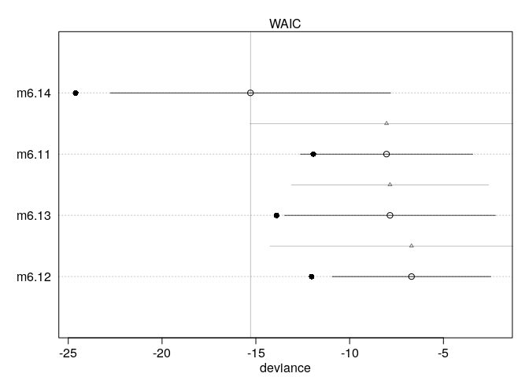
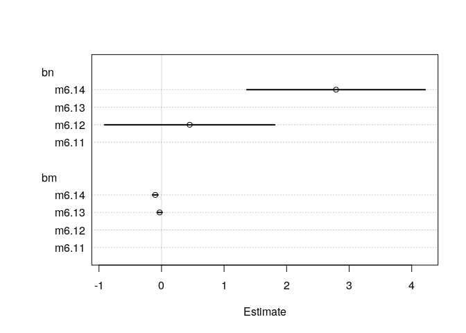

Using Information Critera
================
Corrie
July 4, 2018

Using information criteria
==========================

Model comparison
----------------

``` r
library(rethinking)
data(milk)
d <- milk[ complete.cases(milk), ]     # remove NA values
d$neocortex <- d$neocortex.perc / 100
dim(d)
```

    ## [1] 17  9

``` r
head(d)
```

    ##               clade            species kcal.per.g perc.fat perc.protein
    ## 1     Strepsirrhine     Eulemur fulvus       0.49    16.60        15.42
    ## 6  New World Monkey Alouatta seniculus       0.47    21.22        23.58
    ## 7  New World Monkey         A palliata       0.56    29.66        23.46
    ## 8  New World Monkey       Cebus apella       0.89    53.41        15.80
    ## 10 New World Monkey         S sciureus       0.92    50.58        22.33
    ## 11 New World Monkey   Cebuella pygmaea       0.80    41.35        20.85
    ##    perc.lactose mass neocortex.perc neocortex
    ## 1         67.98 1.95          55.16    0.5516
    ## 6         55.20 5.25          64.54    0.6454
    ## 7         46.88 5.37          64.54    0.6454
    ## 8         30.79 2.51          67.64    0.6764
    ## 10        27.09 0.68          68.85    0.6885
    ## 11        37.80 0.12          58.85    0.5885

We will predict kcal.per.g using the predictors neocortex and the logarithm of mass. For this, we use four different models (all with flat priors):

``` r
a.start <- mean(d$kcal.per.g)
sigma.start <- log( sd( d$kcal.per.g ))

m6.11 <- map( 
  alist(
    kcal.per.g ~ dnorm( a, exp(log.sigma) )
  ), data=d, start=list(a=a.start, log.sigma=sigma.start) )

m6.12 <- map(
  alist(
    kcal.per.g ~ dnorm( mu, exp(log.sigma) ),
    mu <- a + bn*neocortex
  ), data=d, start=list(a=a.start, bn=0, log.sigma=sigma.start)
)

m6.13 <- map(
  alist(
    kcal.per.g ~ dnorm( mu, exp(log.sigma) ),
    mu <- a + bm*log(mass)
  ), data=d, start=list(a=a.start, bm=0, log.sigma=sigma.start)
)

m6.14 <- map(
  alist(
    kcal.per.g ~ dnorm( mu, exp(log.sigma) ),
    mu <- a + bn*neocortex + bm*log(mass)
  ), data=d, start=list(a=a.start, bn=0, bm=0, log.sigma=sigma.start)
)
```

To compute the WAIC value, we can use the function `WAIC()` from the `rethinking` package:

``` r
WAIC( m6.14 )
```

    ## Constructing posterior predictions

    ## [ 100 / 1000 ]
    [ 200 / 1000 ]
    [ 300 / 1000 ]
    [ 400 / 1000 ]
    [ 500 / 1000 ]
    [ 600 / 1000 ]
    [ 700 / 1000 ]
    [ 800 / 1000 ]
    [ 900 / 1000 ]
    [ 1000 / 1000 ]

    ## [1] -14.59507
    ## attr(,"lppd")
    ## [1] 12.33105
    ## attr(,"pWAIC")
    ## [1] 5.033517
    ## attr(,"se")
    ## [1] 7.774764

The package also provides a handy function that computes WAIC for all models and ranks from best to worst:

``` r
set.seed(2405)
( milk.models <- compare( m6.11, m6.12, m6.13, m6.14) )
```

    ##        WAIC pWAIC dWAIC weight   SE  dSE
    ## m6.14 -15.3   4.7   0.0   0.94 7.47   NA
    ## m6.11  -8.0   2.0   7.3   0.02 4.60 7.29
    ## m6.13  -7.8   3.0   7.4   0.02 5.63 5.26
    ## m6.12  -6.7   2.7   8.6   0.01 4.23 7.55

``` r
plot( milk.models, SE=TRUE, dSE=TRUE )
```



How can we interpret the weights (Akaike weights): here, the model m6.14 has probability of 94% to make the best predictions on new data (compared to the other three models). There's a caveat: Uncertainty propagates to the weights as well (and there is a lot of uncertainty since we only have few observations).

As an example, consider the difference between `m6.14` and `m6.11`, centered at 7.3 with a standard deviation of 7.29. We can compute the probability that this difference is negative, i.e. the two models are actually rank-reversed:

``` r
diff <- rnorm(1e5, 7.3, 7.29)
sum( diff < 0 ) / 1e5
```

    ## [1] 0.1572

Comparing estimates
-------------------

To compare parameter estimates across different models, we can use the handy function `coeftab` from McElreath's package:

``` r
coeftab( m6.11, m6.12, m6.13, m6.14 )
```

    ##           m6.11   m6.12   m6.13   m6.14  
    ## a            0.66    0.35    0.71   -1.09
    ## log.sigma   -1.79   -1.80   -1.85   -2.16
    ## bn             NA    0.45      NA    2.79
    ## bm             NA      NA   -0.03   -0.10
    ## nobs           17      17      17      17

``` r
plot( coeftab( m6.11, m6.12, m6.13, m6.14 ) )
```


One can use different options for `coeftab_plot`:

``` r
# sort by model 
plot( coeftab( m6.11, m6.12, m6.13, m6.14), by.model=TRUE )    
```


``` r
 # show only certain parameters
plot( coeftab( m6.11, m6.12, m6.13, m6.14), by.model=FALSE, pars=c("bn", "bm") )    
```



Model averaging
---------------

In model averaging, we use the predictions for each model and average according to their Akaike weights. Let's compare first with the counterfactual predictions for the minimum-WAIC model `m6.14`, holding mass fixed.

``` r
nc.seq <- seq(from=0.5, to =0.8, length.out = 30)
d.predict <- list(
  kcal.per.g = rep(0, 30),            # empty outcome
  neocortex = nc.seq,                 # sequence of neocortex
  mass = rep(median(d$mass), 30)      # average mass   (no idea where the 4.5 came from)
)
pred.m6.14 <- link( m6.14, data=d.predict)
mu <- apply( pred.m6.14, 2, mean )
mu.PI <- apply( pred.m6.14, 2, PI )


# plot it all
plot( kcal.per.g ~ neocortex, d, col=rangi2 )
lines( nc.seq, mu, lty=2 )
lines( nc.seq, mu.PI[1, ], lty=2)
lines( nc.seq, mu.PI[2, ], lty=2)
```


Now comes the ensemble part: Average the posterior predictions, using `ensemble`, another handy function from `rethinking`:

``` r
milk.ensemble <- ensemble( m6.11, m6.12, m6.13, m6.14, data=d.predict )
```

    ## Constructing posterior predictions
    ## Constructing posterior predictions
    ## Constructing posterior predictions
    ## Constructing posterior predictions

``` r
mu <- apply(milk.ensemble$link, 2, mean )
mu.PI <- apply( milk.ensemble$link, 2, PI )
kcal.per.g.PI <- apply(milk.ensemble$sim, 2, PI )

# same plot as before
plot( kcal.per.g ~ neocortex, d, col=rangi2 )
lines( nc.seq, mu, lty=2 )
lines( nc.seq, mu.PI[1, ], lty=2)
lines( nc.seq, mu.PI[2, ], lty=2)

# added ensemble predictions and their uncertainty
lines( nc.seq, mu )
shade( mu.PI, nc.seq )
shade( kcal.per.g.PI, nc.seq )    # yay even more uncertainty!
```


If we want to compute the ensemble average ourselves, we can do as follow:

``` r
# code mostly coppied from the ensemble function
n <- 1e3
ctab <- compare( m6.11, m6.12, m6.13, m6.14, sort = F)
weights <- ctab@output$weight

L <- list( m6.11, m6.12, m6.13, m6.14 )
# for each "observation" in d.predict, link computes 1000 samples of the posterior mu 
# (this for each model)
link.list <- lapply( L, function(m) link(m, data=d.predict, n=n))
# simulate for each "observation" in d.predict an outcome using a sampled mu + sigma + dnorm
sim.list <- lapply( L, function(m) sim(m, data=d.predict, n=n))

# combine values
# for each model, we have a matrix of samples (both of mu and the outcome)
# we combine this into one matrix with 1000 samples taking from each model matrix 
# rows according to their weight
idx <- round( weights * n)

idx_start <- rep(1,length(idx))
idx_end <- idx
if ( length(L)>1 )
  for ( i in 2:length(idx) ) {
    idx_start[i] <- min( idx_start[i-1] + idx[i-1] , n )
    idx_end[i] <- min( idx_start[i] + idx[i] - 1 , n )
    if ( i==length(idx) ) idx_end[i] <- n
  }

link_out <- link.list[[1]]    # initiate with first model matrix
sim_out <- sim.list[[1]]
for ( i in 1:length(idx) ) {
  if ( idx[i]>0 ) {
    idxrange <- idx_start[i]:idx_end[i]
    link_out[idxrange,] <- link.list[[i]][idxrange,]
    sim_out[idxrange,] <- sim.list[[i]][idxrange,]
  }
} # alternatively, we could also use sample with prob = weight
```
