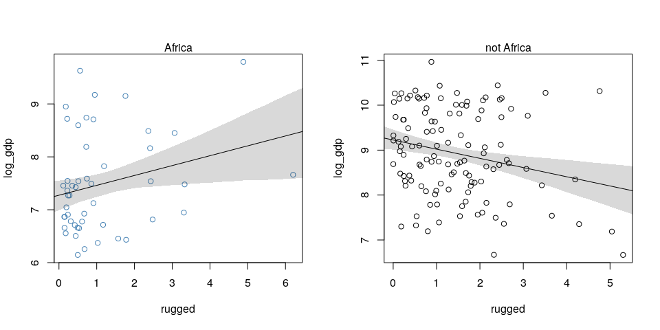
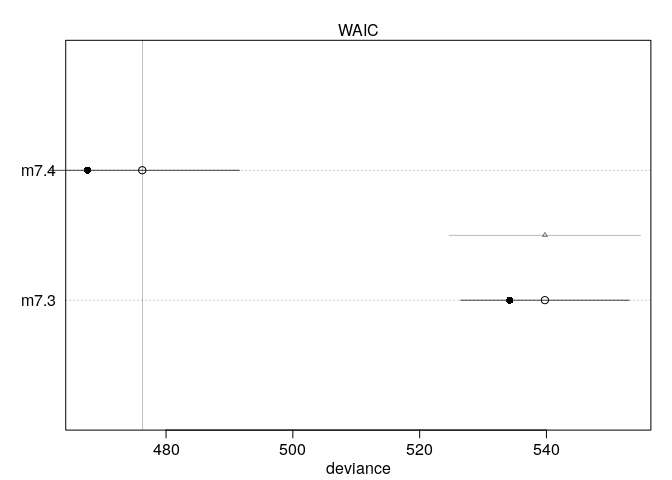
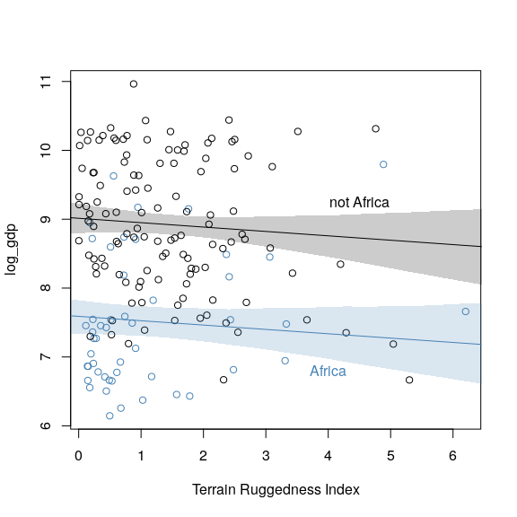
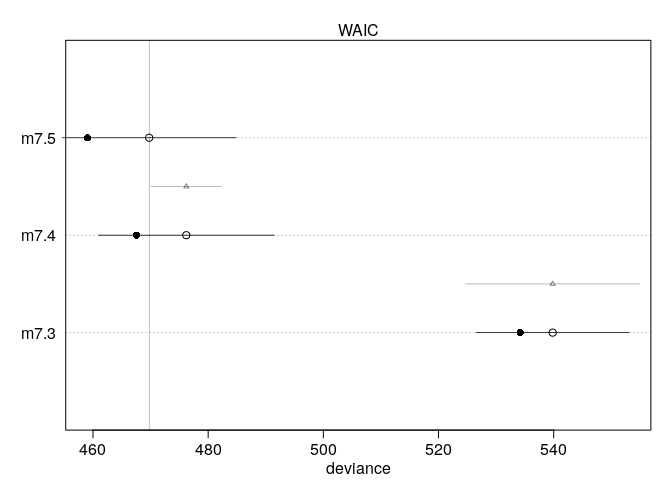
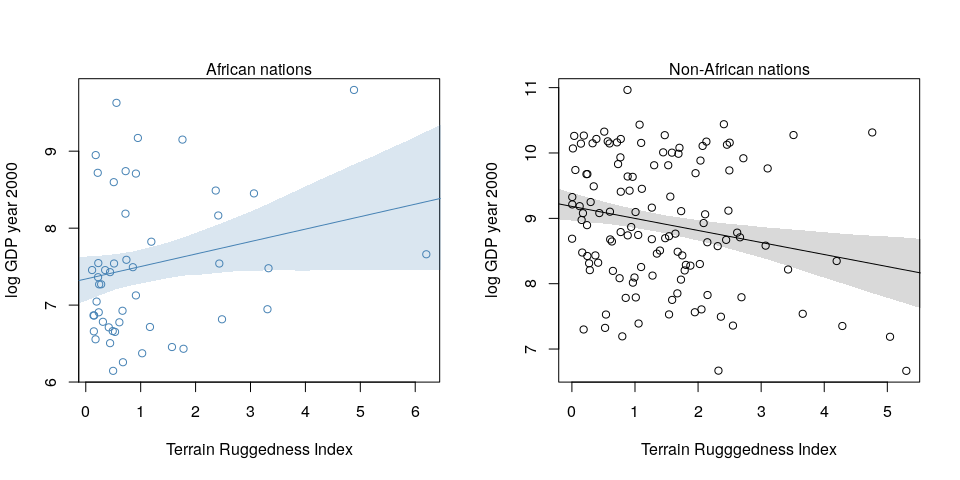
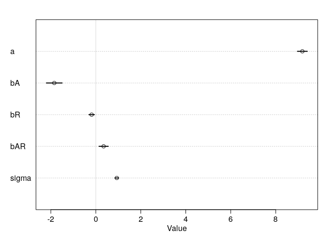
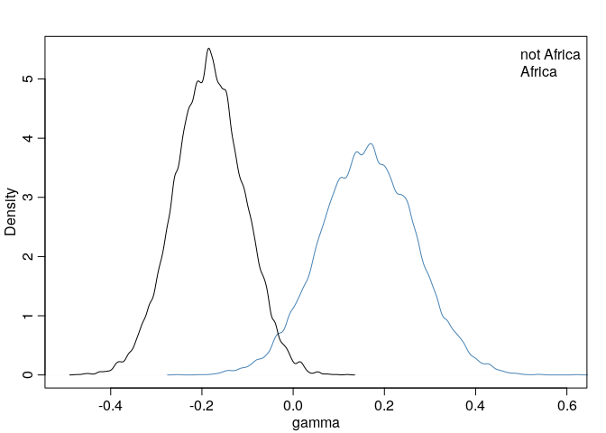

Chapter 7
================
Corrie
August 14, 2018

Chapter 7 - Building an interaction
-----------------------------------

``` r
library(rethinking)
data(rugged)
d <- rugged
```

How does terrain ruggedness influence the GDP?

``` r
# make log version of outcome
d$log_gdp <- log(d$rgdppc_2000)

dd <- d[ complete.cases(d$rgdppc_2000), ]

# split into Africa andnot-Africa
d.A1 <- dd[ dd$cont_africa == 1, ]
d.A0 <- dd[ dd$cont_africa == 0, ]
```

Make two model: one for Africa, one for non-Africa:

``` r
# Africa
m7.1 <- map(
  alist(
    log_gdp ~ dnorm( mu, sigma) ,
    mu <- a + bR*rugged ,
    a ~ dnorm(8, 100),
    bR ~ dnorm( 0, 1 ),
    sigma ~ dunif( 0, 10 )
  ), data=d.A1
)

# non-Africa
m7.2 <- map(
  alist(
    log_gdp ~ dnorm( mu, sigma ),
    mu <- a + bR*rugged ,
    a ~ dnorm( 8, 100),
    bR ~ dnorm( 0, 1),
    sigma ~ dunif( 0, 10 )
  ), data=d.A0
)
```

Make some plots:

``` r
rug.seq <- seq(from=-1, to=8, length.out = 30)
africa.mu <- link( m7.1, data=data.frame(rugged=rug.seq) )
```

    ## [ 100 / 1000 ]
    [ 200 / 1000 ]
    [ 300 / 1000 ]
    [ 400 / 1000 ]
    [ 500 / 1000 ]
    [ 600 / 1000 ]
    [ 700 / 1000 ]
    [ 800 / 1000 ]
    [ 900 / 1000 ]
    [ 1000 / 1000 ]

``` r
africa.mu.mean <- apply(africa.mu, 2, mean)
africa.mu.PI <- apply(africa.mu, 2, PI)

non.africa.mu <- link( m7.2, data=data.frame(rugged=rug.seq))
```

    ## [ 100 / 1000 ]
    [ 200 / 1000 ]
    [ 300 / 1000 ]
    [ 400 / 1000 ]
    [ 500 / 1000 ]
    [ 600 / 1000 ]
    [ 700 / 1000 ]
    [ 800 / 1000 ]
    [ 900 / 1000 ]
    [ 1000 / 1000 ]

``` r
non.africa.mu.mean <- apply(non.africa.mu, 2, mean)
non.africa.mu.PI <- apply(non.africa.mu, 2, PI)

par(mfrow=c(1,2))
plot( log_gdp ~ rugged, data=d.A1, col="steelblue")
lines(rug.seq, africa.mu.mean)
shade(africa.mu.PI, rug.seq)
mtext("Africa")

plot( log_gdp ~ rugged, data=d.A0, col="black")
lines(rug.seq, non.africa.mu.mean)
shade(non.africa.mu.PI, rug.seq)
mtext("not Africa")
```



Ruggedness seems to have different influence for countries outside and inside Africa, the slope is actually reversed! How can we capture the reversed slopes in a single model using all data?

A simple regression on all the data:

``` r
m7.3 <- map(
  alist(
    log_gdp ~ dnorm( mu, sigma),
    mu <- a + bR*rugged,
    a ~ dnorm( 8, 100),
    bR ~ dnorm(0, 1) ,
    sigma ~ dunif( 0, 10)
  ), data=dd
)
```

A regression with a dummy variable for African nations:

``` r
m7.4 <- map(
  alist(
    log_gdp ~ dnorm( mu, sigma ),
    mu <- a + bR*rugged + bA*cont_africa,
    a ~ dnorm( 8, 100),
    bR ~dnorm( 0, 1),
    bA ~ dnorm( 0, 1),
    sigma ~ dunif(0, 19)
  ), data=dd
)
```

Compare the two models:

``` r
compare( m7.3, m7.4)
```

    ##       WAIC pWAIC dWAIC weight    SE  dSE
    ## m7.4 476.5   4.5   0.0      1 15.36   NA
    ## m7.3 539.4   2.6  62.9      0 13.29 15.2

``` r
plot( compare( m7.3, m7.4 ))
```



The model with the dummy-variable does perform better than without. Let's plot the dummy-variable model.

``` r
# mu, fixing cont_africa=0
mu.NotAfrica <- link( m7.4, data=data.frame(rugged=rug.seq, cont_africa=0 ) )
```

    ## [ 100 / 1000 ]
    [ 200 / 1000 ]
    [ 300 / 1000 ]
    [ 400 / 1000 ]
    [ 500 / 1000 ]
    [ 600 / 1000 ]
    [ 700 / 1000 ]
    [ 800 / 1000 ]
    [ 900 / 1000 ]
    [ 1000 / 1000 ]

``` r
mu.NotAfrica.mean <- apply(mu.NotAfrica, 2, mean )
mu.NotAfrica.PI <- apply(mu.NotAfrica, 2, PI)

# mu, fixing cont_africa=1
mu.Africa <- link( m7.4, data=data.frame(rugged=rug.seq, cont_africa=1 ) )
```

    ## [ 100 / 1000 ]
    [ 200 / 1000 ]
    [ 300 / 1000 ]
    [ 400 / 1000 ]
    [ 500 / 1000 ]
    [ 600 / 1000 ]
    [ 700 / 1000 ]
    [ 800 / 1000 ]
    [ 900 / 1000 ]
    [ 1000 / 1000 ]

``` r
mu.Africa.mean <- apply( mu.Africa, 2, mean )
mu.Africa.PI <- apply( mu.Africa, 2, PI )

plot( log_gdp ~ rugged, data=d.A1, col="steelblue", 
      xlab="Terrain Ruggedness Index")
points( log_gdp ~ rugged, data=d.A0, col="black")

lines(rug.seq, mu.Africa.mean, col="steelblue")
shade(mu.Africa.PI, rug.seq, col=col.alpha("steelblue"))
text(4, 6.8, "Africa")

lines(rug.seq, mu.NotAfrica.mean, col="black")
shade(mu.NotAfrica.PI, rug.seq, col=col.alpha("black"))
text(4.5, 9.25, "not Africa")
```



The dummy-variable has only moved the intercept.

### Adding an interaction

``` r
m7.5 <- map(
  alist(
    log_gdp ~ dnorm(mu, sigma),
    mu <- a + gamma*rugged + bA*cont_africa,
    gamma <-bR + bAR*cont_africa,
    a ~ dnorm( 8, 100),
    bA ~ dnorm(0, 1),
    bR ~ dnorm(0, 1),
    bAR ~ dnorm( 0, 1),
    sigma ~ dunif( 0, 10)
  ), data=dd
)

compare( m7.3, m7.4, m7.5 )
```

    ##       WAIC pWAIC dWAIC weight    SE   dSE
    ## m7.5 469.7   5.3   0.0   0.97 15.10    NA
    ## m7.4 476.5   4.5   6.8   0.03 15.33  6.11
    ## m7.3 539.8   2.8  70.1   0.00 13.29 15.14

``` r
plot( compare( m7.3, m7.4, m7.5))
```



The interaction model performs better than the other two, though it only performs slightly better than the dummy variable: Since there are few countries in Africa, the data are sparse.

### Plotting interactions

``` r
mu.Africa <- link( m7.5, data=data.frame(cont_africa=1, rugged=rug.seq))
```

    ## [ 100 / 1000 ]
    [ 200 / 1000 ]
    [ 300 / 1000 ]
    [ 400 / 1000 ]
    [ 500 / 1000 ]
    [ 600 / 1000 ]
    [ 700 / 1000 ]
    [ 800 / 1000 ]
    [ 900 / 1000 ]
    [ 1000 / 1000 ]

``` r
mu.Africa.mean <- apply(mu.Africa, 2, mean)
mu.Africa.PI <- apply(mu.Africa, 2, PI)

mu.NotAfrica <- link( m7.5, data=data.frame(cont_africa=0, rugged=rug.seq))
```

    ## [ 100 / 1000 ]
    [ 200 / 1000 ]
    [ 300 / 1000 ]
    [ 400 / 1000 ]
    [ 500 / 1000 ]
    [ 600 / 1000 ]
    [ 700 / 1000 ]
    [ 800 / 1000 ]
    [ 900 / 1000 ]
    [ 1000 / 1000 ]

``` r
mu.NotAfrica.mean <- apply(mu.NotAfrica, 2, mean)
mu.NotAfrica.PI <- apply(mu.NotAfrica, 2, PI )

par(mfrow=c(1,2))
plot( log_gdp ~ rugged, data=d.A1,
      col="steelblue", ylab="log GDP year 2000",
      xlab="Terrain Ruggedness Index")
mtext("African nations")
lines(rug.seq, mu.Africa.mean, col="steelblue")
shade( mu.Africa.PI, rug.seq, col=col.alpha("steelblue"))

plot( log_gdp ~ rugged, data=d.A0,
      col="black", ylab="log GDP year 2000",
      xlab="Terrain Rugggedness Index")
mtext( "Non-African nations", 3)
lines( rug.seq, mu.NotAfrica.mean )
shade( mu.NotAfrica.PI, rug.seq )
```



The slope reverses!

``` r
plot( precis(m7.5) )
```



Gamma wasn't estimated, we have to compute it ourselves.

``` r
post <- extract.samples( m7.5 )
gamma.Africa <- post$bR + post$bAR*1
gamma.notAfrica <- post$bR + post$bAR*0

mean( gamma.Africa )
```

    ## [1] 0.1635428

``` r
mean( gamma.notAfrica )
```

    ## [1] -0.1844048

How do the distributions compare?

``` r
dens( gamma.Africa, xlim=c(-0.5, 0.6), ylim=c(0, 5.5),
      xlab="gamma", col="steelblue" )
dens( gamma.notAfrica, add=TRUE )
legend("topright", col=c("black", "steelblue"), bty="n", legend=c("not Africa", "Africa"))
```



``` r
diff <- gamma.Africa - gamma.notAfrica
sum( diff < 0 ) / length( diff )
```

    ## [1] 0.0034

So there is a very low probability that the African slope is less than the Non-African slope.
