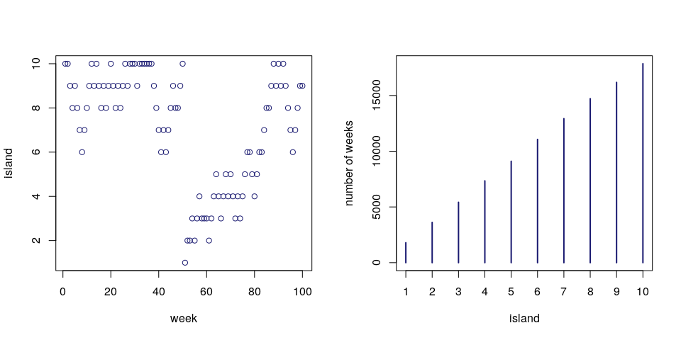
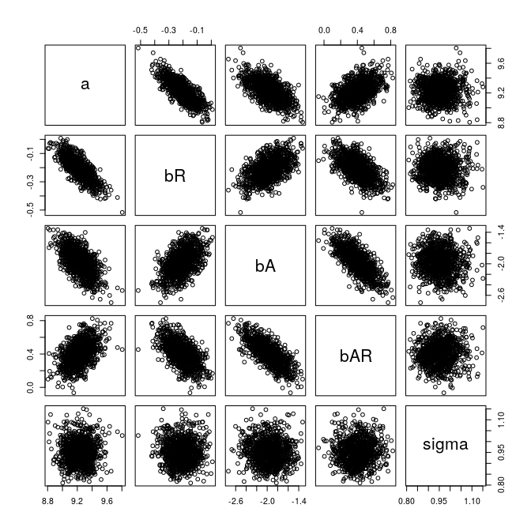
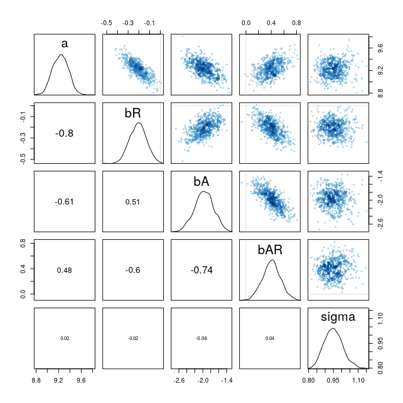
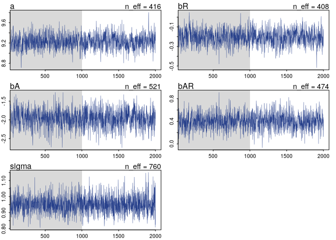
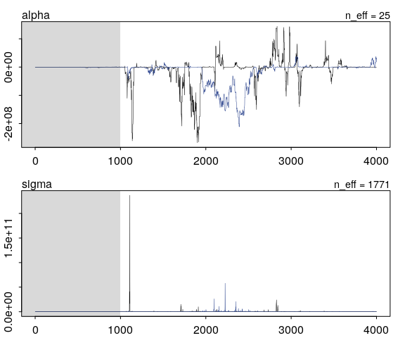
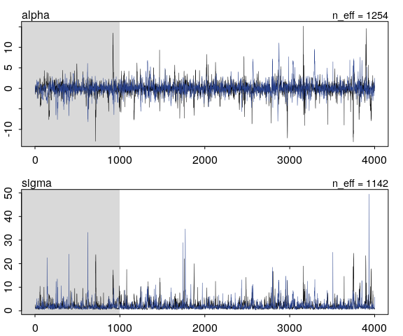
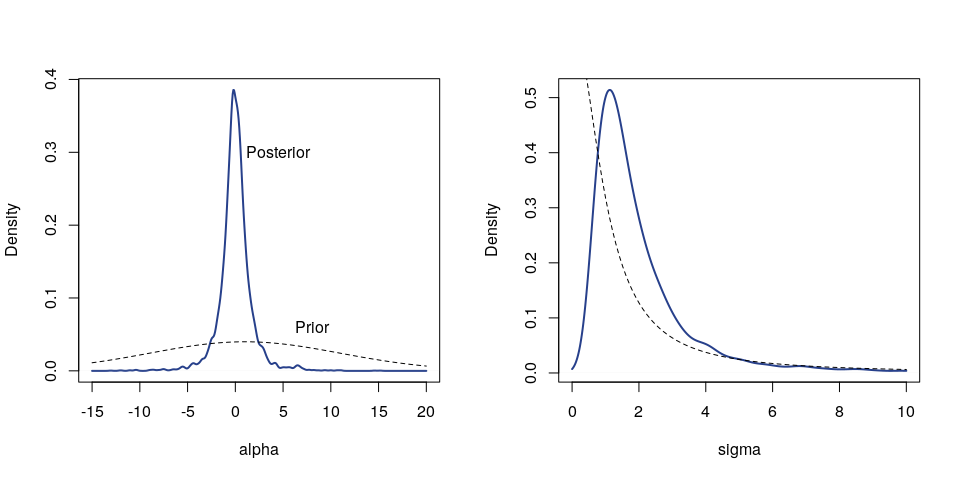
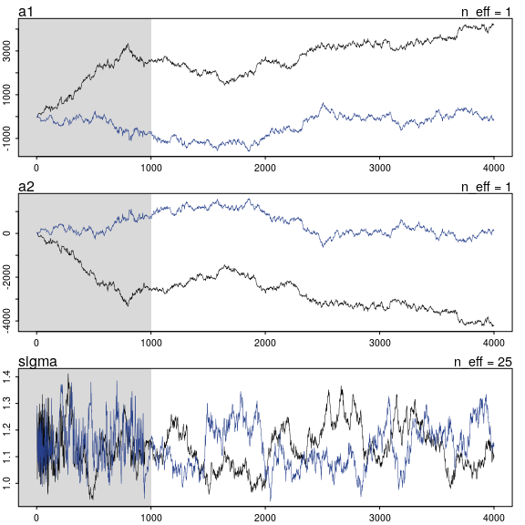
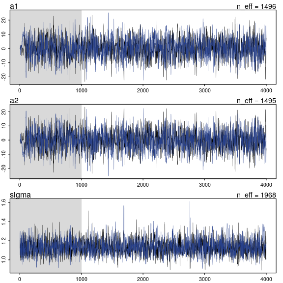
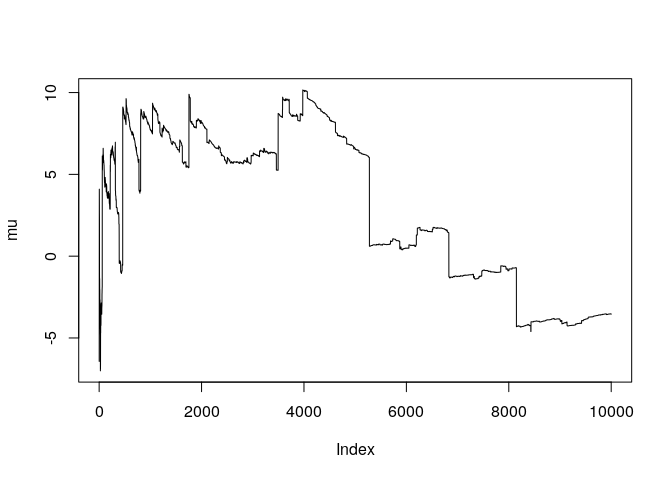

Markov Chain Monte Carlo
================
Corrie
September 4, 2018

8.1 King Markov and His island kingdom
--------------------------------------

A simple example of the Markov Chain Monte Carlo algorithm:

``` r
num_weeks <- 1e5
positions <- rep(0, num_weeks)
current <- 10
for (i in 1:num_weeks) {
  # record current position
  positions[i] <- current
  
  # flip coin to generate proposal
  proposal <- current + sample( c(-1, 1), size=1)
  if ( proposal < 1 ) proposal <- 10
  if ( proposal > 10 ) proposal <- 1
  
  # move?
  prob_move <- proposal / current
  current <- ifelse( runif(1) < prob_move , proposal, current)
}
```

``` r
par(mfrow=c(1,2))
plot( (1:100), positions[1:100], xlab="week", ylab="island", col="midnightblue")
plot(table(positions), col="midnightblue", xlab="island", ylab="number of weeks")
```



8.3 Easy HMC: `map2stan`
------------------------

Using the terrain ruggedness data from Chapter 7:

``` r
library(rethinking)
data(rugged)
d <- rugged
d$log_gdp <- log(d$rgdppc_2000)
dd <- d[ complete.cases(d$rgdppc_2000), ]
```

Fitting the old way using `map`:

``` r
m8.1 <- map(
  alist(
    log_gdp ~ dnorm( mu, sigma ),
    mu <- a + bR*rugged + bA*cont_africa + bAR*rugged*cont_africa ,
    a ~ dnorm( 0, 100),
    bR ~ dnorm(0, 10),
    bA ~ dnorm(0 , 10),
    bAR ~ dnorm(0, 10),
    sigma ~ dunif(0, 10)
  ),
  data = dd
)
precis(m8.1)
```

    ##        Mean StdDev  5.5% 94.5%
    ## a      9.22   0.14  9.00  9.44
    ## bR    -0.20   0.08 -0.33 -0.08
    ## bA    -1.95   0.22 -2.31 -1.59
    ## bAR    0.39   0.13  0.19  0.60
    ## sigma  0.93   0.05  0.85  1.01

To use Stan, we should do some preprocessing. In particular, preprocess all variable transformations and make a trimmed data frame, only containing the variables used in the model.

``` r
dd.trim <- dd[ , c("log_gdp", "rugged", "cont_africa")]
str(dd.trim)
```

    ## 'data.frame':    170 obs. of  3 variables:
    ##  $ log_gdp    : num  7.49 8.22 9.93 9.41 7.79 ...
    ##  $ rugged     : num  0.858 3.427 0.769 0.775 2.688 ...
    ##  $ cont_africa: int  1 0 0 0 0 0 0 0 0 1 ...

Using Stan:

``` r
m8.1stan <- map2stan(
  alist(
    log_gdp ~ dnorm( mu, sigma) ,
    mu <- a + bR*rugged + bA*cont_africa + bAR*rugged*cont_africa,
    a ~ dnorm(0, 100),
    bR ~ dnorm(0, 10),
    bA ~ dnorm(0, 10),
    bAR ~ dnorm(0, 10),
    sigma ~ dcauchy(0, 2)
  ), 
  data=dd.trim,
  start=list(a=5, bR=0, bA=0, bAR=0, sigma=1)
)
```

    ## 
    ## SAMPLING FOR MODEL 'log_gdp ~ dnorm(mu, sigma)' NOW (CHAIN 1).
    ## 
    ## Gradient evaluation took 4.2e-05 seconds
    ## 1000 transitions using 10 leapfrog steps per transition would take 0.42 seconds.
    ## Adjust your expectations accordingly!
    ## 
    ## 
    ## Iteration:    1 / 2000 [  0%]  (Warmup)
    ## Iteration:  200 / 2000 [ 10%]  (Warmup)
    ## Iteration:  400 / 2000 [ 20%]  (Warmup)
    ## Iteration:  600 / 2000 [ 30%]  (Warmup)
    ## Iteration:  800 / 2000 [ 40%]  (Warmup)
    ## Iteration: 1000 / 2000 [ 50%]  (Warmup)
    ## Iteration: 1001 / 2000 [ 50%]  (Sampling)
    ## Iteration: 1200 / 2000 [ 60%]  (Sampling)
    ## Iteration: 1400 / 2000 [ 70%]  (Sampling)
    ## Iteration: 1600 / 2000 [ 80%]  (Sampling)
    ## Iteration: 1800 / 2000 [ 90%]  (Sampling)
    ## Iteration: 2000 / 2000 [100%]  (Sampling)
    ## 
    ##  Elapsed Time: 0.281279 seconds (Warm-up)
    ##                0.272134 seconds (Sampling)
    ##                0.553413 seconds (Total)
    ## 
    ## 
    ## SAMPLING FOR MODEL 'log_gdp ~ dnorm(mu, sigma)' NOW (CHAIN 1).
    ## 
    ## Gradient evaluation took 2.5e-05 seconds
    ## 1000 transitions using 10 leapfrog steps per transition would take 0.25 seconds.
    ## Adjust your expectations accordingly!
    ## 
    ## 
    ## WARNING: No variance estimation is
    ##          performed for num_warmup < 20
    ## 
    ## Iteration: 1 / 1 [100%]  (Sampling)
    ## 
    ##  Elapsed Time: 0 seconds (Warm-up)
    ##                6.1e-05 seconds (Sampling)
    ##                6.1e-05 seconds (Total)

    ## Warning: There were 1 divergent transitions after warmup. Increasing adapt_delta above 0.8 may help. See
    ## http://mc-stan.org/misc/warnings.html#divergent-transitions-after-warmup

    ## Warning: Examine the pairs() plot to diagnose sampling problems

    ## Computing WAIC

    ## Constructing posterior predictions

    ## [ 100 / 1000 ]
    [ 200 / 1000 ]
    [ 300 / 1000 ]
    [ 400 / 1000 ]
    [ 500 / 1000 ]
    [ 600 / 1000 ]
    [ 700 / 1000 ]
    [ 800 / 1000 ]
    [ 900 / 1000 ]
    [ 1000 / 1000 ]

``` r
precis(m8.1stan)
```

    ##        Mean StdDev lower 0.89 upper 0.89 n_eff Rhat
    ## a      9.23   0.14       9.00       9.43   416    1
    ## bR    -0.21   0.08      -0.33      -0.08   408    1
    ## bA    -1.97   0.24      -2.35      -1.59   521    1
    ## bAR    0.40   0.14       0.17       0.62   474    1
    ## sigma  0.95   0.06       0.86       1.03   760    1

It is possible to draw more samples from the stan model, also using more chains:

``` r
m8.1stan_4chains <- map2stan( m8.1stan, chains=4, cores=4)
```

    ## 
    ## SAMPLING FOR MODEL 'log_gdp ~ dnorm(mu, sigma)' NOW (CHAIN 1).
    ## 
    ## Gradient evaluation took 3.4e-05 seconds
    ## 1000 transitions using 10 leapfrog steps per transition would take 0.34 seconds.
    ## Adjust your expectations accordingly!
    ## 
    ## 
    ## WARNING: No variance estimation is
    ##          performed for num_warmup < 20
    ## 
    ## Iteration: 1 / 1 [100%]  (Sampling)
    ## 
    ##  Elapsed Time: 1e-06 seconds (Warm-up)
    ##                5.4e-05 seconds (Sampling)
    ##                5.5e-05 seconds (Total)

    ## Warning: There were 1 divergent transitions after warmup. Increasing adapt_delta above 0.8 may help. See
    ## http://mc-stan.org/misc/warnings.html#divergent-transitions-after-warmup

    ## Warning: Examine the pairs() plot to diagnose sampling problems

    ## Computing WAIC

    ## Constructing posterior predictions

    ## [ 400 / 4000 ]
    [ 800 / 4000 ]
    [ 1200 / 4000 ]
    [ 1600 / 4000 ]
    [ 2000 / 4000 ]
    [ 2400 / 4000 ]
    [ 2800 / 4000 ]
    [ 3200 / 4000 ]
    [ 3600 / 4000 ]
    [ 4000 / 4000 ]

``` r
precis(m8.1stan_4chains)
```

    ##        Mean StdDev lower 0.89 upper 0.89 n_eff Rhat
    ## a      9.22   0.14       9.00       9.44  1842    1
    ## bR    -0.20   0.08      -0.33      -0.09  1861    1
    ## bA    -1.94   0.23      -2.29      -1.57  1852    1
    ## bAR    0.39   0.13       0.19       0.61  2004    1
    ## sigma  0.95   0.05       0.87       1.04  2774    1

To visualize the results, you can plot the samples. To pull out samples, use

``` r
post <- extract.samples( m8.1stan )
str(post)
```

    ## List of 5
    ##  $ a    : num [1:1000(1d)] 9.12 8.88 9.45 9.43 9.2 ...
    ##  $ bR   : num [1:1000(1d)] -0.1544 -0.0302 -0.2736 -0.2696 -0.2287 ...
    ##  $ bA   : num [1:1000(1d)] -2.03 -1.35 -2.29 -2.16 -2.12 ...
    ##  $ bAR  : num [1:1000(1d)] 0.443 0.159 0.469 0.454 0.465 ...
    ##  $ sigma: num [1:1000(1d)] 0.897 0.898 1.009 0.974 0.997 ...

``` r
pairs(post)
```



A prettier plot is also available, directly on the stan model:

``` r
pairs( m8.1stan )
```



By default, `map2stan` computes DIC and WAIC. We can extract them with

``` r
DIC(m8.1stan)
```

    ## [1] 469.1977
    ## attr(,"pD")
    ## [1] 5.156756

and

``` r
WAIC(m8.1stan)
```

    ## [1] 469.6209
    ## attr(,"lppd")
    ## [1] -229.6164
    ## attr(,"pWAIC")
    ## [1] 5.194078
    ## attr(,"se")
    ## [1] 14.84488

Alternatively, it is also displayed in the default `show` output:

``` r
show(m8.1stan)
```

    ## map2stan model fit
    ## 1000 samples from 1 chain
    ## 
    ## Formula:
    ## log_gdp ~ dnorm(mu, sigma)
    ## mu <- a + bR * rugged + bA * cont_africa + bAR * rugged * cont_africa
    ## a ~ dnorm(0, 100)
    ## bR ~ dnorm(0, 10)
    ## bA ~ dnorm(0, 10)
    ## bAR ~ dnorm(0, 10)
    ## sigma ~ dcauchy(0, 2)
    ## 
    ## Log-likelihood at expected values: -229.44 
    ## Deviance: 458.88 
    ## DIC: 469.2 
    ## Effective number of parameters (pD): 5.16 
    ## 
    ## WAIC (SE): 469.62 (14.8)
    ## pWAIC: 5.19

To get the trace plots of the Markov Chain:

``` r
plot( m8.1stan, window=c(100,2000), col="royalblue4", n_cols=2)
```



To get a glimpse at the raw stan code, we can use `stancode()`

``` r
stancode(m8.1stan)
```

    ## data{
    ##     int<lower=1> N;
    ##     real log_gdp[N];
    ##     real rugged[N];
    ##     int cont_africa[N];
    ## }
    ## parameters{
    ##     real a;
    ##     real bR;
    ##     real bA;
    ##     real bAR;
    ##     real<lower=0> sigma;
    ## }
    ## model{
    ##     vector[N] mu;
    ##     sigma ~ cauchy( 0 , 2 );
    ##     bAR ~ normal( 0 , 10 );
    ##     bA ~ normal( 0 , 10 );
    ##     bR ~ normal( 0 , 10 );
    ##     a ~ normal( 0 , 100 );
    ##     for ( i in 1:N ) {
    ##         mu[i] = a + bR * rugged[i] + bA * cont_africa[i] + bAR * rugged[i] * cont_africa[i];
    ##     }
    ##     log_gdp ~ normal( mu , sigma );
    ## }
    ## generated quantities{
    ##     vector[N] mu;
    ##     real dev;
    ##     dev = 0;
    ##     for ( i in 1:N ) {
    ##         mu[i] = a + bR * rugged[i] + bA * cont_africa[i] + bAR * rugged[i] * cont_africa[i];
    ##     }
    ##     dev = dev + (-2)*normal_lpdf( log_gdp | mu , sigma );
    ## }

8.4 Care and feeding of your Markov chain
-----------------------------------------

Example of non-convergent chain:

``` r
y <- c(-1, 1)
m8.2 <- map2stan(
  alist(
    y ~ dnorm( mu, sigma),
    mu <- alpha
  ),
  data=list(y=y), start=list(alpha=0, sigma=1),
  chains=2, iter=4000, warmup=1000
)
```

    ## 
    ## SAMPLING FOR MODEL 'y ~ dnorm(mu, sigma)' NOW (CHAIN 1).
    ## 
    ## Gradient evaluation took 4e-06 seconds
    ## 1000 transitions using 10 leapfrog steps per transition would take 0.04 seconds.
    ## Adjust your expectations accordingly!
    ## 
    ## 
    ## Iteration:    1 / 4000 [  0%]  (Warmup)
    ## Iteration:  400 / 4000 [ 10%]  (Warmup)
    ## Iteration:  800 / 4000 [ 20%]  (Warmup)
    ## Iteration: 1001 / 4000 [ 25%]  (Sampling)
    ## Iteration: 1400 / 4000 [ 35%]  (Sampling)
    ## Iteration: 1800 / 4000 [ 45%]  (Sampling)
    ## Iteration: 2200 / 4000 [ 55%]  (Sampling)
    ## Iteration: 2600 / 4000 [ 65%]  (Sampling)
    ## Iteration: 3000 / 4000 [ 75%]  (Sampling)
    ## Iteration: 3400 / 4000 [ 85%]  (Sampling)
    ## Iteration: 3800 / 4000 [ 95%]  (Sampling)
    ## Iteration: 4000 / 4000 [100%]  (Sampling)
    ## 
    ##  Elapsed Time: 0.043752 seconds (Warm-up)
    ##                0.530917 seconds (Sampling)
    ##                0.574669 seconds (Total)
    ## 
    ## 
    ## SAMPLING FOR MODEL 'y ~ dnorm(mu, sigma)' NOW (CHAIN 2).
    ## 
    ## Gradient evaluation took 3e-06 seconds
    ## 1000 transitions using 10 leapfrog steps per transition would take 0.03 seconds.
    ## Adjust your expectations accordingly!
    ## 
    ## 
    ## Iteration:    1 / 4000 [  0%]  (Warmup)
    ## Iteration:  400 / 4000 [ 10%]  (Warmup)
    ## Iteration:  800 / 4000 [ 20%]  (Warmup)
    ## Iteration: 1001 / 4000 [ 25%]  (Sampling)
    ## Iteration: 1400 / 4000 [ 35%]  (Sampling)
    ## Iteration: 1800 / 4000 [ 45%]  (Sampling)
    ## Iteration: 2200 / 4000 [ 55%]  (Sampling)
    ## Iteration: 2600 / 4000 [ 65%]  (Sampling)
    ## Iteration: 3000 / 4000 [ 75%]  (Sampling)
    ## Iteration: 3400 / 4000 [ 85%]  (Sampling)
    ## Iteration: 3800 / 4000 [ 95%]  (Sampling)
    ## Iteration: 4000 / 4000 [100%]  (Sampling)
    ## 
    ##  Elapsed Time: 0.087006 seconds (Warm-up)
    ##                0.730778 seconds (Sampling)
    ##                0.817784 seconds (Total)

    ## Warning: There were 190 divergent transitions after warmup. Increasing adapt_delta above 0.8 may help. See
    ## http://mc-stan.org/misc/warnings.html#divergent-transitions-after-warmup

    ## Warning: There were 517 transitions after warmup that exceeded the maximum treedepth. Increase max_treedepth above 10. See
    ## http://mc-stan.org/misc/warnings.html#maximum-treedepth-exceeded

    ## Warning: There were 2 chains where the estimated Bayesian Fraction of Missing Information was low. See
    ## http://mc-stan.org/misc/warnings.html#bfmi-low

    ## Warning: Examine the pairs() plot to diagnose sampling problems

    ## 
    ## SAMPLING FOR MODEL 'y ~ dnorm(mu, sigma)' NOW (CHAIN 1).
    ## 
    ## Gradient evaluation took 3e-06 seconds
    ## 1000 transitions using 10 leapfrog steps per transition would take 0.03 seconds.
    ## Adjust your expectations accordingly!
    ## 
    ## 
    ## WARNING: No variance estimation is
    ##          performed for num_warmup < 20
    ## 
    ## Iteration: 1 / 1 [100%]  (Sampling)
    ## 
    ##  Elapsed Time: 1e-06 seconds (Warm-up)
    ##                1.6e-05 seconds (Sampling)
    ##                1.7e-05 seconds (Total)

    ## Computing WAIC

    ## Constructing posterior predictions

    ## [ 600 / 6000 ]
    [ 1200 / 6000 ]
    [ 1800 / 6000 ]
    [ 2400 / 6000 ]
    [ 3000 / 6000 ]
    [ 3600 / 6000 ]
    [ 4200 / 6000 ]
    [ 4800 / 6000 ]
    [ 5400 / 6000 ]
    [ 6000 / 6000 ]

    ## Warning in map2stan(alist(y ~ dnorm(mu, sigma), mu <- alpha), data = list(y = y), : There were 190 divergent iterations during sampling.
    ## Check the chains (trace plots, n_eff, Rhat) carefully to ensure they are valid.

There are quite a few warnings on divergencies. Let's have a look at the estimates:

``` r
precis(m8.2)
```

    ## Warning in precis(m8.2): There were 190 divergent iterations during sampling.
    ## Check the chains (trace plots, n_eff, Rhat) carefully to ensure they are valid.

    ##            Mean     StdDev   lower 0.89 upper 0.89 n_eff Rhat
    ## alpha -14918610   45488810 -79876626.25   40109163    25  1.1
    ## sigma 226946981 3562046858      6040.97  199672504  1771  1.0

This doesn't look right: The estimates are a very far way out there, the effective number of samples is relatively low and `Rhat` is above 1. While `Rhat` in my case is only around 1.01, even such a value is already suspicious. Let's have a look at the trace plots.

``` r
plot(m8.2, col=c("black", "royalblue4"), n_cols=1)
```



The problem: The priors are very flat which means that even values of 500 millions are plausible values. We can fix this by adding a weakly informative prior:

``` r
m8.3 <- map2stan(
  alist(
    y ~ dnorm( mu, sigma),
    mu <- alpha,
    alpha ~ dnorm(1, 10),
    sigma ~ dcauchy( 0, 1)
  ),
  data=list(y=y), start=list(alpha=0, sigma=1),
  chains=2, iter=4000, warmup=1000
)
```

    ## 
    ## SAMPLING FOR MODEL 'y ~ dnorm(mu, sigma)' NOW (CHAIN 1).
    ## 
    ## Gradient evaluation took 1.3e-05 seconds
    ## 1000 transitions using 10 leapfrog steps per transition would take 0.13 seconds.
    ## Adjust your expectations accordingly!
    ## 
    ## 
    ## Iteration:    1 / 4000 [  0%]  (Warmup)
    ## Iteration:  400 / 4000 [ 10%]  (Warmup)
    ## Iteration:  800 / 4000 [ 20%]  (Warmup)
    ## Iteration: 1001 / 4000 [ 25%]  (Sampling)
    ## Iteration: 1400 / 4000 [ 35%]  (Sampling)
    ## Iteration: 1800 / 4000 [ 45%]  (Sampling)
    ## Iteration: 2200 / 4000 [ 55%]  (Sampling)
    ## Iteration: 2600 / 4000 [ 65%]  (Sampling)
    ## Iteration: 3000 / 4000 [ 75%]  (Sampling)
    ## Iteration: 3400 / 4000 [ 85%]  (Sampling)
    ## Iteration: 3800 / 4000 [ 95%]  (Sampling)
    ## Iteration: 4000 / 4000 [100%]  (Sampling)
    ## 
    ##  Elapsed Time: 0.014807 seconds (Warm-up)
    ##                0.040731 seconds (Sampling)
    ##                0.055538 seconds (Total)
    ## 
    ## 
    ## SAMPLING FOR MODEL 'y ~ dnorm(mu, sigma)' NOW (CHAIN 2).
    ## 
    ## Gradient evaluation took 3e-06 seconds
    ## 1000 transitions using 10 leapfrog steps per transition would take 0.03 seconds.
    ## Adjust your expectations accordingly!
    ## 
    ## 
    ## Iteration:    1 / 4000 [  0%]  (Warmup)
    ## Iteration:  400 / 4000 [ 10%]  (Warmup)
    ## Iteration:  800 / 4000 [ 20%]  (Warmup)
    ## Iteration: 1001 / 4000 [ 25%]  (Sampling)
    ## Iteration: 1400 / 4000 [ 35%]  (Sampling)
    ## Iteration: 1800 / 4000 [ 45%]  (Sampling)
    ## Iteration: 2200 / 4000 [ 55%]  (Sampling)
    ## Iteration: 2600 / 4000 [ 65%]  (Sampling)
    ## Iteration: 3000 / 4000 [ 75%]  (Sampling)
    ## Iteration: 3400 / 4000 [ 85%]  (Sampling)
    ## Iteration: 3800 / 4000 [ 95%]  (Sampling)
    ## Iteration: 4000 / 4000 [100%]  (Sampling)
    ## 
    ##  Elapsed Time: 0.012045 seconds (Warm-up)
    ##                0.036529 seconds (Sampling)
    ##                0.048574 seconds (Total)
    ## 
    ## 
    ## SAMPLING FOR MODEL 'y ~ dnorm(mu, sigma)' NOW (CHAIN 1).
    ## 
    ## Gradient evaluation took 4e-06 seconds
    ## 1000 transitions using 10 leapfrog steps per transition would take 0.04 seconds.
    ## Adjust your expectations accordingly!
    ## 
    ## 
    ## WARNING: No variance estimation is
    ##          performed for num_warmup < 20
    ## 
    ## Iteration: 1 / 1 [100%]  (Sampling)
    ## 
    ##  Elapsed Time: 0 seconds (Warm-up)
    ##                1.4e-05 seconds (Sampling)
    ##                1.4e-05 seconds (Total)

    ## Computing WAIC

    ## Constructing posterior predictions

    ## [ 600 / 6000 ]
    [ 1200 / 6000 ]
    [ 1800 / 6000 ]
    [ 2400 / 6000 ]
    [ 3000 / 6000 ]
    [ 3600 / 6000 ]
    [ 4200 / 6000 ]
    [ 4800 / 6000 ]
    [ 5400 / 6000 ]
    [ 6000 / 6000 ]

``` r
precis(m8.3)
```

    ##       Mean StdDev lower 0.89 upper 0.89 n_eff Rhat
    ## alpha 0.02   1.77      -2.54       2.25  1254    1
    ## sigma 2.16   2.22       0.46       3.84  1142    1

The estimates seem much more reasonable and the `Rhat` value is now 1.

``` r
plot(m8.3, col=c("black", "royalblue4"), n_cols=1)
```



The chains also look good now.

If we compare the prior and posterior distribution, even two points can overcome these weakly informative priors and thus lead to better results than flat priors.

``` r
post <- extract.samples(m8.3)
par(mfrow=c(1, 2))
sq <- seq(-15, 20, length.out = 100)
plot( density(post$alpha,  from=-15, to=20, adj=1),
      lwd=2, col="royalblue4", xlab="alpha", 
     main="")
points(sq, dnorm(sq, 1, 10), type="l", lty=2)
text(4.5, 0.3, labels = "Posterior")
text(8, 0.06, labels="Prior")

sq <- seq(0, 10, length.out = 100)
plot( density( post$sigma, from=0, to=10, adj=1.5),
      lwd=2, col="royalblue4", xlab="sigma", 
      main="")
points(sq, 2*dcauchy(sq, 0, 1), type="l", lty=2)
```



### Non-identifiable parameters

We've learned before how highly correlated predictors lead to non-identifiable parameters. Let's have a look how these look inside a Markov chain.

``` r
y <- rnorm( 100, mean=0, sd=1 )
```

We fit the following unidentifiable model:

``` r
m8.4 <- map2stan(
  alist(
    y ~ dnorm( mu, sigma),
    mu <- a1 + a2,
    sigma ~ dcauchy( 0, 1)
  ), 
  data=list(y=y), start=list(a1=0, a2=0, sigma=1),
  chains=2, iter=4000, warmup=1000
)
```

    ## 
    ## SAMPLING FOR MODEL 'y ~ dnorm(mu, sigma)' NOW (CHAIN 1).
    ## 
    ## Gradient evaluation took 8e-06 seconds
    ## 1000 transitions using 10 leapfrog steps per transition would take 0.08 seconds.
    ## Adjust your expectations accordingly!
    ## 
    ## 
    ## Iteration:    1 / 4000 [  0%]  (Warmup)
    ## Iteration:  400 / 4000 [ 10%]  (Warmup)
    ## Iteration:  800 / 4000 [ 20%]  (Warmup)
    ## Iteration: 1001 / 4000 [ 25%]  (Sampling)
    ## Iteration: 1400 / 4000 [ 35%]  (Sampling)
    ## Iteration: 1800 / 4000 [ 45%]  (Sampling)
    ## Iteration: 2200 / 4000 [ 55%]  (Sampling)
    ## Iteration: 2600 / 4000 [ 65%]  (Sampling)
    ## Iteration: 3000 / 4000 [ 75%]  (Sampling)
    ## Iteration: 3400 / 4000 [ 85%]  (Sampling)
    ## Iteration: 3800 / 4000 [ 95%]  (Sampling)
    ## Iteration: 4000 / 4000 [100%]  (Sampling)
    ## 
    ##  Elapsed Time: 2.75859 seconds (Warm-up)
    ##                9.17401 seconds (Sampling)
    ##                11.9326 seconds (Total)
    ## 
    ## 
    ## SAMPLING FOR MODEL 'y ~ dnorm(mu, sigma)' NOW (CHAIN 2).
    ## 
    ## Gradient evaluation took 5e-06 seconds
    ## 1000 transitions using 10 leapfrog steps per transition would take 0.05 seconds.
    ## Adjust your expectations accordingly!
    ## 
    ## 
    ## Iteration:    1 / 4000 [  0%]  (Warmup)
    ## Iteration:  400 / 4000 [ 10%]  (Warmup)
    ## Iteration:  800 / 4000 [ 20%]  (Warmup)
    ## Iteration: 1001 / 4000 [ 25%]  (Sampling)
    ## Iteration: 1400 / 4000 [ 35%]  (Sampling)
    ## Iteration: 1800 / 4000 [ 45%]  (Sampling)
    ## Iteration: 2200 / 4000 [ 55%]  (Sampling)
    ## Iteration: 2600 / 4000 [ 65%]  (Sampling)
    ## Iteration: 3000 / 4000 [ 75%]  (Sampling)
    ## Iteration: 3400 / 4000 [ 85%]  (Sampling)
    ## Iteration: 3800 / 4000 [ 95%]  (Sampling)
    ## Iteration: 4000 / 4000 [100%]  (Sampling)
    ## 
    ##  Elapsed Time: 2.66443 seconds (Warm-up)
    ##                8.63442 seconds (Sampling)
    ##                11.2988 seconds (Total)

    ## Warning: There were 4900 transitions after warmup that exceeded the maximum treedepth. Increase max_treedepth above 10. See
    ## http://mc-stan.org/misc/warnings.html#maximum-treedepth-exceeded

    ## Warning: Examine the pairs() plot to diagnose sampling problems

    ## 
    ## SAMPLING FOR MODEL 'y ~ dnorm(mu, sigma)' NOW (CHAIN 1).
    ## 
    ## Gradient evaluation took 6e-06 seconds
    ## 1000 transitions using 10 leapfrog steps per transition would take 0.06 seconds.
    ## Adjust your expectations accordingly!
    ## 
    ## 
    ## WARNING: No variance estimation is
    ##          performed for num_warmup < 20
    ## 
    ## Iteration: 1 / 1 [100%]  (Sampling)
    ## 
    ##  Elapsed Time: 1e-06 seconds (Warm-up)
    ##                2e-05 seconds (Sampling)
    ##                2.1e-05 seconds (Total)

    ## Computing WAIC

    ## Constructing posterior predictions

    ## [ 600 / 6000 ]
    [ 1200 / 6000 ]
    [ 1800 / 6000 ]
    [ 2400 / 6000 ]
    [ 3000 / 6000 ]
    [ 3600 / 6000 ]
    [ 4200 / 6000 ]
    [ 4800 / 6000 ]
    [ 5400 / 6000 ]
    [ 6000 / 6000 ]

``` r
precis(m8.4)
```

    ##           Mean  StdDev lower 0.89 upper 0.89 n_eff Rhat
    ## a1     1214.73 1803.43   -1269.33    3585.98     1 5.77
    ## a2    -1214.71 1803.43   -3585.96    1269.14     1 5.77
    ## sigma     1.14    0.08       1.01       1.26    25 1.05

These estimates of `a1` and `a2` look suspicious. Also, `n_eff` and `Rhat` have terrible values.

``` r
plot(m8.4, col=c("black", "royalblue4"), n_cols=1)
```



The trace plots also don't look good: The two chains are not mixing and are definitely not stationary. Again, we can use weak priors to solve this problem:

``` r
m8.5 <- map2stan(
  alist(
    y ~ dnorm( mu, sigma),
    mu <- a1 + a2,
    a1 ~ dnorm(0, 10),
    a2 ~ dnorm(0, 10),
    sigma ~ dcauchy(0, 1)
  ),
  data=list(y=y), start=list(a1=0, a2=0, sigma=1),
  chains=2, iter=4000, warmup=1000
)
```

    ## 
    ## SAMPLING FOR MODEL 'y ~ dnorm(mu, sigma)' NOW (CHAIN 1).
    ## 
    ## Gradient evaluation took 1.1e-05 seconds
    ## 1000 transitions using 10 leapfrog steps per transition would take 0.11 seconds.
    ## Adjust your expectations accordingly!
    ## 
    ## 
    ## Iteration:    1 / 4000 [  0%]  (Warmup)
    ## Iteration:  400 / 4000 [ 10%]  (Warmup)
    ## Iteration:  800 / 4000 [ 20%]  (Warmup)
    ## Iteration: 1001 / 4000 [ 25%]  (Sampling)
    ## Iteration: 1400 / 4000 [ 35%]  (Sampling)
    ## Iteration: 1800 / 4000 [ 45%]  (Sampling)
    ## Iteration: 2200 / 4000 [ 55%]  (Sampling)
    ## Iteration: 2600 / 4000 [ 65%]  (Sampling)
    ## Iteration: 3000 / 4000 [ 75%]  (Sampling)
    ## Iteration: 3400 / 4000 [ 85%]  (Sampling)
    ## Iteration: 3800 / 4000 [ 95%]  (Sampling)
    ## Iteration: 4000 / 4000 [100%]  (Sampling)
    ## 
    ##  Elapsed Time: 0.747197 seconds (Warm-up)
    ##                2.54276 seconds (Sampling)
    ##                3.28995 seconds (Total)
    ## 
    ## 
    ## SAMPLING FOR MODEL 'y ~ dnorm(mu, sigma)' NOW (CHAIN 2).
    ## 
    ## Gradient evaluation took 6e-06 seconds
    ## 1000 transitions using 10 leapfrog steps per transition would take 0.06 seconds.
    ## Adjust your expectations accordingly!
    ## 
    ## 
    ## Iteration:    1 / 4000 [  0%]  (Warmup)
    ## Iteration:  400 / 4000 [ 10%]  (Warmup)
    ## Iteration:  800 / 4000 [ 20%]  (Warmup)
    ## Iteration: 1001 / 4000 [ 25%]  (Sampling)
    ## Iteration: 1400 / 4000 [ 35%]  (Sampling)
    ## Iteration: 1800 / 4000 [ 45%]  (Sampling)
    ## Iteration: 2200 / 4000 [ 55%]  (Sampling)
    ## Iteration: 2600 / 4000 [ 65%]  (Sampling)
    ## Iteration: 3000 / 4000 [ 75%]  (Sampling)
    ## Iteration: 3400 / 4000 [ 85%]  (Sampling)
    ## Iteration: 3800 / 4000 [ 95%]  (Sampling)
    ## Iteration: 4000 / 4000 [100%]  (Sampling)
    ## 
    ##  Elapsed Time: 0.684015 seconds (Warm-up)
    ##                2.67554 seconds (Sampling)
    ##                3.35956 seconds (Total)
    ## 
    ## 
    ## SAMPLING FOR MODEL 'y ~ dnorm(mu, sigma)' NOW (CHAIN 1).
    ## 
    ## Gradient evaluation took 6e-06 seconds
    ## 1000 transitions using 10 leapfrog steps per transition would take 0.06 seconds.
    ## Adjust your expectations accordingly!
    ## 
    ## 
    ## WARNING: No variance estimation is
    ##          performed for num_warmup < 20
    ## 
    ## Iteration: 1 / 1 [100%]  (Sampling)
    ## 
    ##  Elapsed Time: 1e-06 seconds (Warm-up)
    ##                2.3e-05 seconds (Sampling)
    ##                2.4e-05 seconds (Total)

    ## Warning: There were 1 divergent transitions after warmup. Increasing adapt_delta above 0.8 may help. See
    ## http://mc-stan.org/misc/warnings.html#divergent-transitions-after-warmup

    ## Warning: Examine the pairs() plot to diagnose sampling problems

    ## Computing WAIC

    ## Constructing posterior predictions

    ## [ 600 / 6000 ]
    [ 1200 / 6000 ]
    [ 1800 / 6000 ]
    [ 2400 / 6000 ]
    [ 3000 / 6000 ]
    [ 3600 / 6000 ]
    [ 4200 / 6000 ]
    [ 4800 / 6000 ]
    [ 5400 / 6000 ]
    [ 6000 / 6000 ]

``` r
precis(m8.5)
```

    ##        Mean StdDev lower 0.89 upper 0.89 n_eff Rhat
    ## a1     0.34   7.02     -10.88      11.45  1496    1
    ## a2    -0.31   7.02     -11.31      11.09  1495    1
    ## sigma  1.13   0.08       1.01       1.26  1968    1

Not only did the model sample much faster, both the estimates and the values for `n_eff` and `Rhat` look much better.

``` r
plot(m8.5, col=c("black", "royalblue4"), n_cols=1)
```



The trace plots as well look very good: stationary and well mixed.

### Overthinking: Cauchy distribution

The Cauchy distribution does not have mean since it has a very thick-tailed distribution. At any moment in a Cauchy sampling process, a very high value can be drawn that overwhelms all of the previous draw and hence the the distribution does not converge to a mean.

``` r
set.seed(13)
y <- rcauchy(1e4, 0, 5)
mu <- sapply(1:length(y), function(i) sum(y[1:i]/i))
plot(mu, type="l")
```


