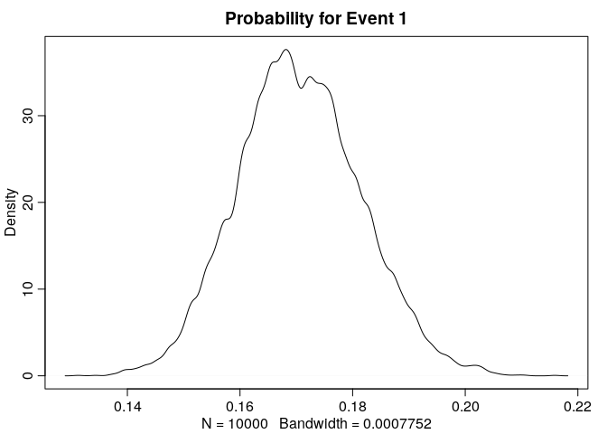
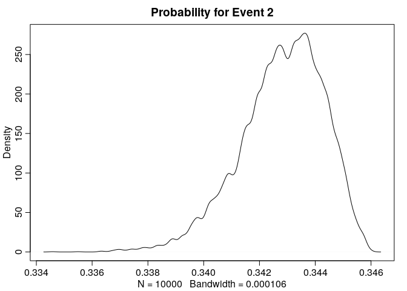
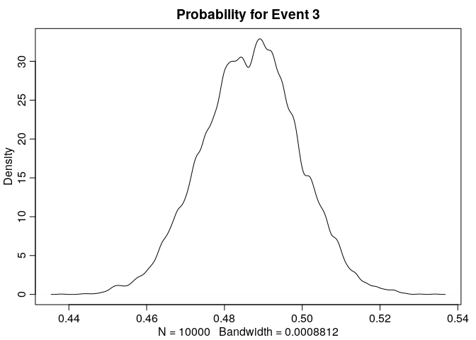

Other count regressions
================
Corrie
November 11, 2018

## Multinomial Regression

A multinomial regression is used when more than two things can happen.
As an example, suppose we are modelling career choices for some young
adults. Let’s assume there are three career choices one can take and
expected income is one of the predictors. One option to model the career
choices would be the explicit multinomial model which uses the
multinomial logit. The multinomial logit uses the multinomial
distribution which is an extension of the binomial distribution to the
case with 
events.

### Explicit Multinomial Model

In the explicit multinomial model we need
 linear models for
 different events. In
our example, we’d thus have two different linear models.

We first simulate the career choices:

``` r
library(rethinking)
set.seed(2405)
N <- 1000                # number of individuals
income <- 1:3           # expected income of each career
score <- 0.5*1:3        # scores for each career, based on income

# convert scores to probabilities
(p <- softmax(score[1], score[2], score[3]) )
```

    [1] 0.1863237 0.3071959 0.5064804

Next, we simulate the career choice an individual made.

``` r
career <- sample(1:3, N, prob=p, replace=TRUE)
```

To fit the model, we use the `dcategorical` likelihood.

``` r
m10.16 <- map(
  alist(
    career ~ dcategorical( softmax( 0, s2, s3 )),
    s2 <- b*2,         # linear model for event type 2
    s3 <- b*3,         # linear model for event type 3
    b  ~ dnorm(0, 5)
  ), data=list(career=career)
)
```

``` r
precis(m10.16)
```

``` 
       mean         sd      5.5%     94.5%
b 0.3499246 0.02952974 0.3027303 0.3971188
```

So what does this estimate mean? From the parameter `b` we can compute
the scores `s2 =` 0.62 and `s3 =` 0.93. The probabilities are then
computed from these scores via `softmax()`. However, these score are
very difficult to interpret. In this example, we assigned a fixed score
of 0 to the first event, but we also could have assigned a fixed score
to the second or third event. The score would be very different in that
case. The probabilities obtained through `softmax()` will stay the same
though, so it’s absolutely important to always convert these scores to
probabilities.

``` r
post <- extract.samples(m10.16)
post$s2 <- post$b * 2
post$s3 <- post$b * 3
probs <- apply(post, 1, function(x) softmax(0, x[2], x[3]))
(pr <- apply(probs, 1, mean) )
```

    [1] 0.1705797 0.3428060 0.4866143

The probabilities are reasonably close to the one we used to simulate
our data.

For comparison, the proportions of our simulated data:

``` r
table(career) / length(career)
```

    career
        1     2     3 
    0.180 0.314 0.506 

Note again, the scores we obtain from the model are very different from
the scores we used for the simulation, only the probabilities match\!

Let’s have a look at the densities for each probability:

``` r
dens(probs[1,], main="Probability for Event 1")
```

<!-- -->

``` r
dens(probs[2,], main="Probability for Event 2")
```

<!-- -->

``` r
dens(probs[3,], main="Probability for Event 3")
```

<!-- -->

The distribution for the probability of the second event is heavily
skewed. I assume this is since the three probabilities are not linearly
independent of each other: They need to sum up to 1. Furthermore, we
constructed the non-fixed scores as multiples of each other.

**Further notes**

There are various ways how to put the linear models and its scores in
the softmax. Here we used

``` r
s1 <- 0
s2 <- b*2
s3 <- b*3
```

which translates to trying to find a
 such
that   
 + \\exp(3\\beta)} + \\epsilon \\\\
p_2 = 0.307 &=  \\frac{\\exp(2\\beta)}{1 + \\exp(2\\beta) + \\exp(3\\beta)} + \\epsilon \\\\
p_3 = 0.506 &=  \\frac{\\exp(3\\beta)}{1 + \\exp(2\\beta) + \\exp(3\\beta)} + \\epsilon .
\\end{align*}")  
But actually, even without the error term
, it’s not guaranteed that such a
 exists.
In this case, such a
 does
not exist, so the best
 is the
one that minimizes the error term. The solution to this optimization
problem is indeed very close to the result we got for `b`.

There are also other possibilities in how we specify our model. One
option for example would be to use different multiplicands for the
scores:

``` r
s1 <- 0
s2 <- b
s3 <- b*2
```

which would indeed get better estimates in this case, since there is a
 that
almost solves the resulting equations exactly. For such a model, we
would get the following estimate for


``` 
       mean         sd      5.5%     94.5%
b 0.5098878 0.04125471 0.4439548 0.5758208
```

and the resulting probability estimates would be

    [1] 0.1840538 0.3060746 0.5098716

For comparison, the proportions in our simulated data:

    career
        1     2     3 
    0.180 0.314 0.506 

These are quite close\!

We don’t need to restrict ourselves to just one parameter for the scores
and its multiples, we an also introduce another parameter for each
score. For example, we could specify the models as follows:

``` r
s1 <- 0
s2 <- b2
s3 <- b2 + b3
```

This also gives better estimates than the original model but also
introduces correlation between `b2` and `b3`.

``` 
        mean        sd      5.5%     94.5%
b2 0.5563025 0.0934674 0.4069236 0.7056815
b3 0.4771160 0.0718306 0.3623168 0.5919151
```

The resulting probability estimates are

    [1] 0.1800222 0.3139969 0.5059809

Interestingly, if we use a model, where each score gets its own
parameter as follow

``` r
s1 <- 0
s2 <- b2
s3 <- b3
```

the correlation of the estimates get worse:

``` 
        mean         sd      5.5%     94.5%
b2 0.5560173 0.09345729 0.4066545 0.7053801
b3 1.0331494 0.08675576 0.8944969 1.1718018
```

The resulting probabilities:

    [1] 0.1800629 0.3139782 0.5059589

In total, which model specification to pick in an explicit multinomial
is not quite straightforward.

#### Including Predictor Variables

The model sofar isn’t very interesting yet. It doesn’t use any predictor
variables and thus for every individual it simply outputs the same
probabilities as above. Let’s get this a bit more interesting by
including family income as a predictor variable into our model. We first
simulate new data where the family income has an influence on the career
taken by an individual:

``` r
N <- 100
# simulate family incomes for each individual
family_income <- runif(N)
# assign a unique coefficient for each type of event
b <- (1:-1)
career <- c()
for (i in 1:N) {
  score <- 0.5*(1:3) +   b * family_income[i]
  p <- softmax(score[1], score[2], score[3])
  career[i] <- sample(1:3, size=1, prob = p)
}
```

To include the predictor variable in our model, we include it for both
linear models of event type 1 and type 2. It is important that the
predictor variable has the same value in both models but we use unique
parameters:

``` r
m10.17 <- map(
  alist(
    career ~ dcategorical( softmax( 0, s2, s3)),
    s2 <- a2 + b2*family_income,
    s3 <- a3 + b3*family_income,
    c(a2, a3, b2, b3) ~ dnorm(0, 5)
  ), 
  data=list(career=career, family_income=family_income)
)
precis(m10.17)
```

``` 
         mean        sd       5.5%      94.5%
a2 -0.6593230 0.5301211 -1.5065589  0.1879128
a3  0.9576812 0.4229572  0.2817140  1.6336485
b2  1.0681466 0.8794221 -0.3373397  2.4736329
b3 -1.4571748 0.8330821 -2.7886009 -0.1257488
```

Again, we should look at the probabilities and not the scores.

First, we compute scores for each individual:

``` r
scores <- link(m10.17)
```

``` r
str(scores)
```

    List of 2
     $ s3: num [1:1000, 1:100] 0.754 0.475 1.308 0.646 0.896 ...
     $ s2: num [1:1000, 1:100] -0.956 -0.882 -0.71 -0.935 -0.464 ...

This time, since the score depends on the family income, we get
different scores for each individual. For the first individual, we would
then get the following probability estimates:

``` r
apply(softmax(0, scores$s2[,1], scores$s3[,1]), 2, mean)
```

    [1] 0.2655084 0.1576247 0.5768670

### Multinomial using Poisson

One way to fit a multinomial likelihood is to refactor it into a series
of Poisson likelihoods. It is often computationally easier to use
Poisson rather than multinomial likelihood. We first will take an
example from earlier with only two events (that is, a binomial case) and
model it using Poisson regression:

``` r
data("UCBadmit")
d <- UCBadmit
```

First the binomial model for comparison:

``` r
set.seed(2405)
m_binom <- map(
  alist(
    admit ~ dbinom(applications, p),
    logit(p) <- a,
    a ~ dnorm(0, 100)
  ), data=d
)
precis(m_binom)
```

``` 
        mean         sd       5.5%      94.5%
a -0.4567393 0.03050707 -0.5054955 -0.4079832
```

And then the Poisson model. To obtain the probability of admission, we
model both the rate of admission and the rate of rejection using
Poisson:

``` r
d$rej <- d$reject
m_pois <- map2stan(
  alist(
    admit ~ dpois(lambda1),
    rej ~ dpois(lambda2),
    log(lambda1) <- a1,
    log(lambda2) <- a2,
    c(a1, a2) ~ dnorm(0, 100)
  ), data=d, chains=3, cores=3
)
```

We will consider only the posterior means.

For the binomial model, the inferred probability of admission is:

``` r
 logistic(coef(m_binom)) 
```

``` 
        a 
0.3877596 
```

In the Poisson model, the probability of admission is given by:   
}{\\exp(a_1) + \\exp(a_2)}
\\end{align*}")  
That is:

``` r
a <- as.numeric(coef(m_pois))
exp(a[1]) / ( exp(a[1]) + exp(a[2]) ) 
```

    [1] 0.3876155

#### Career Choices again, with Poisson

In our example from above, estimating probabilities for career choices,
we would build the following model:

First, we need to reform the data set:

``` r
d <- data.frame(career, 
                career1= 1*(career==1), 
                career2= 1*(career==2), 
                career3= 1*(career==3))
```

``` r
m10.16_poisson <- map2stan(
  alist(
    career1 ~ dpois(lambda1),
    career2 ~ dpois(lambda2),
    career3 ~ dpois(lambda3),
    log(lambda1) <- b1,         # linear model for event type 1
    log(lambda2) <- b2,         # linear model for event type 2
    log(lambda3) <- b3,         # linear model for event type 3
    c(b1, b2, b3)  ~ dnorm(0, 5)
  ), data=d
)
precis(m10.16_poisson, corr = TRUE)
```

This then gives us the following probability estimates for the three
career choices:

``` r
a <- as.numeric(coef(m10.16_poisson))
exp(a) / sum( exp(a)  )
```

    [1] 0.3008142 0.2691109 0.4300749

For comparison, the proportions in the data set:

    career
       1    2    3 
    0.30 0.27 0.43 

## Geometric Model

The geometric distribution can be used if you have a count variable that
is counting the number of events up until something happens. Modelling
the probability of the terminating event is also known as *Event history
analysis* or *Survival analysis*. If the probability of that event
happening is constant through time and the units of time are discrete,
then the geometric distribution is a common likelihood function that has
maximum entropy under certain conditions.

``` r
# simulate
N <- 100
x <- runif(N)
y <- rgeom(N, prob=logistic(-1 + 2*x ))

# estimate
m10.18 <- map(
  alist(
    y ~ dgeom( p) ,
    logit(p) <- a + b*x,
    a ~ dnorm(0, 10),
    b ~ dnorm(0, 1)
  ), data=list(y=y, x=x)
)
precis(m10.18)
```

``` 
       mean        sd      5.5%      94.5%
a -1.044255 0.2133367 -1.385209 -0.7033021
b  1.705896 0.4224419  1.030752  2.3810393
```
