Chapter 5 - Exercises
================
Corrie
June 3, 2018

Chapter 5 - Exercises
=====================

These are my solutions to the exercises from chapter 5.

Easy.
-----

**5E1.** The following linear models are multiple linear regressions:

-   
-   

whereas the following are bivariate linear regressions:

-   
-   ")

**5E2.** Write down a multiple regression to evaluate the claim: *Animal diversity is linearly related to latitude, but only after controlling for plant diversity.*

 \\
\mu_i &= \alpha + \beta_{lat}\text{latitude}_i + \beta_{plant}\text{plant diversity}_i 
\end{align*}")

 **5E3.** Write down a multiple regression to evaluate the claim: *Neither amount of funding nor size of laboratory is by itself a good predictor of time to PhD degree; but together these variables are both positively associated with time to degree.*

 \\
\mu_i &= \alpha + \beta_{f}\text{funding}_i + \beta_{l} \text{lab size}_i
\end{align*}")

 The parameters  and  should be both positive ().

**5E4.** Categorical predictor with 4 levels, labeled A, B, C, and D. , , , and  are the respective indicator variables. The following are inferentially equivalent ways to include the categorical variables in a regression:

-   
-   

Medium.
-------

**5M1.** Invent your own examples of a spurious correlations. An outcome variable should be correlated with both predictor variables. But when both predictors are entered in the same model, the correlation between the outcome and one of the predictors should mostly vanish.

``` r
n <- 100
x_real <- rnorm(n)
x_spur <- rnorm(n, x_real)
y <- rnorm(n, x_real)

df <- data.frame(x_real=x_real, x_spur=x_spur, y=y)
pairs(df)
```

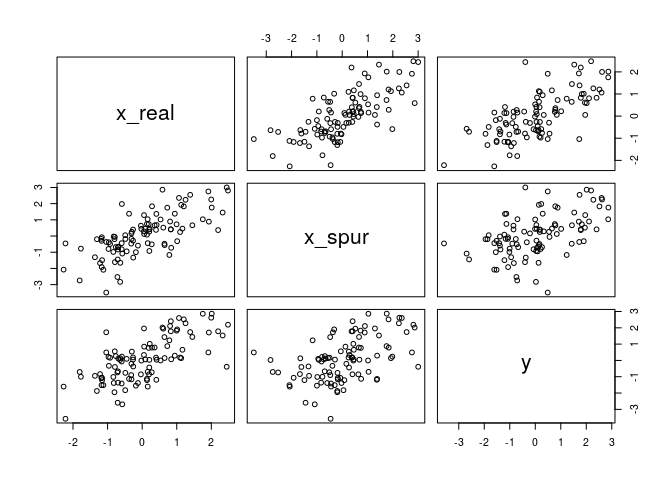

``` r
library(rethinking)
mod1 <- lm(y ~ ., data=df)
plot( precis(mod1) )
```

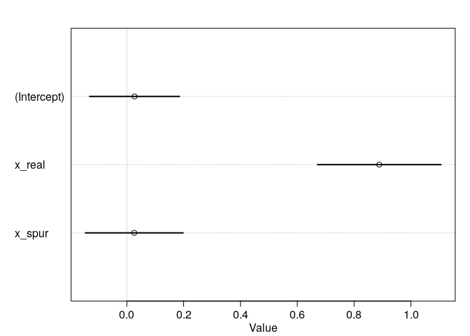

Note: I found an article about an interesting spurious correlation: There are various correlations between a name of a person and where they live, what they work, and whom they marry. Apparently, people with similar names tend to marry each other and similarly, choose occupations that sound similar to their own name (e.g. Dennis - dentist). These are spurious correlations: people of the same age tend to marry each other and people of the same age tend to have similar names. The [article](http://andrewgelman.com/2011/02/09/dennis_the_dent/) gives a short summary of the confounding variables

**5M2.** Invent your own example of a masked relationship. (I have to confess I wasn't very creative here)

``` r
n <- 100
rho <- 0.7                           # correlation between x_pos and x_neg
x_pos <- rnorm( n )                  # x_pos as Gaussian
x_neg <- rnorm( n, rho*x_pos,        # x_neg correlated with x_pos
                sqrt(1-rho^2) )
y <- rnorm( n, x_pos - x_neg)        # y equally associated with x_pos, x_eg
df <- data.frame(x_pos = x_pos, x_neg=x_neg, y=y)
pairs(df)
```

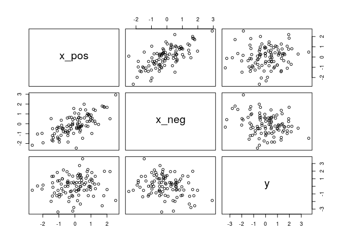

The variables `x_pos` and `x_neg` are correlated with each other but based on the plot, it looks as if they don't associate much with the outcome `y`.

``` r
mod2 <- lm(y ~ ., data=df)
plot( precis(mod2))
```

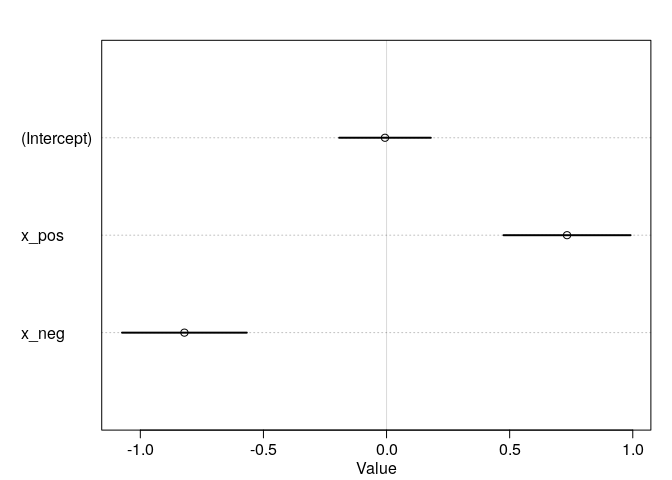

This unmasks the association and shows that both variables have an association with `y`.

**5M3.** It is sometimes observed that the best predictor of fire risk is the presence of firefighters: States and localities with many firefighters also have more fires. Now, firefighters do not *cause* fires, but this is not a spurious correlation. Instead, it is fire tat causes firefighters.

In the context of divorce and marriage data: How might a high divorce rate cause a higher marriage rate? A high divorce rate means that there is also a higher number of people that can marry again, thus raising the marriage rate. One way I can think of testing this relationship would be to include the remarriage rate in a multivariate regression.

**5M4.** In the divorce data, States with high number of Mormons have much lower divorce rates than the regression model expected. Include percent of Latter-day Saints, LDS, in your regression model. I first downloaded the LDS population by State from [wikipedia](https://en.wikipedia.org/wiki/The_Church_of_Jesus_Christ_of_Latter-day_Saints_membership_statistics_(United_States)) (retrieved on June 6, 2018). Next step is to combine the two data frames:

``` r
library(dplyr)
data("WaffleDivorce")
d <- WaffleDivorce
LDS <- read.csv("LDS.csv")
d <- d %>% left_join(LDS, by=c("Location" = "State")) %>% 
  select(Location, Loc, MedianAgeMarriage, Marriage, Divorce, LDS) %>%
  mutate(Location = as.factor(Location))
head(d)
```

    ##     Location Loc MedianAgeMarriage Marriage Divorce    LDS
    ## 1    Alabama  AL              25.3     20.2    12.7 0.0077
    ## 2     Alaska  AK              25.2     26.0    12.5 0.0453
    ## 3    Arizona  AZ              25.8     20.3    10.8 0.0610
    ## 4   Arkansas  AR              24.3     26.4    13.5 0.0104
    ## 5 California  CA              26.8     19.1     8.0 0.0194
    ## 6   Colorado  CO              25.7     23.5    11.6 0.0270

``` r
hist(d$LDS)
```

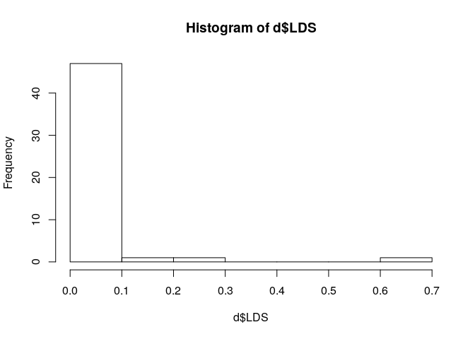

Since the LDS variable is very skewed (most states have almost no LDS population, a few, e.g. Idaho and Utah, have a very high LDS population), it would be better to transform it. We use first a log-transform and then standardize the variable.

``` r
d$log.LDS <- log(d$LDS)
d$log.LDS.s <- ( d$log.LDS - mean(d$log.LDS) ) / sd(d$log.LDS)
d$LDS.s <- (d$LDS - mean(d$LDS)) / sd(d$LDS)
hist(d$log.LDS.s)
```

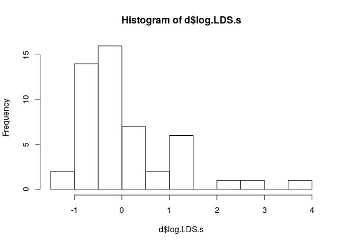

We also need to standardize the other variables:

``` r
d$MedianAgeMarriage.s <- (d$MedianAgeMarriage - mean(d$MedianAgeMarriage)) / sd(d$MedianAgeMarriage)
d$Marriage.s <- (d$Marriage - mean(d$Marriage)) / sd(d$Marriage)
```

Build the model:

``` r
mod4 <- map(
  alist(
    Divorce ~ dnorm( mu, sigma),
    mu <- a + bMA*MedianAgeMarriage.s + bMR*Marriage.s + bL*log.LDS.s,
    a ~ dnorm( 0, 10 ),
    c(bMA, bMR, bL) ~ dnorm( 0, 1),
    sigma ~ dunif(0, 10)
  ), data=d
)
precis( mod4 )
```

    ##        Mean StdDev  5.5% 94.5%
    ## a      9.68   0.19  9.37 10.00
    ## bMA   -1.29   0.28 -1.74 -0.85
    ## bMR    0.13   0.30 -0.35  0.61
    ## bL    -0.54   0.28 -0.98 -0.10
    ## sigma  1.38   0.14  1.16  1.60

``` r
plot(precis( mod4))
```

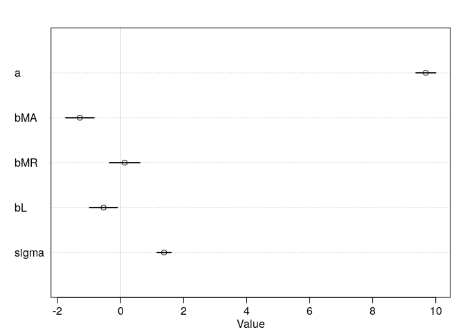

This means, that a higher population is negatively associated with the divorce rate.

``` r
mu <- link(mod4)
mu.mean <- apply(mu, 2, mean)
mu.PI <- apply(mu, 2, PI)

divorce.sim <- sim( mod4, n=1e4 )
divorce.PI <- apply(divorce.sim, 2, PI)
# residual plot showing the mean prediction error
# compute residuals
divorce.resid <- d$Divorce - mu.mean
# get ordering by divorce rate
o <- order(divorce.resid)
# make the plot
dotchart( divorce.resid[o], labels=d$Loc[o], xlim=c(-6,5), cex=0.6 )
abline(v=0, col=col.alpha("black", 0.2))
for (i in 1:nrow(d) ) {
  j <- o[i]    # which State in order
  lines( d$Divorce[j] - c(mu.PI[1, j], mu.PI[2, j]), rep(i,2) )
  points( d$Divorce[j] - c(divorce.PI[1,j], divorce.PI[2, j]), rep(i,2) ,
          pch=3, cex=0.6, col="gray")
}
```

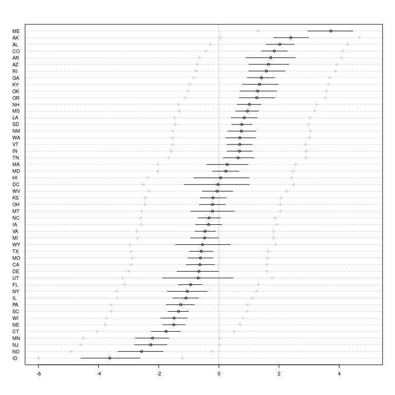

The model still overestimates the divorce rate for Idaho, but whereas before (without the LDS predictor) it had a mean prediction error of about -4.4, it now has a mean prediction error of about

``` r
divorce.resid[d$Loc == "ID"]
```

    ## [1] -3.626627

The mean prediction error for Utah improved similarly.

**5M5.** One way to reason through multiple causation hypotheses is to imagine detailed mechanisms through which predictor variables might influence outcomes. Example: It is sometimes argued that the price of gasoline (predictor variable) is positively associated with lower obesity rates (outcome variable). There are two important mechanisms by which the price of as could reduce obesity. (1) high gas prices lead to less driving and thus more walking (2) high gas prices lead to less driving, which leads to less eating out. What multiple regression variables could we use to address these mechanisms? (assuming we can have any predictor variable we want) For the first case, we could include the predictor variable of the average walked distance. To address the second case, a good variable to include would be the average rate of eating out.

Hard.
-----

All three exercises below use the data `foxes` about the urban fox *Vulpes vulpes*. They move in packs and defend territories, so data on habitat quality and population density is included in the data. It also includes the number of social groups an individual fox belongs to, weight of an individual fox, as well as the average amount of food available in a territory, the group size and area of the territory.

``` r
data(foxes)
d <- foxes
head(d)
```

    ##   group avgfood groupsize area weight
    ## 1     1    0.37         2 1.09   5.02
    ## 2     1    0.37         2 1.09   2.84
    ## 3     2    0.53         2 2.05   5.33
    ## 4     2    0.53         2 2.05   6.07
    ## 5     3    0.49         2 2.12   5.85
    ## 6     3    0.49         2 2.12   3.25

``` r
summary(d)
```

    ##      group          avgfood         groupsize          area      
    ##  Min.   : 1.00   Min.   :0.3700   Min.   :2.000   Min.   :1.090  
    ##  1st Qu.:11.75   1st Qu.:0.6600   1st Qu.:3.000   1st Qu.:2.590  
    ##  Median :18.00   Median :0.7350   Median :4.000   Median :3.130  
    ##  Mean   :17.21   Mean   :0.7517   Mean   :4.345   Mean   :3.169  
    ##  3rd Qu.:24.00   3rd Qu.:0.8000   3rd Qu.:5.000   3rd Qu.:3.772  
    ##  Max.   :30.00   Max.   :1.2100   Max.   :8.000   Max.   :5.070  
    ##      weight     
    ##  Min.   :1.920  
    ##  1st Qu.:3.720  
    ##  Median :4.420  
    ##  Mean   :4.530  
    ##  3rd Qu.:5.375  
    ##  Max.   :7.550

**5H1.** Fit two bivariate Gaussian regressions, using `map`:

1.  `weight ~ area`
2.  `weight ~ groupsize`

``` r
d$area.s <- (d$area - mean(d$area)) / sd(d$area)
mod5 <- map(
  alist(
    weight ~ dnorm( mu, sigma) ,
    mu <- a + bA*area.s ,
    a ~ dnorm( 0, 100),
    bA ~ dnorm(0, 1),
    sigma ~ dunif(0, 10)
  ), data=d
)
plot( precis( mod5))
```

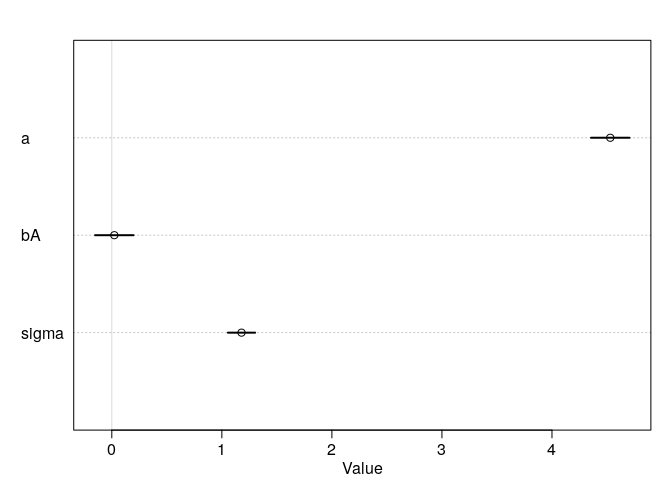

It looks like area is not an important predictor for body weight. Let's have a closer look at some more plots.

``` r
area.seq <- seq(from=-2.5, to=2.5, length.out = 300)
mu <- link(mod5, data=list(area.s = area.seq))
mu.mean <- apply(mu, 2, mean)
mu.HPDI <- apply(mu, 2, HPDI, prob=0.95)
weight.sim <- sim(mod5, data=list(area.s = area.seq))
weight.HPDI <- apply( weight.sim, 2, HPDI, prob=0.95)
plot(  weight ~ area.s, data=d)
lines( area.seq, mu.mean)
shade( mu.HPDI, area.seq)
shade( weight.HPDI, area.seq)
```

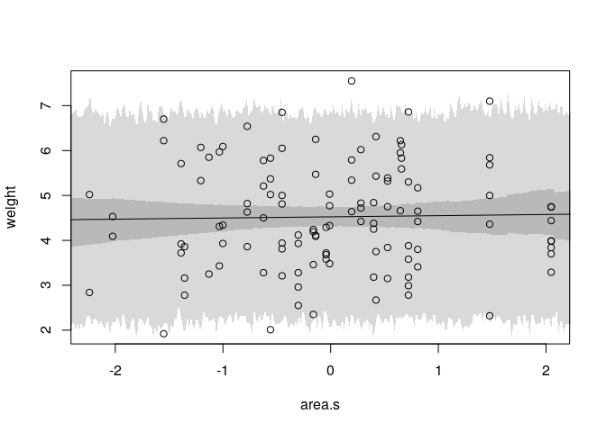

This plot also suggests that area is not an important predictor. There seems to be no relation at all with area and sigma is relatively large.

``` r
d$groupsize.s <- (d$groupsize - mean(d$groupsize)) / sd(d$groupsize)
mod6 <- map(
  alist(
    weight ~ dnorm( mu, sigma) ,
    mu <- a + bG*groupsize.s,
    bG ~ dnorm(0, 1),
    a ~ dnorm(0, 10),
    sigma ~ dunif(0, 10)
  ), data=d
)
plot( precis( mod6))
```

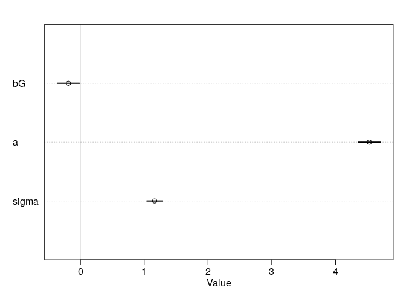

The group size seems to have some importance, at least it is slightly further away from 0 than the parameter for area.

``` r
groupsize.seq <- seq(from=-2, to=3, length.out = 300)
mu <- link( mod6, data=list(groupsize.s=groupsize.seq))
mu.mean <- apply(mu, 2, mean)
mu.HPDI <- apply(mu, 2, HPDI, prob=0.95)
weight.sim <- sim(mod6, data=list(groupsize.s=groupsize.seq))
weight.HPDI <- apply(weight.sim, 2, HPDI, prob=0.95)
plot( weight ~ groupsize.s, data=d)
lines(groupsize.seq, mu.mean)
shade(mu.HPDI, groupsize.seq)
shade(weight.HPDI, groupsize.seq)
```

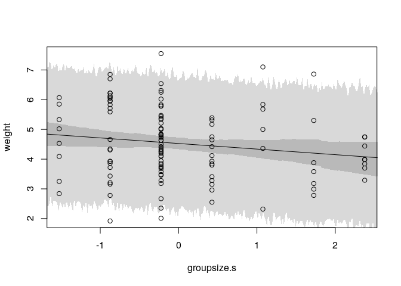

While there seems to be more of a slope here, it is still very minor and doesn't look like it is an important factor..

**5H2.** As before, we try to predict weight, but this time using a multivariate model that uses both the area and group size as predictor.

``` r
mod7 <- map(
  alist(
    weight ~ dnorm(mu, sigma),
    mu <- a + bA*area.s + bG*groupsize.s,
    a ~ dnorm(0, 10),
    bA ~ dnorm(0,1),
    bG ~ dnorm(0,1),
    sigma ~ dunif(0,10)
  ), data=d
)
plot( precis( mod7))
```

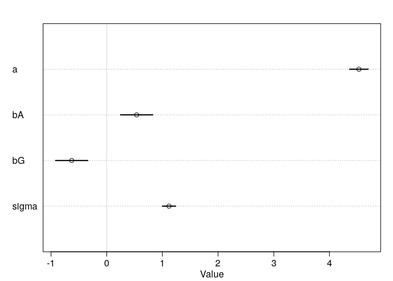

And surprise surprise, suddenly both area and group size seem to have a discernible importance for predicting body weight. Let's plot the predictions of the model for both predictors, for each holding the other predictor constant at its mean.

``` r
# Area, holding groupsize fixed
groupsize.avg <- mean(d$groupsize.s)
area.seq <- seq(from=-3, to=3, length.out = 300)
pred.data <- data.frame(groupsize.s=groupsize.avg, area.s=area.seq)
mu <- link(mod7, data=pred.data)
mu.mean <- apply(mu, 2, mean)
mu.HPDI <- apply(mu, 2, HPDI, prob=0.95)
weight.sim <- sim(mod7, data=pred.data)
weight.HPDI <- apply(weight.sim, 2, HPDI, prob=0.95)
plot( weight ~ area.s, data=d, type="n" )
lines(area.seq, mu.mean)
shade(mu.HPDI, area.seq)
shade(weight.HPDI, area.seq)
```

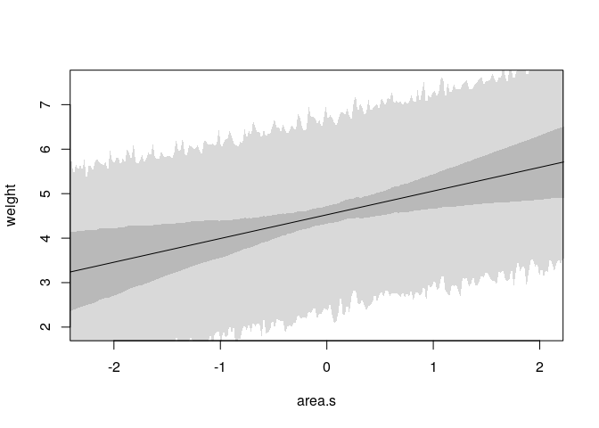

Now, we can see a quite clear association between area and weight: A fox living in a bigger territory seems to be heavier than a fox in a smaller territory.

``` r
# Groupsize, area fixed
area.avg <- mean(d$area.s)
groupsize.seq <- seq(from=-2, to=3, length.out = 300)
pred.data <- data.frame(groupsize.s=groupsize.seq, area.s=area.avg)
mu <- link(mod7, data=pred.data)
mu.mean <- apply(mu, 2, mean)
mu.HPDI <- apply(mu, 2, HPDI, prob=0.95)
weight.sim <- sim(mod7, data=pred.data)
weight.HPDI <- apply(weight.sim, 2, HPDI, prob=0.95)
plot( weight ~ groupsize.s, data=d, type="n")
lines( groupsize.seq, mu.mean)
shade( mu.HPDI, groupsize.seq)
shade( weight.HPDI, groupsize.seq)
```

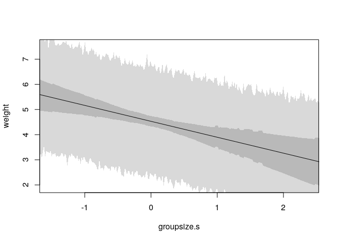

A larger group is associated with a lower weight (more foxes that need to share food, maybe?).

So why is this? Let's look at the correlation plot of the three variables.

``` r
pairs( weight ~ groupsize + area, data=d)
```

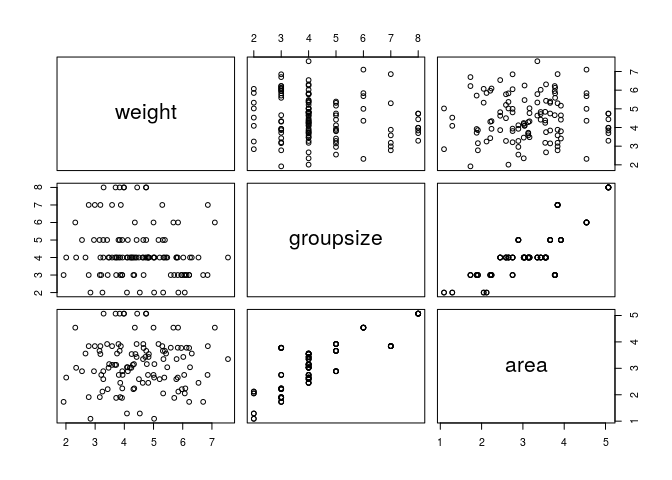

Group size is strongly correlated with area: a larger territory is associated with a larger group of foxes (makes sense, right?). Both area and group size are also correlated with weight: area is positively correlated with weight, while group size is negatively correlated with weight. This circumstance leads to a masked association: the two predictor variables cancel each other out and thus don't seem important.

**5H3.** Let's add the average amount of food variable. We fit two more multivariate regressions:

1.  `weight ~ avgfood + groupsize`
2.  `weight ~ avgfood + groupsize + area`

``` r
d$avgfood.s <- (d$avgfood - mean(d$avgfood)) / sd(d$avgfood)
mod8 <- map(
  alist(
    weight ~ dnorm( mu, sigma),
    mu <- a + bF*avgfood.s + bG*groupsize.s,
    a ~ dnorm(0, 10),
    bF ~ dnorm(0,1),
    bG ~ dnorm(0,1),
    sigma ~ dunif(0,10)
  ), data=d
)
plot( precis( mod8))
```

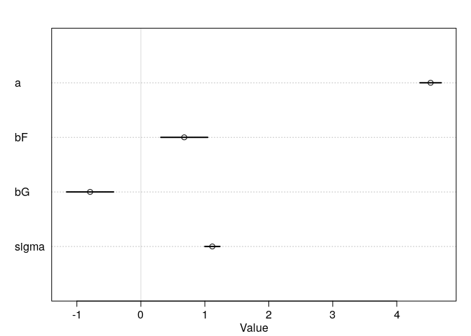

``` r
mod9 <- map(
  alist(
    weight ~ dnorm( mu, sigma),
    mu <- a + bF*avgfood.s + bG*groupsize.s + bA*area.s,
    a ~ dnorm(0, 10),
    c(bF, bG, bA) ~ dnorm(0, 1),
    sigma ~ dunif(0, 10)
  ), data=d
)
plot( precis( mod9))
```

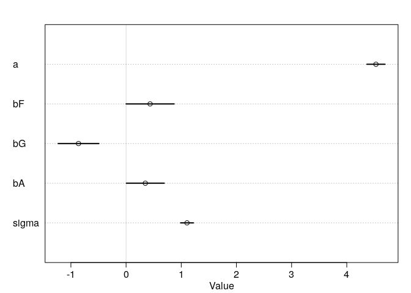

Adding both average amount of food and the area of the territory leads to a decrease in their parameters for both predictor variables, compared with the regressions that contain only of the two. (a) Is `avgfood` or `area` a better predictor to include in a model?

``` r
# Predictor residual plot
mod9.1 <- map(
  alist(
    avgfood.s ~ dnorm( mu, sigma) ,
    mu <- a + b*area.s,
    a ~ dnorm(0, 10),
    b ~ dnorm(0,1),
    sigma ~ dunif(0, 10)
  ), data=d
)

# cpmpute residuals
mu <- coef(mod9.1)['a'] + coef(mod9.1)['b']*d$area.s

# compute residuals
f.resid <- d$avgfood.s - mu

plot( avgfood.s ~ area.s, d, col=rangi2)
abline(mod9.1)
```

    ## Warning in abline(mod9.1): only using the first two of 3 regression
    ## coefficients

``` r
for (i in 1:length(f.resid)) {
  x <- d$area.s[i]
  y <- d$avgfood.s[i]
  # draw the lines segment
  lines( c(x,x), c(mu[i], y), lwd=0.5, col=col.alpha("black", 0.5))
}
```

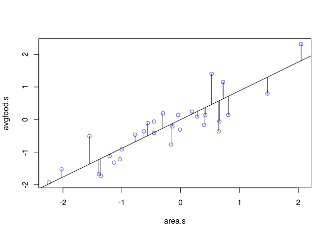

This residual plot shows the residual average amount of food after accounting for the linear association with area. Each line segment is a residual, that is. the distance of observed average amount of food from the expected value, when trying to predict the amount of average food with the area alone. Thus foxes above the regression line have more food than expected and the one below the line have less than expected, according to the area. The residuals are the variation in average amount of food that is left over, after taking out the purely linear relationship between area and average food. We can use these residuals to plot them against the actual outcome of interest, the weight. These are also called predictor residual plots.

``` r
plot( d$weight ~ f.resid, col=rangi2, xlab="Average food residuals", ylab="Weight")
abline(a=coef(mod9)['a'], b=coef(mod9)['bF'])
abline(v=0, lty=2)
```

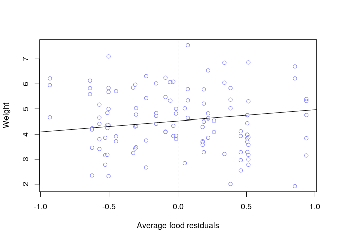

``` r
# Predictor residual plot
mod9.2 <- map(
  alist(
    area.s ~ dnorm( mu, sigma) ,
    mu <- a + b*avgfood.s,
    a ~ dnorm(0, 10),
    b ~ dnorm(0,1),
    sigma ~ dunif(0, 10)
  ), data=d
)

# cpmpute residuals
mu <- coef(mod9.2)['a'] + coef(mod9.2)['b']*d$avgfood.s

# compute residuals
a.resid <- d$area.s - mu

plot( d$weight ~  a.resid, col=rangi2, xlab="Area residuals", ylab="Weight")
abline(a=coef(mod9)['a'], b=coef(mod9)['bA'])
abline(v=0, lty=2)
```

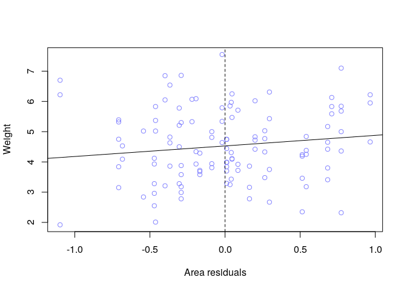

These predictor residual plots can be interpreted as follows: The vertical dashed line indicates an area that exactly matches the expectation from the average amount of food. Thus points to the right of the line represent foxes having more area than expected for their average food and the one to the left have less area than expected for their amount of average food. To both sides, we have about the same weights.

Unfortunately, the plots are about the same for both area and average food, so I don't find them helpful to determine which predictor variable would be better to include in the model.

So let's have a look at the counterfactual plots for both average food and the area.

``` r
# counterfactual plot of average food, holding area and groupsize fixed
area.avg <- mean(d$area.s)
groupsize.avg <- mean(d$groupsize.s)
avgfood.seq <- seq(from=-2, to=3)
data.pred <- data.frame(area.s=area.avg,
                        groupsize.s=groupsize.avg,
                        avgfood.s=avgfood.seq)
mu <- link(mod9, data=data.pred)
mu.mean <- apply(mu, 2, mean)
mu.HPDI <- apply(mu, 2, HPDI)
weight.sim <- sim(mod9, data=data.pred)
weight.HPDI <- apply(weight.sim, 2, HPDI, prob=0.95)
plot( weight ~ avgfood.s, data=d, type="n")
lines( avgfood.seq, mu.mean)
shade( mu.HPDI, avgfood.seq)
shade( weight.HPDI, avgfood.seq)
```

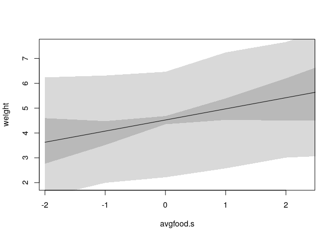

Now the same for area:

``` r
# counterfactual plot for area, holding groupsize and average food fixed
avgfood.avg <- mean(d$avgfood.s)
groupsize.avg <- mean(d$groupsize.s)
area.seq <- seq(from=-3, to=3)
data.pred <- data.frame(area.s=area.seq,
                        groupsize.s=groupsize.avg,
                        avgfood.s=avgfood.avg)
mu <- link(mod9, data=data.pred)
mu.mean <- apply(mu, 2, mean)
mu.HPDI <- apply(mu, 2, HPDI)
weight.sim <- sim(mod9, data=data.pred)
weight.HPDI <- apply(weight.sim, 2, HPDI, prob=0.95)
plot( weight ~ area.s, data=d, type="n")
lines(area.seq, mu.mean)
shade(mu.HPDI, area.seq)
shade(weight.HPDI, area.seq)
```

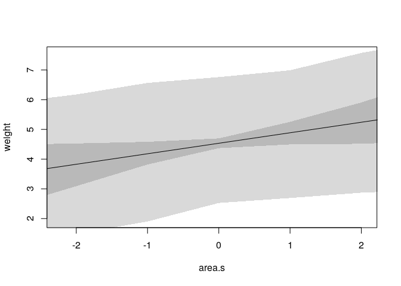

Both plots look very similar, so they're not very helpful in deciding which of the two variables would be better to include. Based on these plots, I would conclude that in terms of the model, it doesn't make much difference if you include one or the other. I would not recommend to include both though. As we can see in the following plot, both variables are strongly correlated with each other:

``` r
pairs(weight ~ avgfood + groupsize + area, data=d)
```

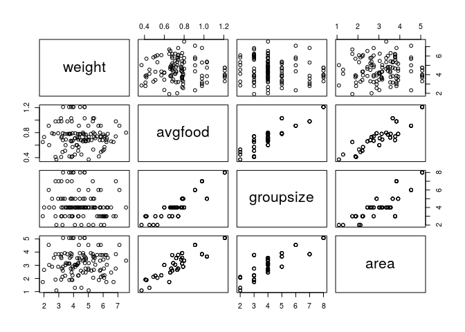

``` r
cor( d[,c("weight", "avgfood", "groupsize", "area")])
```

    ##                weight     avgfood  groupsize       area
    ## weight     1.00000000 -0.02503892 -0.1609938 0.01947728
    ## avgfood   -0.02503892  1.00000000  0.9014829 0.88310378
    ## groupsize -0.16099376  0.90148290  1.0000000 0.82759448
    ## area       0.01947728  0.88310378  0.8275945 1.00000000

The correlations between average food, group size and area are all very high (above 0.8). Especially the correlation of average food with groupsize and area are very high, about 0.9. Which makes sense, since thinking about it, they should all be correlated: More area means more food available, which means a bigger group is sustainable. This high correlation leads to multicollinearity, which also explains why the effect of average food and area is greatly reduced, with higher standard deviation, when both are included in the model. Knowing the area (and group size), adding the average amount of food doesn't add any more useful information. Since I assume that area causes average food which causes weight, I would only include area (the original cause) in my model, but I guess you could also argue that average food is the more direct cause for weight. As said in the chapter, one valid approach is also to just show that using either of the highly correlated predictor variables leads to the same result.
