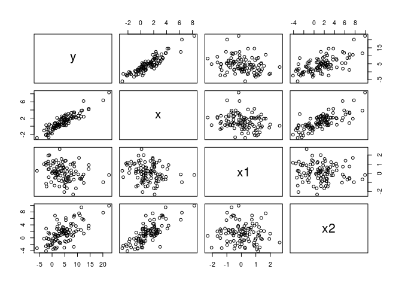
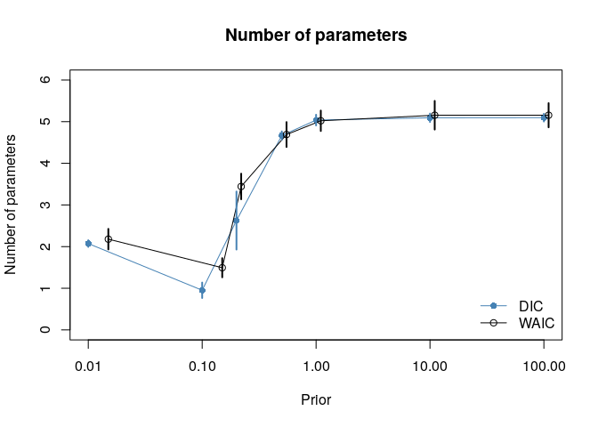
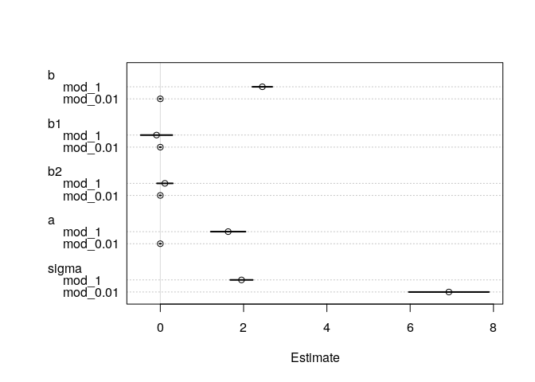
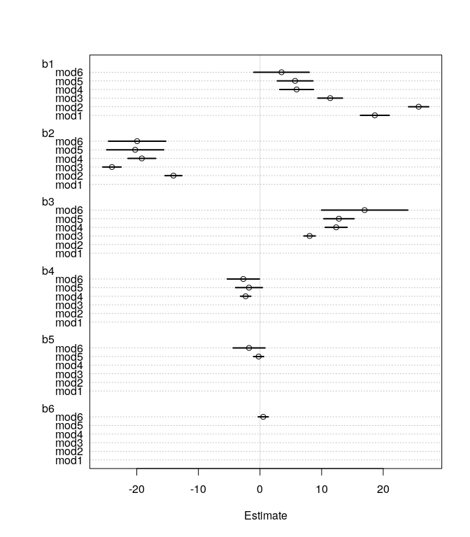
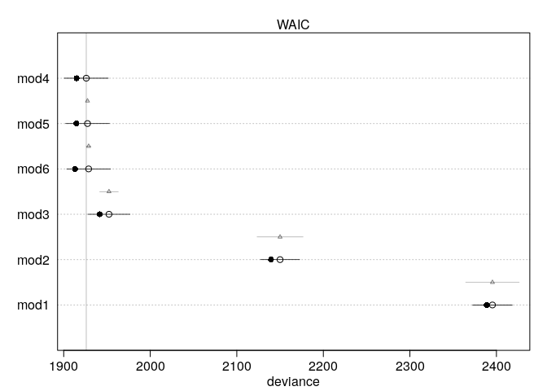
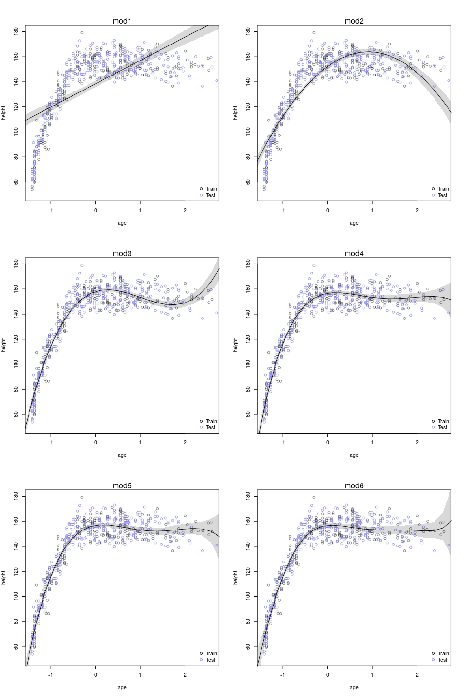
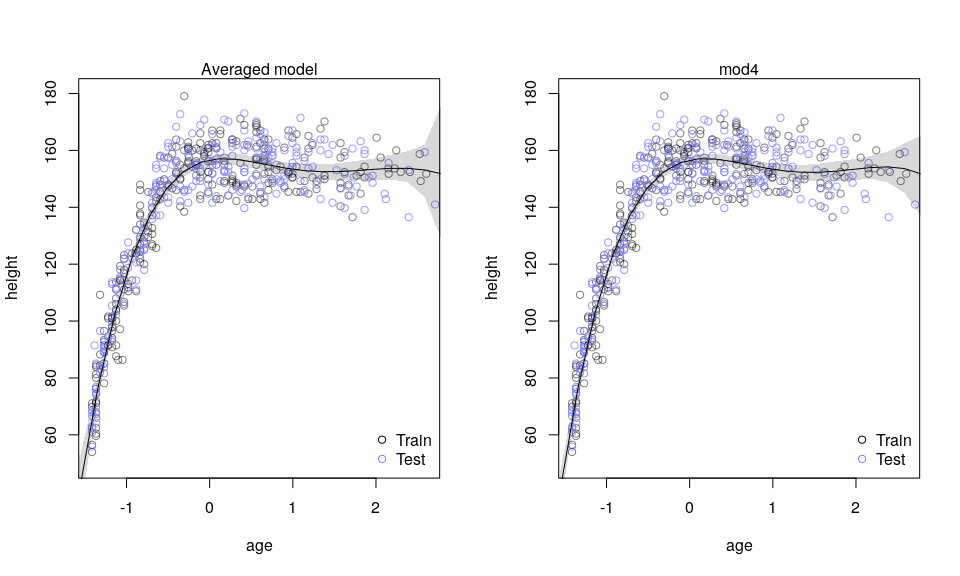
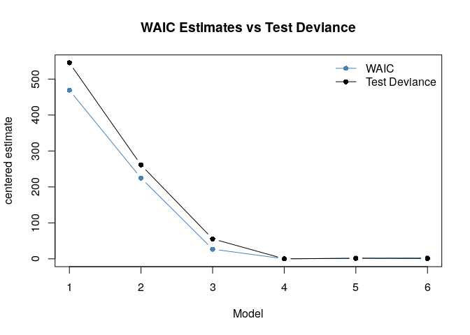
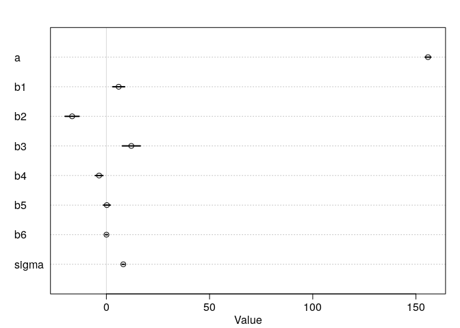
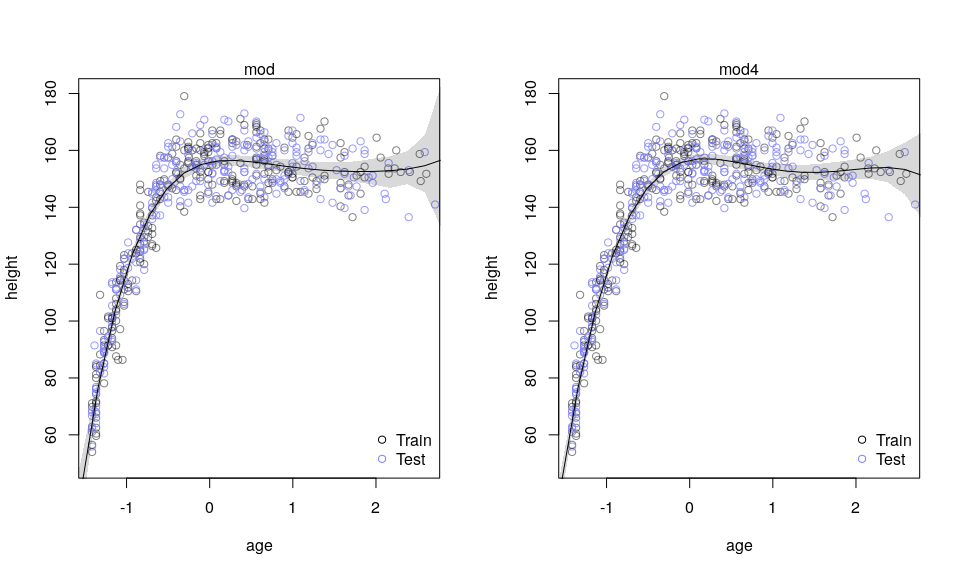

Chpter 6 - Exercies
================
Corrie
July 8, 2018

Chapter 6 - Exercises
=====================

These are my solutions to the exercises from chapter 6.

Easy.
-----

**6E1.** State the three motivating criteria that define information entropy.

Information entropy (a measure of uncertainty) should be

-   *continous*. A small change in probability should also lead to only a small change in uncertainty. We don't want to allow for sudden jumps.
-   *increasing* as the number of possible events increases. That means, if only one event has a very high chance of happening and all other have only a very small chance, then there is little uncertainty in what comes next and thus more less information. On the other hand, if all events are equally likely, there is the most uncertainty about what comes next and thus most information.
-   *additive*. If we take the uncertainty of two independent distributions, e.g. rain or not (two events) and if I drink coffee in the morning or not (also two events), these events are independent of each other. Then taking the uncertainty for the distribution over all four combinations (rain and coffee, rain and no coffee, etc) is the same as taking the sum over the single distributions. Note that if the two distributions are dependent of each other (maybe instead of me drinking coffee, take the event me biking to work or taking the bus), then the uncertainty is not additive.

**6E2.** Suppose a coin is weighted such that it comes up head 70% of the time. What is the entropy of this coin?

``` r
p <- c(0.7, 0.3)
entropy <- function(p) - sum( p[p!=0] * log(p[p!=0]) ) # to avoid NaN errors when probability = 0
entropy(p)
```

    ## [1] 0.6108643

**6E3.** Suppose a four-sided die is loaded such that it shows up with the following probabilities: 1 comes up 20%, 2 comes up 25%, 3 comes up 25% and 4 comes up 30%. What is the entropy of this die?

``` r
p_die <- c(0.2, 0.25, 0.25, 0.3)
entropy(p_die)
```

    ## [1] 1.376227

**6E4.** Suppose another four-sided die is loaded such that it never shows 4. The other three sides show equally often. What is the entropy of this die?

``` r
p_die2 <- c(1/3, 1/3, 1/3, 0) 
entropy(p_die2)
```

    ## [1] 1.098612

This is the same entropy as for the three-sided fair die.

Medium.
-------

**6M1.** Compare the definitions of AIC, DIC, and WAIC. Which of these criteria is most general, which assumptions are required to transform a more general criterion into a less general one? The criteria from the least to the most general:

**AIC**:

 where  is the deviance of the training set and  is the number of parameters. AIC provides an estimate for the test deviance when the following assumptions are met:

-   Priors are flat or overwhelmed by the likelihood.
-   The posterior distribution is approximately multivariate Gaussian.
-   The sample size  is much greater than the number of parameters.

**DIC**:

 where . Furthermore,  is the deviance computed using the mean of the posterior sample and  is the mean of the posterior deviance. The DIC is only valid when the following assumptions are met:

-   The posterior distribution is approximately multivariate Gaussian.
-   The sample size  is much greater than the number of parameters.

**WAIC**:

") where ") is the log-pointwise-predictive-density, i.e. over all observations the sum of the average likelihood of each observation. ") is the effective number of parameters with ") being the variance in log-likelihood for observation observation . The WAIC is valid when the following assumption is met:

-   The sample size  is much greater than the number of parameters.

**6M2.** Explain the difference between model *selection* and model *averaging*. What information is lost under model selection? What information is lost under model averaging?

-   *Model selection*: In model selection, we use the information criteria to select one model: Among multiple models (all fit to the same observations!), we pick the one that has the best information criteria value. Best means for AIC, DIC, and WAIC the lowest value. This procedure discards information about relative model accuracy contained in the differences among the AIC, DIC, and WAIC values. Model comparison instead uses the DIC or WAIC together with other information from the models (estimate, posterior predictives etc) to find out why one model performs better than another. Information criteria can, for example, help to detect masking associations.
-   *Model averaging*: In model averaging, the DIC or WAIC are used to construct a posterior predictive distribution that combines all models. The DIC or WAIC are used to compute weights for each model, and these weights are then used to average the posterior predictive distributions of the models to one single distribution. Model averaging is a rather conservative procedure, meaning that it will never make a predictor variable appear more influential than it already appears in any single model.

**6M3.** When comparing models with an information criterion, why must all models be fit to exactly the same observations? What would happen to the information criterion values, if the models were fit to different numbers of observations? Perform some experiments.

``` r
library(rethinking)
# generate some data
set.seed(1234)
x <-  rnorm(200, mean=1, sd=1.5)
x1 <- rnorm(200, mean=0, sd=1)            # not associated with outcome
y <- rnorm(200, mean = 5 + 2.4*x, sd=1)
d <- data.frame(x=x, y=y, x1=x1)
```

*Control:*: Three models are fit on the same data, two using the same linear model, the last one using a third predictor variable (that is not associated with the outcome).

``` r
mod1 <- lm( y ~ x, data=d)
mod2 <- lm( y ~ x, data=d)
mod3 <- lm( y ~ x + x1, data=d)
control <- compare( mod1, mod2, mod3 )
control
```

    ##       WAIC pWAIC dWAIC weight    SE  dSE
    ## mod2 580.4   2.1   0.0    0.4 20.58   NA
    ## mod1 580.4   2.1   0.0    0.4 20.60 0.09
    ## mod3 581.8   3.3   1.4    0.2 20.58 1.97

The first two models have essentially the same WAIC and have approximately equal weights. The last model has a slightly higher WAIC and lower weight.

*First experiment*: Two models are fit with the same linear model, but using different data (but with the same number of observations).

``` r
mod1_e1 <- lm( y ~ x, data=d, subset=1:33)
mod2_e1 <- lm( y ~ x, data=d, subset=34:66)
mod3_e1 <- lm( y ~ x, data=d, subset=67:99)
exp1 <- compare( mod1_e1, mod2_e1, mod3_e1)
exp1
```

    ##          WAIC pWAIC dWAIC weight   SE   dSE
    ## mod1_e1  89.3   1.5   0.0   0.79 7.30    NA
    ## mod2_e1  91.9   1.6   2.6   0.21 5.85  8.81
    ## mod3_e1 116.8   2.3  27.5   0.00 7.55 10.07

The WAIC differ quite a bit even though all models are fit with the same linear model. Almost weight is on the first model, and the other two have little or zero weight.

*Second experiment*:

``` r
mod1_e2 <- lm( y ~ x + x1, data=d, subset=1:33)
mod2_e2 <- lm( y ~ x, data=d, subset=34:66)
mod3_e2 <- lm( y ~ x + x1, data=d, subset=67:99)
exp2 <- compare( mod1_e2, mod2_e2, mod3_e2)
exp2
```

    ##          WAIC pWAIC dWAIC weight   SE  dSE
    ## mod1_e2  85.5   3.0   0.0   0.97 5.86   NA
    ## mod2_e2  92.4   1.8   6.8   0.03 5.88 6.89
    ## mod3_e2 119.1   3.3  33.6   0.00 7.80 9.65

Now the first has a much lower WAIC and basically all weight is on the first model. The first and the last model both use the unnecessary (since not associated) variable `x1` but this does not become apparent in the WAICs.

**6M4.** What happens to the effective number of parameters, as measured by DIC or WAIC, as a prior becomes more concentrated? Why? Perform some experiments.

We use the same data again as before.

``` r
x <-  rnorm(100, mean=1, sd=2)
x1 <- rnorm(100, mean=0, sd=1)            # not associated with outcome
x2 <- rnorm(100, mean=x, sd=2)            # spurious assocation
y <- rnorm(100, mean = 2 + 2.4*x, sd=2)
d <- data.frame( y=y, x=x, x1=x1, x2=x2)
pairs(d)
```



We run 6 models using the data as above, each time with a different prior. The models thus have 5 parameters: `a, b, b1, b2` and `sigma` of which only `a, b` and `sigma` are actually relevant.

``` r
N <- 10    # Number of experiments
dic.l <- list()
waic.l <- list()
for (i in 1:N){
  # generate new data
  x <-  rnorm(100, mean=1, sd=2)
  x1 <- rnorm(100, mean=0, sd=1)            # not associated with outcome
  x2 <- rnorm(100, mean=x, sd=2)            # spurious assocation
  y <- rnorm(100, mean = 2 + 2.4*x, sd=2)
  d <- data.frame( y=y, x=x, x1=x1, x2=x2)
  
  # run the same model with 6 different priors
  mod_100 <- map(
    alist(
      y ~ dnorm( mu, sigma) ,
      mu <- a + b*x +b1*x1 + b2*x2,
      c(b,b1,b2) ~ dnorm(0, 100),
      a ~ dnorm(0, 100),
      sigma ~ dunif(0, 100)
    ), data=d, start=list(b=0, b1=0, b2=0, a=5, sigma=10)
  )
  dic.l[["100"]] <- c(dic.l[["100"]], attr(DIC(mod_100), "pD"))
  waic.l[["100"]] <- c(waic.l[["100"]], attr(WAIC(mod_100), "pWAIC"))
  
  mod_10 <- map(
    alist(
      y ~ dnorm(mu, sigma),
      mu <- a + b*x + b1*x1 +b2*x2,
      c(b, b1, b2) ~ dnorm(0, 10 ),
      a ~ dnorm(0, 10),
      sigma ~ dunif(0, 50)
    ), data=d, start=list(b=0, b1=0, b2=0, a=5, sigma=10)
  )
  
  dic.l[["10"]] <- c(dic.l[["10"]], attr(DIC(mod_10), "pD"))
  waic.l[["10"]] <- c(waic.l[["10"]], attr(WAIC(mod_10), "pWAIC"))
  
  mod_1 <- map(
    alist(
      y ~ dnorm(mu, sigma),
      mu <- a + b*x + b1*x1 + b2*x2,
      c(b, b1,b2) ~ dnorm(0, 1 ),
      a ~ dnorm(0, 1),
      sigma ~ dunif(0, 20)
    ), data=d, start=list(b=0, b1=0, b2=0, a=5, sigma=10)
  )
  
  dic.l[["1"]] <- c(dic.l[["1"]], attr(DIC(mod_1), "pD"))
  waic.l[["1"]] <- c(waic.l[["1"]], attr(WAIC(mod_1), "pWAIC"))
  
  mod_0.5 <- map(
    alist(
      y ~ dnorm(mu, sigma),
      mu <- a + b*x + b1*x1 +b2*x2,
      c(b, b1,b2) ~ dnorm(0, 0.5 ),
      a ~ dnorm(0, 0.5),
      sigma ~ dunif(0, 15)
    ), data=d, start=list(b=0, b1=0, b2=0, a=5, sigma=10)
  )
  
  dic.l[["0.5"]] <- c(dic.l[["0.5"]], attr(DIC(mod_0.5), "pD"))
  waic.l[["0.5"]] <- c(waic.l[["0.5"]], attr(WAIC(mod_0.5), "pWAIC"))
  
  mod_0.2 <- map(
    alist(
      y ~ dnorm(mu, sigma),
      mu <- a + b*x + b1*x1 +b2*x2,
      c(b, b1,b2) ~ dnorm(0, 0.2 ),
      a ~ dnorm(0, 0.2),
      sigma ~ dunif(0, 10)
    ), data=d, start=list(b=0, b1=0, b2=0, a=5, sigma=5)
  )
  
  dic.l[["0.2"]] <- c(dic.l[["0.2"]], attr(DIC(mod_0.2), "pD"))
  waic.l[["0.2"]] <- c(waic.l[["0.2"]], attr(WAIC(mod_0.2), "pWAIC"))
  
  
  mod_0.1 <- map(
    alist(
      y ~ dnorm(mu, sigma),
      mu <- a + b*x + b1*x1 +b2*x2,
      c(b, b1,b2) ~ dnorm(0, 0.1 ),
      a ~ dnorm(0, 0.1),
      sigma ~ dunif(0, 10)
    ), data=d, start=list(b=0, b1=0, b2=0, a=5, sigma=5)
  )
  
  dic.l[["0.1"]] <- c(dic.l[["0.1"]], attr(DIC(mod_0.1), "pD"))
  waic.l[["0.1"]] <- c(waic.l[["0.1"]], attr(WAIC(mod_0.1), "pWAIC"))
  
  mod_0.01 <- map(
    alist(
      y ~ dnorm(mu, sigma),
      mu <- a + b*x + b1*x1 +b2*x2,
      c(b, b1,b2) ~ dnorm(0, 0.01 ),
      a ~ dnorm(0, 10),
      sigma ~ dunif(0, 10)
    ), data=d, start=list(b=0, b1=0, b2=0, a=5, sigma=5)
  )
  
  dic.l[["0.01"]] <- c(dic.l[["0.01"]], attr(DIC(mod_0.01), "pD"))
  waic.l[["0.01"]] <- c(waic.l[["0.01"]], attr(WAIC(mod_0.01), "pWAIC"))
  
}
```

    ## Constructing posterior predictions
    ## Constructing posterior predictions
    ## Constructing posterior predictions
    ## Constructing posterior predictions
    ## Constructing posterior predictions
    ## Constructing posterior predictions
    ## Constructing posterior predictions
    ## Constructing posterior predictions
    ## Constructing posterior predictions
    ## Constructing posterior predictions
    ## Constructing posterior predictions
    ## Constructing posterior predictions
    ## Constructing posterior predictions
    ## Constructing posterior predictions
    ## Constructing posterior predictions
    ## Constructing posterior predictions
    ## Constructing posterior predictions
    ## Constructing posterior predictions
    ## Constructing posterior predictions
    ## Constructing posterior predictions
    ## Constructing posterior predictions
    ## Constructing posterior predictions
    ## Constructing posterior predictions
    ## Constructing posterior predictions
    ## Constructing posterior predictions
    ## Constructing posterior predictions
    ## Constructing posterior predictions
    ## Constructing posterior predictions
    ## Constructing posterior predictions
    ## Constructing posterior predictions
    ## Constructing posterior predictions
    ## Constructing posterior predictions
    ## Constructing posterior predictions
    ## Constructing posterior predictions
    ## Constructing posterior predictions
    ## Constructing posterior predictions
    ## Constructing posterior predictions
    ## Constructing posterior predictions
    ## Constructing posterior predictions
    ## Constructing posterior predictions
    ## Constructing posterior predictions
    ## Constructing posterior predictions
    ## Constructing posterior predictions
    ## Constructing posterior predictions
    ## Constructing posterior predictions
    ## Constructing posterior predictions
    ## Constructing posterior predictions
    ## Constructing posterior predictions
    ## Constructing posterior predictions
    ## Constructing posterior predictions
    ## Constructing posterior predictions
    ## Constructing posterior predictions
    ## Constructing posterior predictions
    ## Constructing posterior predictions
    ## Constructing posterior predictions
    ## Constructing posterior predictions
    ## Constructing posterior predictions
    ## Constructing posterior predictions
    ## Constructing posterior predictions
    ## Constructing posterior predictions
    ## Constructing posterior predictions
    ## Constructing posterior predictions
    ## Constructing posterior predictions
    ## Constructing posterior predictions
    ## Constructing posterior predictions
    ## Constructing posterior predictions
    ## Constructing posterior predictions
    ## Constructing posterior predictions
    ## Constructing posterior predictions
    ## Constructing posterior predictions

``` r
options(scipen = 3)
prior <- c(100, 10, 1, 0.5, 0.2, 0.1, 0.01)
prior2 <- c(110, 11, 1.1, 0.55, 0.22, 0.15, 0.015)
dic.mean <- sapply(dic.l, mean)
dic.sd <- sapply(dic.l, sd)
waic.mean <- sapply(waic.l, mean)
waic.sd <- sapply(waic.l, sd)
plot(prior , dic.mean, ylim=c(0,6),
       xlab="Prior", ylab="Number of parameters", log="x",
      pch=16, cex=1, col="steelblue", type="o",
     main="Number of parameters")
points(prior2, waic.mean, cex=1, type="o")

for ( i in 1:length(prior)) {
  pts_in <- dic.mean[i] + c(-1,1)*dic.sd[i] 
  pts_out <- waic.mean[i] + c(-1,1)*waic.sd[i]
  lines( c(prior[i],prior[i]), pts_in, col="steelblue", lwd=2)
  lines( c(prior2[i],prior2[i]), pts_out, lwd=2 )
}
legend("bottomright", c("DIC", "WAIC"), pch=c(16, 1), lwd=c(1,1), 
       col=c("steelblue", "black"), bty="n")
```



The more concentrated a prior becomes, the smaller DIC and WAIC become. They're both bounded from above by the number of used parameters (here 5) but can go lower than the actual relevant parameters (here 3).

**6M5.** Provide an informal explanation of why informative priors reduce overfitting. Overfitting occurs when there are too many parameters (for too little data). If these parameters are allowed to vary, they can fit the data too closely, such that the curve perfectly matches the data, including all the noise and it generalizes poorly to new data. If on the other hand, we use informative priors, we restrict the parameters to only vary in the bounds of the prior. It thus limits strongly the degree to which the model can overfit to the data.

**6M6.** Provide an informal explanation of why overly informative priors result in underfitting. If we put very restrictive priors on a parameter, the parameter is not allowed to vary much and has to stay inside the bounds of the prior. If then the true parameter is outside these bounds, the model can not learn this parameter, or only with a lot of data. Compare for example the following two models, one with a very restrictive prior and one with a weakly informative prior on the parameter coefficients.

``` r
mod_0.01 <- map(
    alist(
      y ~ dnorm(mu, sigma),
      mu <- a + b*x + b1*x1 +b2*x2,
      c(b, b1,b2) ~ dnorm(0, 0.01 ),
      a ~ dnorm(0, 0.01),
      sigma ~ dunif(0, 10)
    ), data=d
  )

  mod_1 <- map(
    alist(
      y ~ dnorm(mu, sigma),
      mu <- a + b*x + b1*x1 + b2*x2,
      c(b, b1,b2) ~ dnorm(0, 1 ),
      a ~ dnorm(0, 1),
      sigma ~ dunif(0, 10)
    ), data=d
  )
  
coeftab_plot( coeftab( mod_0.01, mod_1) )
```



Both models correctly identify that `b1` and `b2` are not relevant to predict the data, but the restrictive model severely underfits and sets all parameters (except `sigma`) to 0.

Hard.
-----

All practice problems to follow use the !Kung demography data. We split the data in two equally sized subsets.

``` r
data("Howell1")
d <- Howell1
d$age <- (d$age - mean(d$age) ) / sd(d$age)
set.seed(1000)
i <- sample( 1:nrow(d), size=nrow(d)/2)
d1 <- d[ i, ]
d2 <- d[ -i,]
```

We will use `d1` to fit models and evaluate them on `d2`. We will predict the height  using the centered age values  with the following models:

![\\begin{align\*}
\\mathcal{M}\_1 : \\,& h\_i \\sim \\text{Normal}(\\mu\_i, \\sigma) \\\\
& \\mu\_i = \\alpha + \\beta\_1 x\_i \\\\
\\\\
\\mathcal{M}\_2 : \\,& h\_i \\sim \\text{Normal}(\\mu\_i, \\sigma) \\\\
& \\mu\_i = \\alpha + \\beta\_1 x\_i + \\beta\_2 x\_i^2\\\\
\\\\
\\mathcal{M}\_3 : \\,& h\_i \\sim \\text{Normal}(\\mu\_i, \\sigma) \\\\
& \\mu\_i = \\alpha + \\beta\_1 x\_i + \\beta\_2 x\_i^2 + \\beta\_3 x\_i^3   \\\\
\\\\
\\mathcal{M}\_4 :\\, & h\_i \\sim \\text{Normal}(\\mu\_i, \\sigma) \\\\
& \\mu\_i = \\alpha + \\beta\_1 x\_i + \\beta\_2 x\_i^2 + \\beta\_3 x\_i^3  + \\beta\_4 x\_i^4  \\\\
\\\\
\\mathcal{M}\_5 : \\,& h\_i \\sim \\text{Normal}(\\mu\_i, \\sigma) \\\\
& \\mu\_i = \\alpha + \\beta\_1 x\_i + \\beta\_2 x\_i^2 + \\beta\_3 x\_i^3  + \\beta\_4 x\_i^4 + \\beta\_5 x\_i^5 \\\\
\\\\
\\mathcal{M}\_6 : \\,& h\_i \\sim \\text{Normal}(\\mu\_i, \\sigma) \\\\
& \\mu\_i = \\alpha + \\beta\_1 x\_i + \\beta\_2 x\_i^2 + \\beta\_3 x\_i^3  + \\beta\_4 x\_i^4 + \\beta\_5 x\_i^5 + \\beta\_6 x\_i^6
\\end{align\*}](https://latex.codecogs.com/png.latex?%5Cbegin%7Balign%2A%7D%0A%5Cmathcal%7BM%7D_1%20%3A%20%5C%2C%26%20h_i%20%5Csim%20%5Ctext%7BNormal%7D%28%5Cmu_i%2C%20%5Csigma%29%20%5C%5C%0A%26%20%5Cmu_i%20%3D%20%5Calpha%20%2B%20%5Cbeta_1%20x_i%20%5C%5C%0A%5C%5C%0A%5Cmathcal%7BM%7D_2%20%3A%20%5C%2C%26%20h_i%20%5Csim%20%5Ctext%7BNormal%7D%28%5Cmu_i%2C%20%5Csigma%29%20%5C%5C%0A%26%20%5Cmu_i%20%3D%20%5Calpha%20%2B%20%5Cbeta_1%20x_i%20%2B%20%5Cbeta_2%20x_i%5E2%5C%5C%0A%5C%5C%0A%5Cmathcal%7BM%7D_3%20%3A%20%5C%2C%26%20h_i%20%5Csim%20%5Ctext%7BNormal%7D%28%5Cmu_i%2C%20%5Csigma%29%20%5C%5C%0A%26%20%5Cmu_i%20%3D%20%5Calpha%20%2B%20%5Cbeta_1%20x_i%20%2B%20%5Cbeta_2%20x_i%5E2%20%2B%20%5Cbeta_3%20x_i%5E3%20%20%20%5C%5C%0A%5C%5C%0A%5Cmathcal%7BM%7D_4%20%3A%5C%2C%20%26%20h_i%20%5Csim%20%5Ctext%7BNormal%7D%28%5Cmu_i%2C%20%5Csigma%29%20%5C%5C%0A%26%20%5Cmu_i%20%3D%20%5Calpha%20%2B%20%5Cbeta_1%20x_i%20%2B%20%5Cbeta_2%20x_i%5E2%20%2B%20%5Cbeta_3%20x_i%5E3%20%20%2B%20%5Cbeta_4%20x_i%5E4%20%20%5C%5C%0A%5C%5C%0A%5Cmathcal%7BM%7D_5%20%3A%20%5C%2C%26%20h_i%20%5Csim%20%5Ctext%7BNormal%7D%28%5Cmu_i%2C%20%5Csigma%29%20%5C%5C%0A%26%20%5Cmu_i%20%3D%20%5Calpha%20%2B%20%5Cbeta_1%20x_i%20%2B%20%5Cbeta_2%20x_i%5E2%20%2B%20%5Cbeta_3%20x_i%5E3%20%20%2B%20%5Cbeta_4%20x_i%5E4%20%2B%20%5Cbeta_5%20x_i%5E5%20%5C%5C%0A%5C%5C%0A%5Cmathcal%7BM%7D_6%20%3A%20%5C%2C%26%20h_i%20%5Csim%20%5Ctext%7BNormal%7D%28%5Cmu_i%2C%20%5Csigma%29%20%5C%5C%0A%26%20%5Cmu_i%20%3D%20%5Calpha%20%2B%20%5Cbeta_1%20x_i%20%2B%20%5Cbeta_2%20x_i%5E2%20%2B%20%5Cbeta_3%20x_i%5E3%20%20%2B%20%5Cbeta_4%20x_i%5E4%20%2B%20%5Cbeta_5%20x_i%5E5%20%2B%20%5Cbeta_6%20x_i%5E6%0A%5Cend%7Balign%2A%7D "\begin{align*}
\mathcal{M}_1 : \,& h_i \sim \text{Normal}(\mu_i, \sigma) \\
& \mu_i = \alpha + \beta_1 x_i \\
\\
\mathcal{M}_2 : \,& h_i \sim \text{Normal}(\mu_i, \sigma) \\
& \mu_i = \alpha + \beta_1 x_i + \beta_2 x_i^2\\
\\
\mathcal{M}_3 : \,& h_i \sim \text{Normal}(\mu_i, \sigma) \\
& \mu_i = \alpha + \beta_1 x_i + \beta_2 x_i^2 + \beta_3 x_i^3   \\
\\
\mathcal{M}_4 :\, & h_i \sim \text{Normal}(\mu_i, \sigma) \\
& \mu_i = \alpha + \beta_1 x_i + \beta_2 x_i^2 + \beta_3 x_i^3  + \beta_4 x_i^4  \\
\\
\mathcal{M}_5 : \,& h_i \sim \text{Normal}(\mu_i, \sigma) \\
& \mu_i = \alpha + \beta_1 x_i + \beta_2 x_i^2 + \beta_3 x_i^3  + \beta_4 x_i^4 + \beta_5 x_i^5 \\
\\
\mathcal{M}_6 : \,& h_i \sim \text{Normal}(\mu_i, \sigma) \\
& \mu_i = \alpha + \beta_1 x_i + \beta_2 x_i^2 + \beta_3 x_i^3  + \beta_4 x_i^4 + \beta_5 x_i^5 + \beta_6 x_i^6
\end{align*}")

We fit the models using `map` using a weakly regularizing prior. What is a weakly regularizing prior? This [article](https://github.com/stan-dev/stan/wiki/Prior-Choice-Recommendations) states that a weakly informative prior "should contain enough information to regularize: the idea is that the prior rules out unreasonable parameter values but is not so strong as to rule out values that might make sense". A helpful example on how to get a weakly informative prior has been this [article](http://mc-stan.org/users/documentation/case-studies/weakly_informative_shapes.html).

Since we centered and standardized age, the  coefficients correspond to a decrease in centimeter if age increases by one standard deviation (about 20 years). So the question is, how much to we expect someone to grow in 20 years? Maybe up to 100cm if they're still young (e.g. less than 10years), otherwise maybe around 5cm. As a compromise, I picked ") as a prior.

``` r
mod1 <- map(
  alist(
    height ~ dnorm(mu, sigma),
    mu <- a + b1*age,
    a ~ dnorm(140, 10),
    b1 ~ dnorm(0, 50),
    sigma ~ dunif(0, 40)
  ), data=d1
)

mod2 <- map(
  alist(
    height ~ dnorm(mu, sigma),
    mu <- a + b1*age +b2*age^2,
    a ~ dnorm(140, 10),
    c(b1, b2) ~ dnorm(0, 50),
    sigma ~ dunif(0, 40)
  ), data=d1
)

mod3 <- map(
  alist(
    height ~ dnorm(mu, sigma),
    mu <- a + b1*age +b2*age^2 + b3*age^3,
    a ~ dnorm(140, 10),
    c(b1, b2,b3) ~ dnorm(0, 50),
    sigma ~ dunif(0, 40)
  ), data=d1
)

mod4 <- map(
  alist(
    height ~ dnorm(mu, sigma),
    mu <- a + b1*age + b2*age^2 + b3*age^3 + b4*age^4 ,
    a ~ dnorm(140, 10),
    c(b1,b2,b3,b4) ~ dnorm(0, 50),
    sigma ~ dunif(0, 40)
  ), data=d1
)

mod5 <- map(
  alist(
    height ~ dnorm(mu, sigma),
    mu <- a + b1*age + b2*age^2 + b3*age^3 + b4*age^4 + 
      b5*age^5 ,
    a ~ dnorm(140, 10),
    c(b1,b2,b3,b4,b5) ~ dnorm(0, 50),
    sigma ~ dunif(0, 40)
  ), data=d1
)

mod6 <- map(
  alist(
    height ~ dnorm(mu, sigma),
    mu <- a + b1*age + b2*age^2 + b3*age^3 + b4*age^4 + 
      b5*age^5 + b6*age^6,
    a ~ dnorm(140, 10),
    c(b1,b2,b3,b4,b5,b6) ~ dnorm(0, 50),
    sigma ~ dunif(0, 40)
  ), data=d1
)

plot(coeftab( mod1, mod2, mod3, mod4, mod5, mod6), 
     pars=c("b1", "b2", "b3", "b4", "b5", "b6"))
```



The parameters for the beta coefficients vary quite a bit and are in between -20 and +20.

**6H1.** Compare the models above, using WAIC. Compare the models ranking, as well as the WAIC weights.

``` r
( height.models <- compare(mod1, mod2, mod3, mod4, mod5, mod6) )
```

    ##        WAIC pWAIC dWAIC weight    SE   dSE
    ## mod4 1926.1   5.6   0.0   0.57 25.45    NA
    ## mod5 1927.5   6.4   1.4   0.28 25.33  0.97
    ## mod6 1928.8   7.8   2.7   0.15 25.25  2.74
    ## mod3 1952.3   5.4  26.2   0.00 24.19 10.86
    ## mod2 2150.0   5.2 223.9   0.00 22.60 26.66
    ## mod1 2395.4   3.4 469.3   0.00 22.96 31.01

``` r
plot( height.models )
```



The fourth model has the lowest WAIC but the fifth and sixth model have basically almost indistinguishably slightly higher WAICs. The first and second model on the other hand have much higher WAIC. Thus all the Akaike weight is on the fourth, fifth and sixth model.

**6H2.** For each model, produce a plot with model averaged mean and 97% confidence interval of the mean, superimposed on the raw data.

``` r
plot_model <- function(mod){
  name <- deparse(substitute(mod))
  age.seq <- seq(from=-3, to=3, length.out = 30)    # generate ages (centered and scaled)
  post <- extract.samples(mod)                     # extract a posterior sample
  
  num_coef <- ncol(post) - 2
  # compute mu
  mu <- link( mod, data=data.frame(age=age.seq) )
  mu.mean <- apply(mu, 2, mean)
  mu.HPDI <- apply(mu, 2, HPDI, prob=0.97)

  # compute predicted height
  # sim.height <- sim( mod, data=list(age=age.seq ))
  
  # height.HPDI <- apply(sim.height, 2, HPDI, prob=0.89)
  # height.mean <- apply(sim.height, 2, mean)

  # plot everything
  plot(height ~ age, data=d1, col=col.alpha("black", 0.5), ylim=c(50, 180))   # train data in black
  points( height ~ age, data=d2, col=col.alpha(rangi2, 0.8))     # test data in blue
  lines( age.seq, mu.mean)                                      # the MAP regression line
  shade( mu.HPDI, age.seq)                               # draw HPDI region around the regression line
  #shade( height.HPDI, age.seq)                          # draw HPDI region for the simulated heights
  
  legend("bottomright", c("Train", "Test"), pch=c(1,1), col=c("black", rangi2), bty="n")
  mtext(name)
}
```

``` r
par(mfrow=c(3,2))
plot_model(mod1)
```

    ## [ 100 / 1000 ]
    [ 200 / 1000 ]
    [ 300 / 1000 ]
    [ 400 / 1000 ]
    [ 500 / 1000 ]
    [ 600 / 1000 ]
    [ 700 / 1000 ]
    [ 800 / 1000 ]
    [ 900 / 1000 ]
    [ 1000 / 1000 ]

``` r
plot_model(mod2)
```

    ## [ 100 / 1000 ]
    [ 200 / 1000 ]
    [ 300 / 1000 ]
    [ 400 / 1000 ]
    [ 500 / 1000 ]
    [ 600 / 1000 ]
    [ 700 / 1000 ]
    [ 800 / 1000 ]
    [ 900 / 1000 ]
    [ 1000 / 1000 ]

``` r
plot_model(mod3)
```

    ## [ 100 / 1000 ]
    [ 200 / 1000 ]
    [ 300 / 1000 ]
    [ 400 / 1000 ]
    [ 500 / 1000 ]
    [ 600 / 1000 ]
    [ 700 / 1000 ]
    [ 800 / 1000 ]
    [ 900 / 1000 ]
    [ 1000 / 1000 ]

``` r
plot_model(mod4)
```

    ## [ 100 / 1000 ]
    [ 200 / 1000 ]
    [ 300 / 1000 ]
    [ 400 / 1000 ]
    [ 500 / 1000 ]
    [ 600 / 1000 ]
    [ 700 / 1000 ]
    [ 800 / 1000 ]
    [ 900 / 1000 ]
    [ 1000 / 1000 ]

``` r
plot_model(mod5)
```

    ## [ 100 / 1000 ]
    [ 200 / 1000 ]
    [ 300 / 1000 ]
    [ 400 / 1000 ]
    [ 500 / 1000 ]
    [ 600 / 1000 ]
    [ 700 / 1000 ]
    [ 800 / 1000 ]
    [ 900 / 1000 ]
    [ 1000 / 1000 ]

``` r
plot_model(mod6)
```

    ## [ 100 / 1000 ]
    [ 200 / 1000 ]
    [ 300 / 1000 ]
    [ 400 / 1000 ]
    [ 500 / 1000 ]
    [ 600 / 1000 ]
    [ 700 / 1000 ]
    [ 800 / 1000 ]
    [ 900 / 1000 ]
    [ 1000 / 1000 ]



Both the first and second model have an inflexible model that does not fit the data well. The only discernible difference in the last three models is in the way the model predicts outside of the data. This is also the part where we can see that the model follows more closely the training data.

**6H3.** Plot the model averaged predictions, across all models. In what ways do the averaged predictions differ from the predictions of the model with the lowest WAIC value?

``` r
age.seq <- seq(from=-3, to=3, length.out = 30)
height.ensemble <- ensemble( mod1, mod2, mod3, mod4, mod5, mod6, 
                             data=data.frame(age=age.seq ) )
```

    ## [ 100 / 1000 ]
    [ 200 / 1000 ]
    [ 300 / 1000 ]
    [ 400 / 1000 ]
    [ 500 / 1000 ]
    [ 600 / 1000 ]
    [ 700 / 1000 ]
    [ 800 / 1000 ]
    [ 900 / 1000 ]
    [ 1000 / 1000 ]
    ## [ 100 / 1000 ]
    [ 200 / 1000 ]
    [ 300 / 1000 ]
    [ 400 / 1000 ]
    [ 500 / 1000 ]
    [ 600 / 1000 ]
    [ 700 / 1000 ]
    [ 800 / 1000 ]
    [ 900 / 1000 ]
    [ 1000 / 1000 ]
    ## [ 100 / 1000 ]
    [ 200 / 1000 ]
    [ 300 / 1000 ]
    [ 400 / 1000 ]
    [ 500 / 1000 ]
    [ 600 / 1000 ]
    [ 700 / 1000 ]
    [ 800 / 1000 ]
    [ 900 / 1000 ]
    [ 1000 / 1000 ]
    ## [ 100 / 1000 ]
    [ 200 / 1000 ]
    [ 300 / 1000 ]
    [ 400 / 1000 ]
    [ 500 / 1000 ]
    [ 600 / 1000 ]
    [ 700 / 1000 ]
    [ 800 / 1000 ]
    [ 900 / 1000 ]
    [ 1000 / 1000 ]
    ## [ 100 / 1000 ]
    [ 200 / 1000 ]
    [ 300 / 1000 ]
    [ 400 / 1000 ]
    [ 500 / 1000 ]
    [ 600 / 1000 ]
    [ 700 / 1000 ]
    [ 800 / 1000 ]
    [ 900 / 1000 ]
    [ 1000 / 1000 ]
    ## [ 100 / 1000 ]
    [ 200 / 1000 ]
    [ 300 / 1000 ]
    [ 400 / 1000 ]
    [ 500 / 1000 ]
    [ 600 / 1000 ]
    [ 700 / 1000 ]
    [ 800 / 1000 ]
    [ 900 / 1000 ]
    [ 1000 / 1000 ]

``` r
# compute mu
mu.mean <- apply(height.ensemble$link, 2, mean)
mu.HPDI <- apply(height.ensemble$link, 2, HPDI, prob=0.97)

par(mfrow=c(1,2))
# plot everything
plot(height ~ age, data=d1, col=col.alpha("black", 0.5), ylim=c(50, 180))   # train data in black
points( height ~ age, data=d2, col=col.alpha(rangi2, 0.8))     # test data in blue
lines( age.seq, mu.mean)                                      # the MAP regression line
shade( mu.HPDI, age.seq)                              # draw HPDI region around the regression line
#shade( height.HPDI, age.seq)                         # draw HPDI region for the simulated heights

legend("bottomright", c("Train", "Test"), pch=c(1,1), col=c("black", rangi2), bty="n")
mtext("Averaged model")

plot_model(mod4)
```

    ## [ 100 / 1000 ]
    [ 200 / 1000 ]
    [ 300 / 1000 ]
    [ 400 / 1000 ]
    [ 500 / 1000 ]
    [ 600 / 1000 ]
    [ 700 / 1000 ]
    [ 800 / 1000 ]
    [ 900 / 1000 ]
    [ 1000 / 1000 ]



Since only the models 4, 5, and 6 had some positive weight, we do not see any influence of the other three models in the averaged predictions. Compared with model 4 (the one with the lowest WAIC), the averaged model places more uncertainty at the higher ends of the data.

**6H4.** Compute the test-sample deviance for each model. We can compute the deviance for each model as follow:

``` r
compute_deviance <- function(mod, data) {
  mu <- link( mod, data=data )
  mu.mean <- apply(mu, 2, mean)
  sigma <- coef(mod)["sigma"]
  
  logLikelihood <- sum( dnorm( data$height, 
            mu.mean,
            sigma, 
            log=TRUE))
  deviance <- (-2) * logLikelihood
  deviance
}
```

The test-sample deviance for the models are thus:

``` r
dev <- sapply(list(mod1, mod2, mod3, mod4, mod5, mod6), compute_deviance, data=d2)
```

    ## [ 100 / 1000 ]
    [ 200 / 1000 ]
    [ 300 / 1000 ]
    [ 400 / 1000 ]
    [ 500 / 1000 ]
    [ 600 / 1000 ]
    [ 700 / 1000 ]
    [ 800 / 1000 ]
    [ 900 / 1000 ]
    [ 1000 / 1000 ]
    ## [ 100 / 1000 ]
    [ 200 / 1000 ]
    [ 300 / 1000 ]
    [ 400 / 1000 ]
    [ 500 / 1000 ]
    [ 600 / 1000 ]
    [ 700 / 1000 ]
    [ 800 / 1000 ]
    [ 900 / 1000 ]
    [ 1000 / 1000 ]
    ## [ 100 / 1000 ]
    [ 200 / 1000 ]
    [ 300 / 1000 ]
    [ 400 / 1000 ]
    [ 500 / 1000 ]
    [ 600 / 1000 ]
    [ 700 / 1000 ]
    [ 800 / 1000 ]
    [ 900 / 1000 ]
    [ 1000 / 1000 ]
    ## [ 100 / 1000 ]
    [ 200 / 1000 ]
    [ 300 / 1000 ]
    [ 400 / 1000 ]
    [ 500 / 1000 ]
    [ 600 / 1000 ]
    [ 700 / 1000 ]
    [ 800 / 1000 ]
    [ 900 / 1000 ]
    [ 1000 / 1000 ]
    ## [ 100 / 1000 ]
    [ 200 / 1000 ]
    [ 300 / 1000 ]
    [ 400 / 1000 ]
    [ 500 / 1000 ]
    [ 600 / 1000 ]
    [ 700 / 1000 ]
    [ 800 / 1000 ]
    [ 900 / 1000 ]
    [ 1000 / 1000 ]
    ## [ 100 / 1000 ]
    [ 200 / 1000 ]
    [ 300 / 1000 ]
    [ 400 / 1000 ]
    [ 500 / 1000 ]
    [ 600 / 1000 ]
    [ 700 / 1000 ]
    [ 800 / 1000 ]
    [ 900 / 1000 ]
    [ 1000 / 1000 ]

``` r
names(dev) <- c("mod1", "mod2", "mod3", "mod4", "mod5", "mod6")
dev
```

    ##     mod1     mod2     mod3     mod4     mod5     mod6 
    ## 2422.126 2137.808 1932.311 1876.782 1878.145 1877.711

**6H5.** Compare the deviances to the WAIC values. To make the values easier to compare, we center both by subtracting the minimum.

``` r
dev.c <- dev - min(dev)
waic <- compare(mod1, mod2, mod3, mod4, mod5, mod6, sort=NULL)
waic <- attr(waic, "output")$WAIC
waic.c <- waic - min(waic)
```

``` r
plot(1:6 , waic.c, ylim=c(0,max(c( waic.c, dev.c))),
       xlab="Model", ylab="centered estimate", 
      pch=16, cex=1, col="steelblue", type="b",
     main="WAIC Estimates vs Test Deviance")
points(1:6, dev.c, cex=1, pch=16, type="b")

legend("topright", c( "WAIC", "Test Deviance"), pch=c(16, 16), 
       lwd=c(1,1), col=c("steelblue", "black"), bty="n")
```



Both the WAIC and the test deviance agree which models best predict the data: model 4, 5, and 6. In this case, WAIC does a quite good job in approximating the test deviance.

**6H6:** Consider the following model:

 \\
\mu_i &= \alpha + \beta_1 x_i + \beta_2 x_i^2 + \beta_3 x_i^3 + \beta_4 x_i^4 + \beta_5 x_i^5 + \beta_6 x_i^6 \\
\beta_i &\sim \text{Normal}(0, 5) 
\end{align*}")

 and assume flat (or nearly flat) priors on  and .

This model has more strongly regularizing priors on the beta coefficients. Fit the model to `d1`:

``` r
mod <- map(
  alist(
    height ~ dnorm(mu, sigma),
    mu <- a + b1*age + b2*age^2 + b3*age^3 + b4*age^4 + 
          b5*age^5 + b6*age^6,
    a ~ dnorm(140, 50),
    c(b1,b2,b3,b4,b5,b6) ~ dnorm(0, 5),
    sigma ~ dunif(0, 50)
  ), data=d1
)

precis(mod)
```

    ##         Mean StdDev   5.5%  94.5%
    ## a     155.85   0.88 154.45 157.25
    ## b1      5.97   1.81   3.08   8.86
    ## b2    -16.60   2.13 -20.00 -13.19
    ## b3     12.09   2.72   7.75  16.44
    ## b4     -3.51   1.16  -5.37  -1.66
    ## b5      0.23   1.04  -1.43   1.89
    ## b6      0.05   0.33  -0.48   0.58
    ## sigma   8.20   0.36   7.63   8.77

``` r
plot(precis(mod))
```



The beta parameter values are all much smaller than the parameter values in the models before.

``` r
WAIC(mod)
```

    ## Constructing posterior predictions

    ## [ 100 / 1000 ]
    [ 200 / 1000 ]
    [ 300 / 1000 ]
    [ 400 / 1000 ]
    [ 500 / 1000 ]
    [ 600 / 1000 ]
    [ 700 / 1000 ]
    [ 800 / 1000 ]
    [ 900 / 1000 ]
    [ 1000 / 1000 ]

    ## [1] 1930.578
    ## attr(,"lppd")
    ## [1] -958.6746
    ## attr(,"pWAIC")
    ## [1] 6.614642
    ## attr(,"se")
    ## [1] 25.39394

``` r
waic
```

    ## [1] 2395.283 2150.568 1952.729 1925.894 1927.909 1928.541

The model has a WAIC of 1930 which gives it a similar (though slightly higher) WAIC than the best performing models from before. The effective number of parameter for the regularized model is 6.4.

We plot the predictions together with the confidence interval of the mean. For comparison, I also plot the model 4 (with the best WAIC) from before.

``` r
par(mfrow=c(1,2))
plot_model(mod)
```

    ## [ 100 / 1000 ]
    [ 200 / 1000 ]
    [ 300 / 1000 ]
    [ 400 / 1000 ]
    [ 500 / 1000 ]
    [ 600 / 1000 ]
    [ 700 / 1000 ]
    [ 800 / 1000 ]
    [ 900 / 1000 ]
    [ 1000 / 1000 ]

``` r
plot_model(mod4)
```

    ## [ 100 / 1000 ]
    [ 200 / 1000 ]
    [ 300 / 1000 ]
    [ 400 / 1000 ]
    [ 500 / 1000 ]
    [ 600 / 1000 ]
    [ 700 / 1000 ]
    [ 800 / 1000 ]
    [ 900 / 1000 ]
    [ 1000 / 1000 ]



The curves are both very similar, though the regularized model seems to have a slightly less wiggly curve. Also, it puts more uncertainty to the higher ages.

Let's compute the deviance:

``` r
compute_deviance(mod, data=d2)
```

    ## [ 100 / 1000 ]
    [ 200 / 1000 ]
    [ 300 / 1000 ]
    [ 400 / 1000 ]
    [ 500 / 1000 ]
    [ 600 / 1000 ]
    [ 700 / 1000 ]
    [ 800 / 1000 ]
    [ 900 / 1000 ]
    [ 1000 / 1000 ]

    ## [1] 1875.827

``` r
dev
```

    ##     mod1     mod2     mod3     mod4     mod5     mod6 
    ## 2422.126 2137.808 1932.311 1876.782 1878.145 1877.711

The regularized model has an out-of-sample deviance even lower than the best deviance from the models before. The regularizing prior thus produce a better model, with better predictive power than the models with less regularizing prior.
