Chapter 7 - Exercises
================
Corrie
August 17, 2018

Chapter 7 - Exercises
=====================

Easy.
-----

**7E1.** For the causal relationships below, name a hypothetical third variable that would lead to an interaction effect.

1.  Bread dough rises because of yeast.

-   sugar, since the yeast needs some food to grow
-   temperature, if it's too hot, the yeast dies, maybe a too cold temperature would slow down the dough rising
-   salt inhibits yeast growth

1.  Education leads to higher income.

-   class and race could potentially strengthen or weaken the impact of education in income
-   same for gender

1.  Gasoline makes a car go.

-   Number of cylinders, age of motor, weight of the car all have an effect of how far a car can go with one liter of gasoline
-   Presence of wheels is a trivial interaction: you can pour as much gasoline as you want, the car won't drive without wheels

**7E2.** Which of the following explanations invokes an interaction?

1.  Caramelizing onions requires cooking over low heat and making sure the onions do not dry out

-   caramelizing invokes an interaction between heat and humidity

1.  A car will go faster when it has more cylinders or when it has a better fuel injector

-   no interaction; the or indicates the two are independently making a car faster

1.  Most people acquire their political beliefs from their parents, unless they get them instead from their friends.

-   This explanation does invoke an interaction insofar that if someone get their political beliefs from their friends, they don't get it from their parents (and vice versa)

1.  Intelligent animal species tend to be either highly social or have manipulative appendages

-   The or again indicates no interaction (unless you interpret the or as an exclusive or). Though I could also imagine there to be an interaction: if a species has manipulative appendages, then the degree of socialness might have an higher impact on intelligence

**7E3.** Write a linear model for the explanations above.

1.  Caramelizing onions requires cooking over low heat and making sure the onions do not dry out. We assume caramelizing can be quantified as some degree, to how much the onions are caramelized.

     \\
    \mu_i &= \alpha + \beta_{h}\text{heat}_i + \beta_d\text{dryness}_i + \beta_{hd}\text{heat}_i \times \text{dryness}_i
    \end{align*}")

2.  A car will go faster when it has more cylinders or when it has a better fuel injector.

     \\
    \mu_i &= \alpha + \beta_c\text{cylinders}_i + \beta_f\text{fuel injector}_i
    \end{align*}")

3.  Most people acquire their political beliefs from their parents, unless they get them instead from their friends. We first assume that political belief can be modeled as a number from minus infinity to plus infinity, where zero is moderate (also assuming most people are moderate, thus we can assume normal distribution), negative is left-leaning and positive right-leaning. We also introduce an indicator variable  that is 0 if the political belief is acquired from the parents and 1 if from the friends. Assuming a strict exclusive-or relationship, the linear model would look like this:

     \\
    \mu_i &= \alpha + \beta_{sp}\text{Parents belief}_i (1- \text{Belief source}_i) \\
    &\quad \quad + \beta_{sf}\text{Belief source}_i \times \text{Friends belief}_i
    \end{align*}")

4.  Intelligent animal species tend to be either highly social or have manipulative appendages.

     \\
    \mu_i &= \alpha + \beta_s\text{Socialness}_i + \beta_a \text{Appendages}_i
    \end{align*}")

Medium.
-------

**7M1.** The tulips example. Suppose another set of treatments adjusted the temperature in the greenhouse over two levels: cold and hot. The data before were all collected at the cold temperature. You find none of the plants grown under the hot temperature developed any blooms at all, regardless of the water and shade levels. What does this mean in terms of interactions?

This would mean that temperature interacts with both water and shade, basically setting their effect to zero if it's hot.

**7M2.** A regression equation for the example above could look as follows:

 \\
\mu_i &= \alpha +  \text{Temperature}_i( \beta_{st} \text{Shade}_i + \beta_{wt} \text{Water}_i + \beta_{wst}\text{Water}_i \times \text{Shade}_i) \\
&\quad \quad + \beta_s \text{Shade}_i + \beta_w \text{Water}_i + \beta{ws} \text{Water}_i \times \text{Shade}_i + \beta_t \text{Temperature}_i
\end{align*}")

 where  is 1 when it's hot and 0 when it's cold. If then , ,  and  then the whole equation is 0 when it's hot and the same as before when it's cold.

**7M3.** In parts of america, ravens depend upon wolves for their food. Such a species relationship is generally described as a "species interaction". How could a hypothetical set of data on raven population size look like in which this relationship would manifest as a statistical interaction? Do you think the biological interaction could be linear? Why or why not?

The regression equation could look like this:

 \\
\mu &= \alpha + \beta_p \text{Prey} + \beta_w\text{Wolves} + \beta_{pw}\text{Prey} \times \text{Wolves}
\end{align*}")

 where  is the amount of ravens in an area,  the amount of wolves and  is the amount of available prey.

A data set could look like this:

``` r
prey <- as.integer(rnorm(100, mean=50, sd=15) ) # as.integer, so we have "whole" animals
wolves <- as.integer(rnorm(100, mean=25, sd=7))
ravens <- as.integer(rnorm(100, mean= 5 + 0.3*prey + -1*wolves + 0.4*wolves*prey, sd=9))

d <- data.frame(prey=prey, wolves=wolves, ravens=ravens)
par(mfrow=c(1,2))
plot(ravens ~ prey, data=d)
plot(ravens ~ wolves, data=d)
```

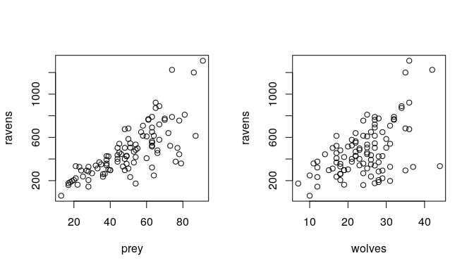

The biological interaction is probably not linear, since both the amount of prey and predator (wolves and ravens) depend upon each other. The more prey there is, the more predator are there and the more predator there are, the less prey there is.

Hard.
-----

**7H1.** Return to the tulips data and include the `bed` variable.

``` r
library(rethinking)
data(tulips)
d <- tulips
d$bed_id <- coerce_index(d$bed) 
d$shade.c <- d$shade - mean(d$shade)
d$water.c <- d$water - mean(d$water)

m7.1 <- map(
  alist(
    blooms ~ dnorm(mu, sigma),
    mu <- a + a_bed[bed_id] + bW*water.c + bS*shade.c + bWS*water.c*shade.c,
    a ~ dnorm(130, 100),
    a_bed[bed_id] ~ dnorm(0, 10),
    sigma ~ dunif(0, 100)
  ), 
  data=d,
  start=list(a=mean(d$blooms), a_bed=0, bW=0, bS=0, bWS=0, sigma=sd(d$blooms))
)
precis( m7.1 , depth = 2)
```

    ##            Mean StdDev   5.5%  94.5%
    ## a        129.01   9.88 113.22 144.79
    ## a_bed[1] -10.79   9.03 -25.22   3.63
    ## a_bed[2]   4.59   8.84  -9.53  18.71
    ## a_bed[3]   6.18   8.87  -8.00  20.35
    ## bW        75.79   9.89  59.99  91.59
    ## bS       -41.60   9.89 -57.40 -25.79
    ## bWS      -52.81  12.11 -72.16 -33.45
    ## sigma     41.95   5.98  32.40  51.50

**7H2.** Compare the model above with one that omits `bed` using WAIC. What do you infer from this comparison? Can you reconcile the WAIC results with the posterior distribution of the bed coefficients?

``` r
m7.2 <- map(
  alist(
    blooms ~ dnorm( mu, sigma),
    mu <- a + bW*water.c + bS*shade.c + bWS*water.c*shade.c,
    a ~ dnorm(130, 100),
    c(bW, bS, bWS) ~ dnorm( 0, 10),
    sigma ~ dunif(0, 100)
  ),
  data=d,
  start=list(a=mean(d$blooms), bW=0, bS=0, bWS=0, sigma=sd(d$blooms))
)
precis(m7.2)
```

    ##         Mean StdDev   5.5%  94.5%
    ## a     129.02  14.50 105.85 152.19
    ## bW     17.89   9.79   2.24  33.53
    ## bS     -9.82   9.07 -24.31   4.67
    ## bWS    -9.08   9.42 -24.13   5.97
    ## sigma  76.14  12.26  56.55  95.73

``` r
plot( coeftab(m7.1, m7.2) )
```

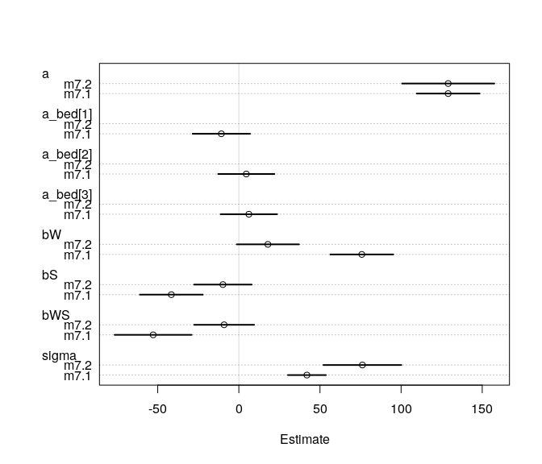

Estimates for all parameters are pretty much the same for the parameters included in both models. The index variables for the `bed` variable are all very close to zero.

``` r
compare( m7.1, m7.2 )
```

    ##       WAIC pWAIC dWAIC weight    SE   dSE
    ## m7.1 294.0   7.6   0.0      1 10.17    NA
    ## m7.2 316.7   3.1  22.7      0  9.00 12.69

The two models have almost the same WAIC and similar weights. Indeed, running the function a few times gives sometimes the first model as having the lower WAIC and sometimes the second model as having lower WAIC. Also, both models have more or less the same number of parameters estimated by WAIC and similar amounts of weight.

``` r
plot( compare( m7.1, m7.2 ))
```

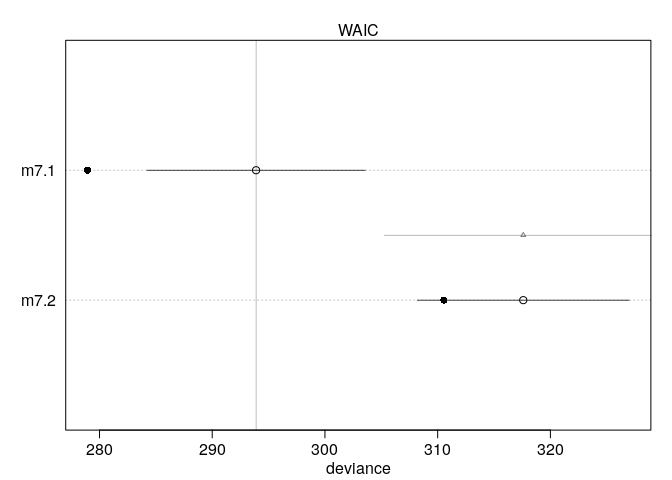

Let's have a closer look at the posterior distribution of the index variables.

``` r
post <- extract.samples( m7.1 )
post.a_bed <- as.data.frame(post$a_bed)
colnames(post.a_bed) <- c("a", "b", "c")
dens(post.a_bed$a)
dens(post.a_bed$b, add=T, col="steelblue")
dens(post.a_bed$c, add=T, col=col.desat("red"))
abline(v=0, lty=2, col="grey")
legend('topright', lty=c(1,1,1), col=c("black", "steelblue", col.desat("red")), 
       legend=c("bed a", "bed b", "bed c"), bty="n")
```

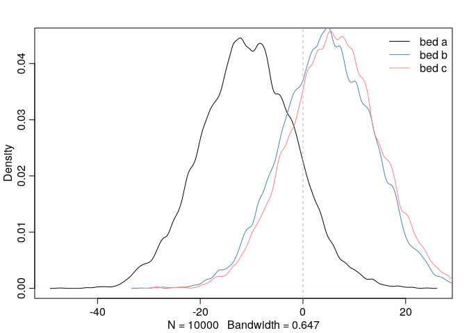

All three index parameter have most of their posterior density around 0. It's not even clear if the parameters should be positive or negative and there is a large uncertainty regarding the influence of the `bed` variable. In particular, the bed parameters for bed b and c appear to have the same distribution. Maybe it could be helpful to recode the levels, i.e. to merge b and c to one level. In my opinion, such recoding of levels should be driven by domain knowledge and not by results of models.

This also explains why the WAIC of the two models are basically the same.

**7H3.** Consider again the `rugged` data on economic development and terrain ruggedness. There is one African country in the list, Seychelles, that has both a relatively high GDP and high ruggedness. Seychelles are a group of islands, far from mainland Africa, and it is highly touristic.

``` r
data("rugged")
d <- rugged
d <- d[complete.cases(d$rgdppc_2000),]
d$log_gdp <- log(d$rgdppc_2000)
plot(log_gdp ~ rugged, data=d[d$cont_africa==0,], 
     ylim=c(min(d$log_gdp) - 0.5, max(d$log_gdp)),
     main="GDP versus Ruggedness",
     ylab="log(GDP)", xlab="Ruggedness Index")
points(log_gdp ~ rugged, data=d[d$cont_africa==1,], col="steelblue")
points(log_gdp ~ rugged, data=d[d$country=="Seychelles",], col=col.desat("red"))
text(d[d$country=="Seychelles", "rugged"], d[d$country=="Seychelles", "log_gdp"], 
     labels="Seychelles", pos=1, col=col.desat("red"))
legend("bottomright", col=c("black", "steelblue", col.desat("red")), 
       bty="n", legend=c("Non-Africa", "Africa", "Seychelles"),
       pch=c(1,1,1))
```

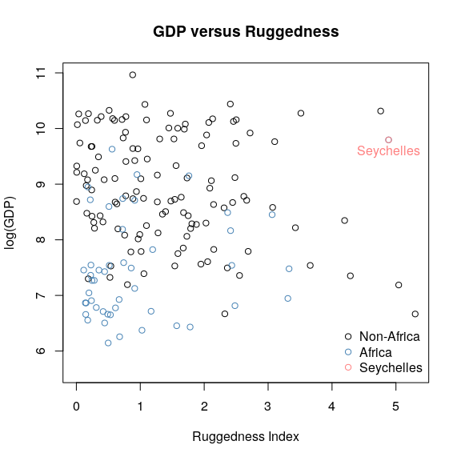

It might be, that this one nation is exerting a strong influence on the conclusion from before, that high terrain ruggedness leads to higher GDP in Africa but lower outside Africa. We will now re-evaluate this hypothesis without the Seychelles.

1.  Does it still seem like the effect of ruggedness depends upon continent? How much has the expected relationship changed?

``` r
d1 <- d[d$country != "Seychelles",]

m7.1 <- map(
  alist(
    log_gdp ~ dnorm(mu, sigma),
    mu <- a + bA*cont_africa + bR*rugged + bAR*rugged*cont_africa,
    a ~ dnorm( 8, 100),
    bA ~ dnorm(0, 1),
    bR ~ dnorm(0, 1),
    bAR ~ dnorm( 0, 1),
    sigma ~ dunif( 0, 10)
  ), data=d1
)
precis(m7.1)
```

    ##        Mean StdDev  5.5% 94.5%
    ## a      9.19   0.14  8.97  9.40
    ## bA    -1.78   0.22 -2.13 -1.43
    ## bR    -0.19   0.08 -0.31 -0.07
    ## bAR    0.25   0.14  0.04  0.47
    ## sigma  0.93   0.05  0.85  1.01

``` r
plot( precis( m7.1 ))
```

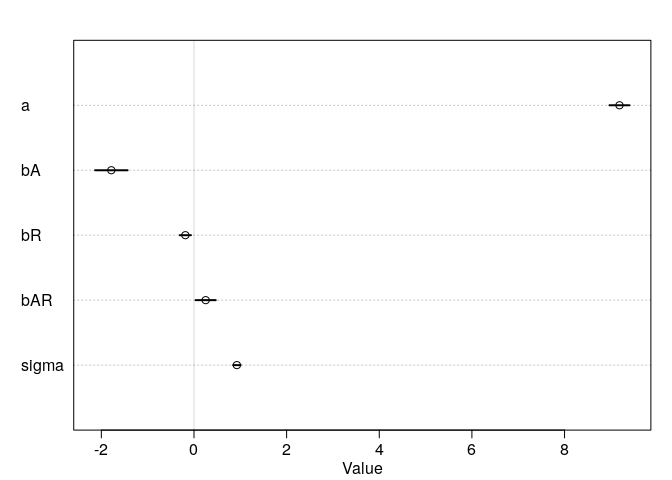

Compare with the model on the full data:

``` r
m7.2 <- map(
  alist(
    log_gdp ~ dnorm(mu, sigma),
    mu <- a + bA*cont_africa + bR*rugged + bAR*rugged*cont_africa,
    a ~ dnorm( 8, 100),
    bA ~ dnorm(0, 1),
    bR ~ dnorm(0, 1),
    bAR ~ dnorm( 0, 1),
    sigma ~ dunif( 0, 10)
  ), data=d
)
precis(m7.2)
```

    ##        Mean StdDev  5.5% 94.5%
    ## a      9.18   0.14  8.97  9.40
    ## bA    -1.85   0.22 -2.20 -1.50
    ## bR    -0.18   0.08 -0.31 -0.06
    ## bAR    0.35   0.13  0.14  0.55
    ## sigma  0.93   0.05  0.85  1.01

``` r
plot( coeftab( m7.1, m7.2 ), pars=c("bA", "bR", "bAR"))
```

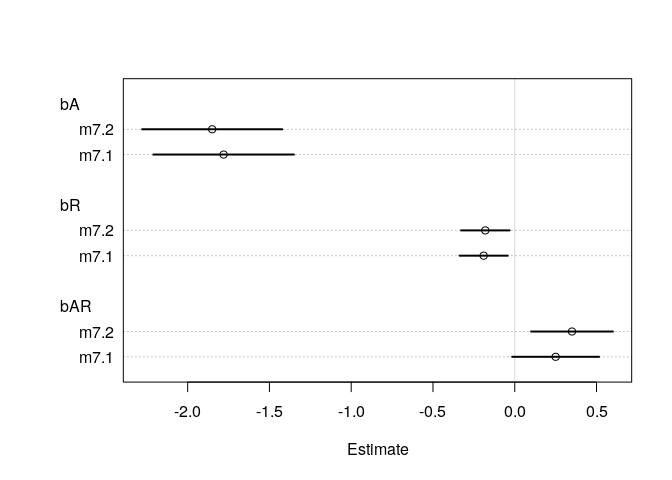

Most of the coefficients are still very close to each other, we can see some small change though for the parameter for the Africa dummy-variable and for the interaction between ruggedness and Africa. The parameter  decreased, meaning removing the Seychelles decreased the mean for GDP for Africa. The interaction coefficient  decreased a bit and thus shrank a bit closer to zero. Let's rearrange the coefficients for ruggedness and the interaction to one Gamma: 

``` r
post <- extract.samples(m7.1)
gamma.Africa <- post$bR + post$bAR*1
gamma.notAfrica <- post$bR + post$bAR*0

mean(gamma.Africa)
```

    ## [1] 0.06566328

Before, this was about 0.16.

``` r
mean(gamma.notAfrica)
```

    ## [1] -0.1849966

Comparing the distributions:

``` r
dens( gamma.Africa, xlim=c(-0.5, 0.6), ylim=c(0, 5.5),
      xlab="gamma", col="steelblue" )
dens( gamma.notAfrica, add=TRUE )
legend("topright", col=c("black", "steelblue"), bty="n", 
       legend=c("not Africa", "Africa"), lty=c(1,1))
```

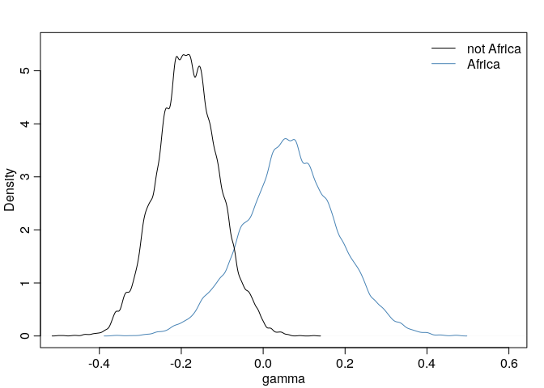

There is now much more overlap between the two distributions than before and the distribution of the Africa parameter has more density mass around 0 than before.

``` r
diff <- gamma.Africa - gamma.notAfrica
mean(diff < 0)
```

    ## [1] 0.0326

The probability that the parameter for Africa is smaller than the parameter for Not Africa is still very low though.

Compare with the model including the Seychelles:

``` r
post1 <- extract.samples(m7.2)
gamma.Africa1 <- post1$bR + post1$bAR*1
gamma.notAfrica1 <- post1$bR + post1$bAR*0

mean(gamma.Africa1)
```

    ## [1] 0.1635209

``` r
mean(gamma.notAfrica1)
```

    ## [1] -0.1837993

``` r
dens( gamma.Africa1, xlim=c(-0.5, 0.6), ylim=c(0, 5.5),
      xlab="gamma", col="steelblue" )
dens( gamma.notAfrica1, add=TRUE )
legend("topright", col=c("black", "steelblue"), bty="n", 
       legend=c("not Africa", "Africa"), lty=c(1,1))
```

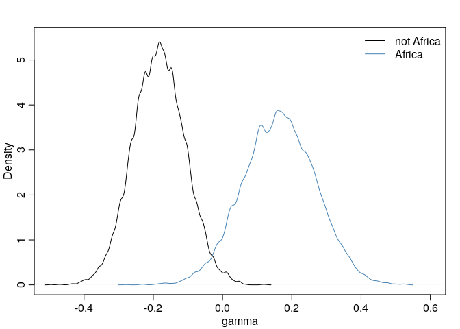

These results suggest, that without the Seychelles, there is more uncertainty, if ruggedness has a positive or any effect on GDP in Africa. The conclusion that the relationship between ruggedness and GDP differs inside and outside of Africa still holds with high probability.

1.  Plot the predictions of the interaction model, with and without Seychelles. Does it still seem like the effect of ruggedness depends upon continent? How much has the expected relationship changed?

``` r
d.A1 <- d[d$cont_africa == 1,]
d.A0 <- d[d$cont_africa ==0,]
rug.seq <- seq(from=-1, to=8, length.out = 30)
mu.Africa <- link( m7.1, data=data.frame(cont_africa=1, rugged=rug.seq))
```

    ## [ 100 / 1000 ]
    [ 200 / 1000 ]
    [ 300 / 1000 ]
    [ 400 / 1000 ]
    [ 500 / 1000 ]
    [ 600 / 1000 ]
    [ 700 / 1000 ]
    [ 800 / 1000 ]
    [ 900 / 1000 ]
    [ 1000 / 1000 ]

``` r
mu.Africa.mean <- apply(mu.Africa, 2, mean)
mu.Africa.PI <- apply(mu.Africa, 2, PI)

mu.NotAfrica <- link( m7.1, data=data.frame(cont_africa=0, rugged=rug.seq))
```

    ## [ 100 / 1000 ]
    [ 200 / 1000 ]
    [ 300 / 1000 ]
    [ 400 / 1000 ]
    [ 500 / 1000 ]
    [ 600 / 1000 ]
    [ 700 / 1000 ]
    [ 800 / 1000 ]
    [ 900 / 1000 ]
    [ 1000 / 1000 ]

``` r
mu.NotAfrica.mean <- apply(mu.NotAfrica, 2, mean)
mu.NotAfrica.PI <- apply(mu.NotAfrica, 2, PI )


mu.Africa1 <- link( m7.2, data=data.frame(cont_africa=1, rugged=rug.seq))
```

    ## [ 100 / 1000 ]
    [ 200 / 1000 ]
    [ 300 / 1000 ]
    [ 400 / 1000 ]
    [ 500 / 1000 ]
    [ 600 / 1000 ]
    [ 700 / 1000 ]
    [ 800 / 1000 ]
    [ 900 / 1000 ]
    [ 1000 / 1000 ]

``` r
mu.Africa1.mean <- apply(mu.Africa1, 2, mean)
mu.Africa1.PI <- apply(mu.Africa1, 2, PI)

mu.NotAfrica1 <- link( m7.2, data=data.frame(cont_africa=0, rugged=rug.seq))
```

    ## [ 100 / 1000 ]
    [ 200 / 1000 ]
    [ 300 / 1000 ]
    [ 400 / 1000 ]
    [ 500 / 1000 ]
    [ 600 / 1000 ]
    [ 700 / 1000 ]
    [ 800 / 1000 ]
    [ 900 / 1000 ]
    [ 1000 / 1000 ]

``` r
mu.NotAfrica1.mean <- apply(mu.NotAfrica1, 2, mean)
mu.NotAfrica1.PI <- apply(mu.NotAfrica1, 2, PI )

par(mfrow=c(2,2))
plot( log_gdp ~ rugged, data=d.A1[d.A1$country != "Seychelles",],
      col="steelblue", ylab="log GDP year 2000",
      xlab="Terrain Ruggedness Index")
mtext("African nations (without Seychelles)")
lines(rug.seq, mu.Africa.mean, col="steelblue")
shade( mu.Africa.PI, rug.seq, col=col.alpha("steelblue"))

plot( log_gdp ~ rugged, data=d.A0,
      col="black", ylab="log GDP year 2000",
      xlab="Terrain Rugggedness Index")
mtext( "Non-African nations", 3)
lines( rug.seq, mu.NotAfrica.mean )
shade( mu.NotAfrica.PI, rug.seq )


plot( log_gdp ~ rugged, data=d.A1,
      col="steelblue", ylab="log GDP year 2000",
      xlab="Terrain Ruggedness Index")
points(log_gdp ~ rugged, data=d[d$country=="Seychelles",], col=col.desat("red"))
text(d[d$country=="Seychelles", "rugged"], d[d$country=="Seychelles", "log_gdp"], 
     labels="Seychelles", pos=1, col=col.desat("red"))
mtext("African nations (with Seychelles)")
lines(rug.seq, mu.Africa1.mean, col="steelblue")
shade( mu.Africa1.PI, rug.seq, col=col.alpha("steelblue"))

plot( log_gdp ~ rugged, data=d.A0,
      col="black", ylab="log GDP year 2000",
      xlab="Terrain Rugggedness Index")
mtext( "Non-African nations", 3)
lines( rug.seq, mu.NotAfrica1.mean )
shade( mu.NotAfrica1.PI, rug.seq )
```

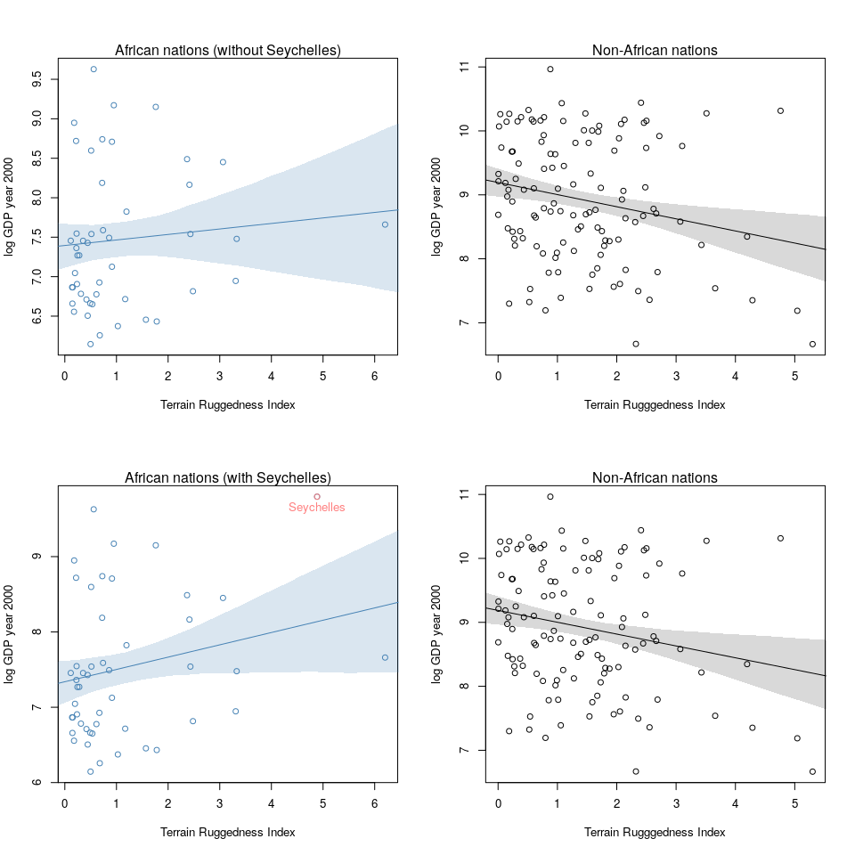

Comparing the prediction plots, the effect of ruggedness still does seem to depend upon continent but one can see how adding the Seychelles in, changed the regression line upwards.

1.  Conduct a model comparison analysis, using WAIC. Fit three models to the data without Seychelles:

     \\
    \mu_i &= \alpha + \beta_R R_i \\
    \text{Model 2} \; : y_i &\sim \text{Normal}(\mu_i, \sigma) \\
    \mu_i &= \alpha + \beta_A A_i +  \beta_R R_i \\
    \text{Model 3} \; : y_i &\sim \text{Normal}(\mu_i, \sigma) \\
    \mu_i &= \alpha + \beta_A A_i +  \beta_R R_i + \beta_{AR}A_i R_i 
    \end{align*}")

     Use whatever priors you think are sensible. Plot the model-averaged predictions of this model set. Do your inferences differ from those in (b)?

``` r
m7.3 <- map(
  alist(
    log_gdp ~ dnorm( mu, sigma),
    mu <- a + bR*rugged,
    a ~ dnorm(8, 100),
    bR ~ dnorm(0, 1),
    sigma ~ dunif(0, 10)
  ), data=d1
)

m7.4 <- map(
  alist(
    log_gdp ~ dnorm( mu, sigma),
    mu <- a + bR*rugged + bA*cont_africa,
    a ~ dnorm(8, 100),
    bR ~ dnorm(0, 1),
    bA ~ dnorm(0, 1),
    sigma ~ dnorm(0, 10)
  ), data=d1
)

m7.5 <- map(
  alist(
    log_gdp ~ dnorm( mu, sigma),
    mu <- a + bR*rugged + bA*cont_africa + bAR*cont_africa*rugged,
    a ~ dnorm(8, 100),
    bR ~ dnorm(0, 1),
    bA ~ dnorm(0, 1),
    bAR ~ dnorm(0, 1),
    sigma ~ dunif( 0, 10)
  ), data=d1
)

compare(m7.3, m7.4, m7.5)
```

    ##       WAIC pWAIC dWAIC weight    SE   dSE
    ## m7.5 463.6   4.7   0.0   0.78 15.10    NA
    ## m7.4 466.2   4.0   2.5   0.22 14.34  3.39
    ## m7.3 536.4   2.8  72.7   0.00 13.34 15.33

Now, most of the weight is on the model with the interaction. It also has the lowest WAIC. Including the Africa variable as a dummy variable gives a lower WAIC than only using ruggedness as predictor variable.

``` r
plot( compare( m7.3, m7.4, m7.5))
```

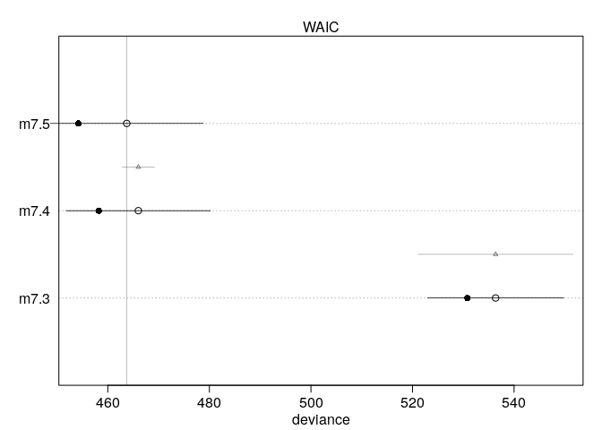

There is quite a bit of uncertainty if the interaction model has a lower WAIC than the model with just the dummy variable.

Plotting the model-averaged predictions:

``` r
rugged.Africa.ensemble <- ensemble( m7.3, m7.4, m7.5, data=data.frame(cont_africa=1, rugged=rug.seq))
```

    ## Constructing posterior predictions

    ## [ 100 / 1000 ]
    [ 200 / 1000 ]
    [ 300 / 1000 ]
    [ 400 / 1000 ]
    [ 500 / 1000 ]
    [ 600 / 1000 ]
    [ 700 / 1000 ]
    [ 800 / 1000 ]
    [ 900 / 1000 ]
    [ 1000 / 1000 ]

    ## Constructing posterior predictions

    ## [ 100 / 1000 ]
    [ 200 / 1000 ]
    [ 300 / 1000 ]
    [ 400 / 1000 ]
    [ 500 / 1000 ]
    [ 600 / 1000 ]
    [ 700 / 1000 ]
    [ 800 / 1000 ]
    [ 900 / 1000 ]
    [ 1000 / 1000 ]

    ## Constructing posterior predictions

    ## [ 100 / 1000 ]
    [ 200 / 1000 ]
    [ 300 / 1000 ]
    [ 400 / 1000 ]
    [ 500 / 1000 ]
    [ 600 / 1000 ]
    [ 700 / 1000 ]
    [ 800 / 1000 ]
    [ 900 / 1000 ]
    [ 1000 / 1000 ]

``` r
mu.Africa.mean <- apply(rugged.Africa.ensemble$link, 2, mean)
mu.Africa.PI <- apply(rugged.Africa.ensemble$link, 2, PI)
log_gdp.Africa.PI <- apply(rugged.Africa.ensemble$sim, 2, PI )

rugged.notAfrica.ensemble <- ensemble(m7.3, m7.4, m7.5, data=data.frame(cont_africa=0, rugged=rug.seq))
```

    ## Constructing posterior predictions

    ## [ 100 / 1000 ]
    [ 200 / 1000 ]
    [ 300 / 1000 ]
    [ 400 / 1000 ]
    [ 500 / 1000 ]
    [ 600 / 1000 ]
    [ 700 / 1000 ]
    [ 800 / 1000 ]
    [ 900 / 1000 ]
    [ 1000 / 1000 ]

    ## Constructing posterior predictions

    ## [ 100 / 1000 ]
    [ 200 / 1000 ]
    [ 300 / 1000 ]
    [ 400 / 1000 ]
    [ 500 / 1000 ]
    [ 600 / 1000 ]
    [ 700 / 1000 ]
    [ 800 / 1000 ]
    [ 900 / 1000 ]
    [ 1000 / 1000 ]

    ## Constructing posterior predictions

    ## [ 100 / 1000 ]
    [ 200 / 1000 ]
    [ 300 / 1000 ]
    [ 400 / 1000 ]
    [ 500 / 1000 ]
    [ 600 / 1000 ]
    [ 700 / 1000 ]
    [ 800 / 1000 ]
    [ 900 / 1000 ]
    [ 1000 / 1000 ]

``` r
mu.NotAfrica.mean <-apply(rugged.notAfrica.ensemble$link, 2, mean)
mu.NotAfrica.PI <- apply(rugged.notAfrica.ensemble$link,2, PI)
log_gdp.NotAfrica.PI <- apply(rugged.notAfrica.ensemble$sim, 2, PI)

par(mfrow=c(1,2))
plot( log_gdp ~ rugged, data=d.A1[d.A1$country != "Seychelles",],
      col="steelblue", ylab="log GDP year 2000",
      xlab="Terrain Ruggedness Index")
mtext("African nations (without Seychelles)")
lines(rug.seq, mu.Africa.mean, col="steelblue")
shade( mu.Africa.PI, rug.seq, col=col.alpha("steelblue"))
# shade( log_gdp.Africa.PI, rug.seq, col=col.alpha("steelblue"))

plot( log_gdp ~ rugged, data=d.A0,
      col="black", ylab="log GDP year 2000",
      xlab="Terrain Rugggedness Index")
mtext( "Non-African nations", 3)
lines( rug.seq, mu.NotAfrica.mean )
shade( mu.NotAfrica.PI, rug.seq )
```

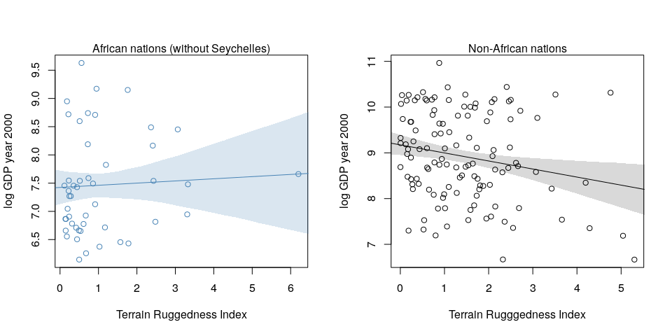

``` r
# shade( log_gdp.NotAfrica.PI, rug.seq)
```

The slope for ruggedness for Africa nations seem to have got even a bit closer to zero and there is quite some uncertainty about the regression line. The uncertainty ribbon would for example also include the regression line with the same slope as the one for non-Africa nations. These models suggest, that one cannot conclude that there is a positive relationship between ruggedness and GDP in African nations.

**7H4.** The data set `data(nettle)` is data on language diversity in 74 nations. Evaluate the hypothesis that language diversity is partly a product of food security. The notion is that, in productive ecologies, people don't need large social networks to buffer them against risk of food shortfalls and thus ethnic groups can be smaller and more self-sufficient.

``` r
data(nettle)
d <- nettle
str(d)
```

    ## 'data.frame':    74 obs. of  7 variables:
    ##  $ country            : Factor w/ 74 levels "Algeria","Angola",..: 1 2 3 4 5 6 7 8 9 12 ...
    ##  $ num.lang           : int  18 42 234 37 52 38 27 209 75 94 ...
    ##  $ area               : int  2381741 1246700 7713364 143998 112622 1098581 581730 8511965 274000 622984 ...
    ##  $ k.pop              : int  25660 10303 17336 118745 4889 7612 1348 153322 9242 3127 ...
    ##  $ num.stations       : int  102 50 134 20 7 48 10 245 6 13 ...
    ##  $ mean.growing.season: num  6.6 6.22 6 7.4 7.14 6.92 4.6 9.71 5.17 8.08 ...
    ##  $ sd.growing.season  : num  2.29 1.87 4.17 0.73 0.99 2.5 1.69 5.87 1.07 1.21 ...

Specifically, try to model the number of languages per capita as the outcome variable:

``` r
d$lang.per.cap <- d$num.lang / d$k.pop
d$log.lang <- log( d$lang.per.cap)
```

where `num.lang` is the number of languages spoken and `k.pop` is the population in thousands. We will use the predictor variables `mean.growing.season`, the average length of growing season in months and `sd.growing.season`, the standard deviation of length of growing season, in months, and their interactions.

1.  Evaluate the hypothesis that language diversity, as measured by `log(lang.per.cap)` is positively associated with the average length of the growing season. Consider `log(area)` as a covariate.

We first center the variables used as predictor variables. The lowest value a country could have for languages per capita would be only one language for ~1.5 billion people (most populated country in the world: China). The ratio of this is ~6.7e-10 which on log scale (and counting population in thousands) translates to about -12 and the maximum value would be each thousand people speaks a different language (very unlikely), as ratio this is 1, so on log scale 0. I expect most countries to be in between these extremes, so the prior for the intercept is "), allowing values between -25 and 20. For the parameters, I use weakly regularizing priors ").

``` r
d$log.area <- log(d$area)
d$mean.growing.season.c <- d$mean.growing.season - mean(d$mean.growing.season)
d$log.area.c <- d$log.area - mean(d$log.area)

m7.1 <- map(
  alist(
    log.lang ~ dnorm( mu, sigma),
    mu <- a + bM*mean.growing.season.c,
    a ~ dnorm(-5, 10),
    bM ~ dnorm(0, 1),
    sigma ~ dunif(0, 10)
  ), data=d
)
m7.2 <- map(
  alist( 
    log.lang ~ dnorm( mu, sigma),
    mu <- a + bM*mean.growing.season.c + bA*log.area.c,
    a ~ dnorm(-5, 10),
    bM ~ dnorm(0, 1),
    bA ~ dnorm(0, 1),
    sigma ~ dunif(0, 10)
    ), data=d
)
coeftab(m7.1, m7.2 )
```

    ##       m7.1    m7.2   
    ## a       -5.46   -5.46
    ## bM       0.17    0.14
    ## sigma    1.41    1.39
    ## bA         NA    -0.2
    ## nobs       74      74

``` r
plot( coeftab( m7.1, m7.2 ), pars=c("bM", "bA"))
```

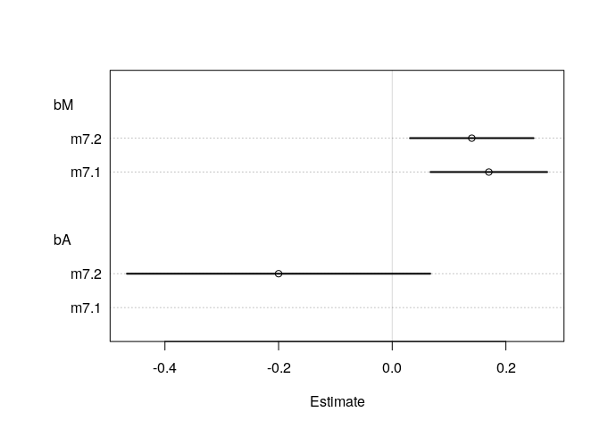

The parameter for area has a huge uncertainty, so seems to not have a influence on our target variable. Including area leads to a slight decrease in the parameter for the mean length of growing season. For both models, the mean length of growing season is positively associated with the number of languages per capita.

``` r
compare( m7.1, m7.2)
```

    ##       WAIC pWAIC dWAIC weight    SE  dSE
    ## m7.1 267.5   3.5   0.0   0.63 15.09   NA
    ## m7.2 268.6   5.2   1.1   0.37 15.93 3.54

``` r
plot( compare( m7.1, m7.2 ))
```

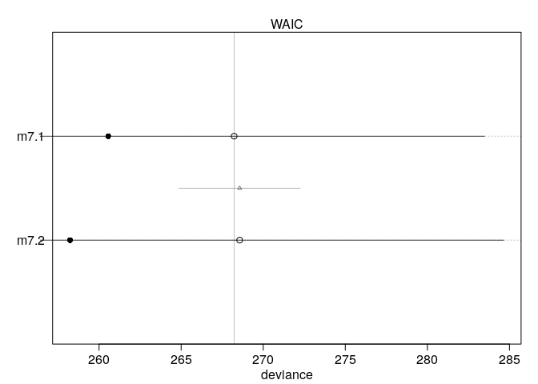

WAIC does not favor any of the two models, so adding the area doesn't seem to bring big improvements to the model.

``` r
mean.g.s.seq <- seq(from=-8, to=6, length.out = 50)
mu <- link(m7.1, data=data.frame(mean.growing.season.c=mean.g.s.seq ) )
```

    ## [ 100 / 1000 ]
    [ 200 / 1000 ]
    [ 300 / 1000 ]
    [ 400 / 1000 ]
    [ 500 / 1000 ]
    [ 600 / 1000 ]
    [ 700 / 1000 ]
    [ 800 / 1000 ]
    [ 900 / 1000 ]
    [ 1000 / 1000 ]

``` r
mu.mean <- apply(mu, 2, mean)
mu.PI <- apply(mu, 2, PI)

plot( log.lang ~ mean.growing.season.c, data=d,
      xlab="Mean lenght of growing season (centered)",
      ylab="log languages per capita")
lines(mean.g.s.seq, mu.mean)
shade(mu.PI, mean.g.s.seq)
```

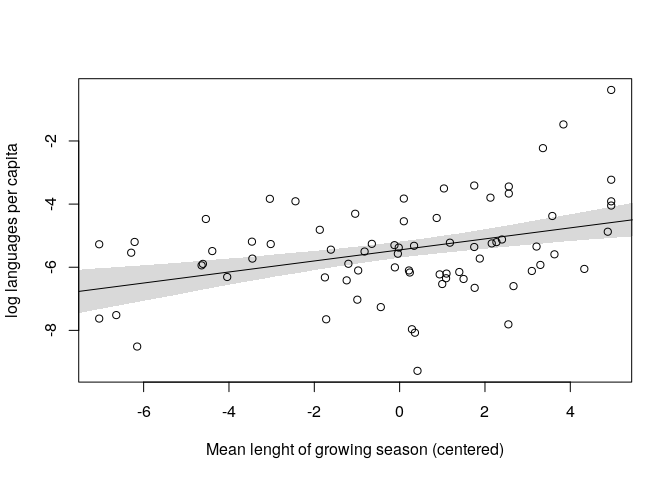

1.  Evaluate the hypothesis that language diversity is negatively associated with the standard deviation of length of growing season.

``` r
d$sd.growing.season.c <- d$sd.growing.season - mean(d$sd.growing.season)
m7.3 <- map(
  alist(
    log.lang ~ dnorm(mu, sigma),
    mu <- a + bS*sd.growing.season.c,
    a ~ dnorm(-5, 10),
    bS ~ dnorm(0, 1),
    sigma ~ dunif(0, 10)
  ), data=d
)

m7.4 <- map(
  alist(
    log.lang ~ dnorm( mu, sigma),
    mu <- a + bS*sd.growing.season.c + bA*log.area.c,
    a ~ dnorm( -5, 10),
    bS ~ dnorm( 0, 1),
    bA ~ dnorm( 0, 1),
    sigma ~ dunif( 0, 10)
  ), data=d
)
coeftab(m7.3, m7.4)
```

    ##       m7.3    m7.4   
    ## a       -5.46   -5.46
    ## bS      -0.35   -0.21
    ## sigma    1.46    1.44
    ## bA         NA   -0.24
    ## nobs       74      74

``` r
plot( coeftab( m7.3, m7.4 ), pars=c("bS", "bA"))
```

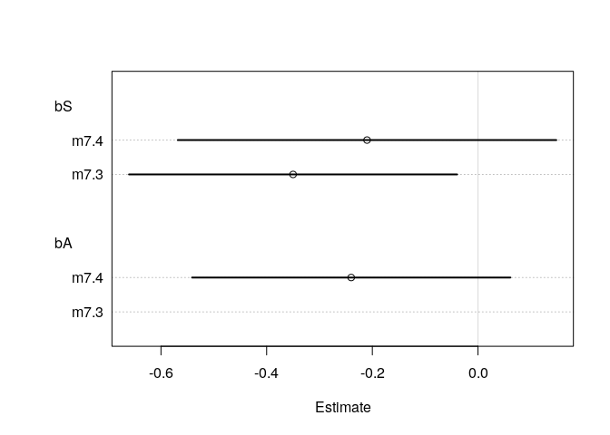

``` r
cor(d$sd.growing.season, d$log.area)
```

    ## [1] 0.5320083

There seems to be some collinearity between standard deviation of growing season and the area. This makes sense if the length of the growing season can also vary quite a bit inside a country if the country is large (consider for example Brazil or Australia, both having area that ranges through different climate zones, like desert and rain forests).

Without the area, the standard deviation of length of growing season has a negative impact on language diversity.

``` r
compare(m7.3, m7.4)
```

    ##       WAIC pWAIC dWAIC weight    SE  dSE
    ## m7.3 273.0   3.6   0.0    0.6 16.91   NA
    ## m7.4 273.8   5.3   0.8    0.4 16.88 3.88

``` r
plot(compare( m7.3, m7.4))
```

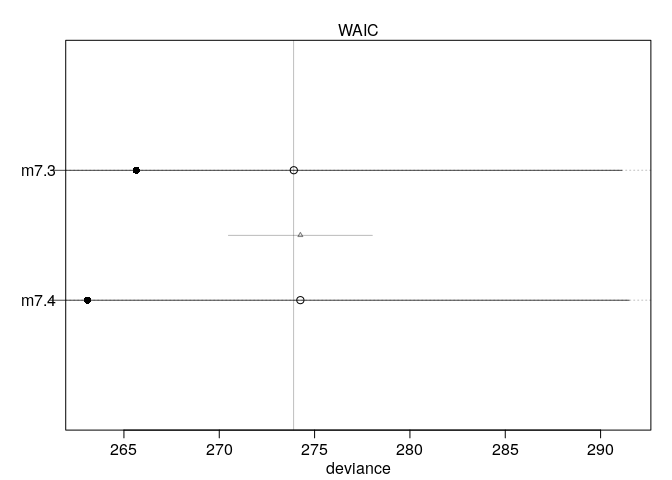

Again, both models have almost identical WAIC and both get half of the weight.

``` r
sd.g.s.seq <- seq(from=-2, to=5, length.out = 50)
mu <- link(m7.3, data=data.frame(sd.growing.season.c=sd.g.s.seq ) )
```

    ## [ 100 / 1000 ]
    [ 200 / 1000 ]
    [ 300 / 1000 ]
    [ 400 / 1000 ]
    [ 500 / 1000 ]
    [ 600 / 1000 ]
    [ 700 / 1000 ]
    [ 800 / 1000 ]
    [ 900 / 1000 ]
    [ 1000 / 1000 ]

``` r
mu.mean <- apply(mu, 2, mean)
mu.PI <- apply(mu, 2, PI)

plot( log.lang ~ sd.growing.season.c, data=d,
      xlab="Standard deviation of lenght of growing season (centered)",
      ylab="log languages per capita")
lines(sd.g.s.seq, mu.mean)
shade(mu.PI, sd.g.s.seq)
```

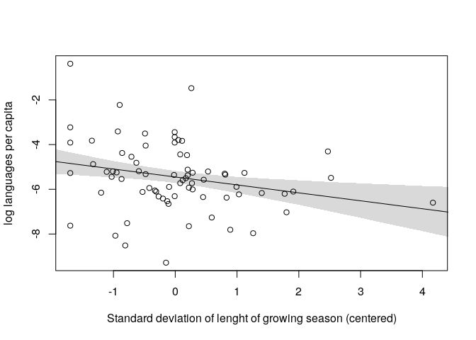

From the model, we can conclude a very slight negative association of standard deviation of length of growing season on the language diversity.

1.  Evaluate the hypothesis, that the average length of growing season and the standard deviation of length of growing season interact to synergistically reduce language diversity.

``` r
m7.5 <- map(
  alist(
    log.lang ~ dnorm( mu, sigma),
    mu <- a + bM*mean.growing.season.c + bS*sd.growing.season.c + bMS*sd.growing.season.c*mean.growing.season.c,
    a ~ dnorm( -5, 10),
    bM ~ dnorm(0 , 1),
    bS ~ dnorm(0, 1),
    bMS ~ dnorm(0, 1),
    sigma ~ dunif( 0, 10)
  ), data=d
)
precis(m7.5)
```

    ##        Mean StdDev  5.5% 94.5%
    ## a     -5.45   0.15 -5.69 -5.21
    ## bM     0.11   0.06  0.03  0.20
    ## bS    -0.34   0.14 -0.57 -0.11
    ## bMS   -0.11   0.05 -0.18 -0.03
    ## sigma  1.31   0.11  1.14  1.48

``` r
plot( coeftab( m7.1, m7.3, m7.5), pars=c("bM", "bS", "bMS"))
```

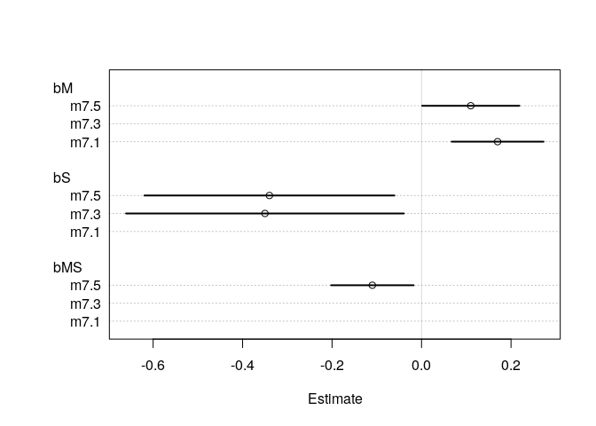

Plotting the interaction. Since we don't have discrete values as in the example in the chapter before, I only pick a subset of values for which to make a (counterfactual) plot.

``` r
par(mfrow=c(1,4))
for (s in -1:2) {
  plot( log.lang ~ mean.growing.season.c, data=d,
        col="steelblue", type="n",
        main=paste("sd.growing.season.c=",s),
        xlab="mean growing season (centered)",
        ylim=c(-8, -4))
  mu <- link( m7.5, data= data.frame(mean.growing.season.c=mean.g.s.seq,
                                     sd.growing.season.c=s))
  mu.mean <- apply( mu, 2, mean)
  mu.PI <- apply( mu, 2, PI )
  lines( mean.g.s.seq, mu.mean )
  lines( mean.g.s.seq, mu.PI[1,], lty=2)
  lines( mean.g.s.seq, mu.PI[2,], lty=2)
}
```

    ## [ 100 / 1000 ]
    [ 200 / 1000 ]
    [ 300 / 1000 ]
    [ 400 / 1000 ]
    [ 500 / 1000 ]
    [ 600 / 1000 ]
    [ 700 / 1000 ]
    [ 800 / 1000 ]
    [ 900 / 1000 ]
    [ 1000 / 1000 ]

    ## [ 100 / 1000 ]
    [ 200 / 1000 ]
    [ 300 / 1000 ]
    [ 400 / 1000 ]
    [ 500 / 1000 ]
    [ 600 / 1000 ]
    [ 700 / 1000 ]
    [ 800 / 1000 ]
    [ 900 / 1000 ]
    [ 1000 / 1000 ]

    ## [ 100 / 1000 ]
    [ 200 / 1000 ]
    [ 300 / 1000 ]
    [ 400 / 1000 ]
    [ 500 / 1000 ]
    [ 600 / 1000 ]
    [ 700 / 1000 ]
    [ 800 / 1000 ]
    [ 900 / 1000 ]
    [ 1000 / 1000 ]

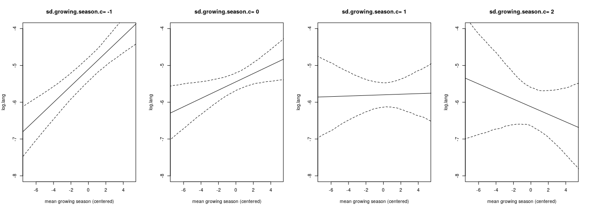

    ## [ 100 / 1000 ]
    [ 200 / 1000 ]
    [ 300 / 1000 ]
    [ 400 / 1000 ]
    [ 500 / 1000 ]
    [ 600 / 1000 ]
    [ 700 / 1000 ]
    [ 800 / 1000 ]
    [ 900 / 1000 ]
    [ 1000 / 1000 ]

For a very low standard deviation of length of growing season, the mean length is strongly positively associated with diversity of languages. With a growing standard deviation, this association decreases, so that for a very high standard deviation the association even reverses to a negative one. This fits with the proposed theory, that if the average length of growing season is long and the standard deviation is large as well, then it is crucial to store and redistribute food in years of a long growing season, thus fostering corporation and larger networks.

``` r
par(mfrow=c(1,4))
for (m in c(-2,0,2,4)) {
  plot( log.lang ~ sd.growing.season.c, data=d,
        col="steelblue", type="n",
        main=paste("mean.growing.season.c=",m),
        xlab="standard deviation growing season (centered)",
        ylim=c(-8, -4))
  mu <- link( m7.5, data= data.frame(mean.growing.season.c=m,
                                     sd.growing.season.c=sd.g.s.seq))
  mu.mean <- apply( mu, 2, mean)
  mu.PI <- apply( mu, 2, PI )
  lines( mean.g.s.seq, mu.mean )
  lines( mean.g.s.seq, mu.PI[1,], lty=2)
  lines( mean.g.s.seq, mu.PI[2,], lty=2)
}
```

    ## [ 100 / 1000 ]
    [ 200 / 1000 ]
    [ 300 / 1000 ]
    [ 400 / 1000 ]
    [ 500 / 1000 ]
    [ 600 / 1000 ]
    [ 700 / 1000 ]
    [ 800 / 1000 ]
    [ 900 / 1000 ]
    [ 1000 / 1000 ]

    ## [ 100 / 1000 ]
    [ 200 / 1000 ]
    [ 300 / 1000 ]
    [ 400 / 1000 ]
    [ 500 / 1000 ]
    [ 600 / 1000 ]
    [ 700 / 1000 ]
    [ 800 / 1000 ]
    [ 900 / 1000 ]
    [ 1000 / 1000 ]

    ## [ 100 / 1000 ]
    [ 200 / 1000 ]
    [ 300 / 1000 ]
    [ 400 / 1000 ]
    [ 500 / 1000 ]
    [ 600 / 1000 ]
    [ 700 / 1000 ]
    [ 800 / 1000 ]
    [ 900 / 1000 ]
    [ 1000 / 1000 ]

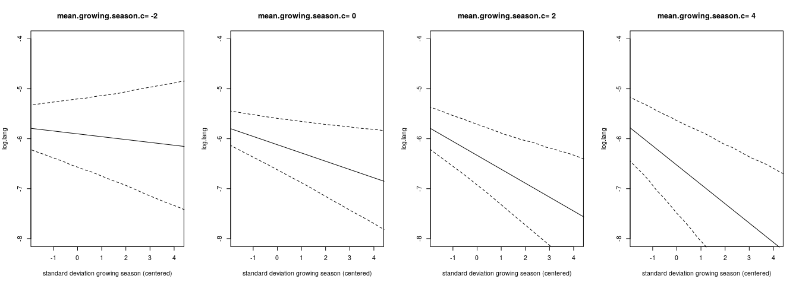

    ## [ 100 / 1000 ]
    [ 200 / 1000 ]
    [ 300 / 1000 ]
    [ 400 / 1000 ]
    [ 500 / 1000 ]
    [ 600 / 1000 ]
    [ 700 / 1000 ]
    [ 800 / 1000 ]
    [ 900 / 1000 ]
    [ 1000 / 1000 ]

The higher the average length of growing season is, the more negative is the association between the standard deviation of growing season and language diversity.
