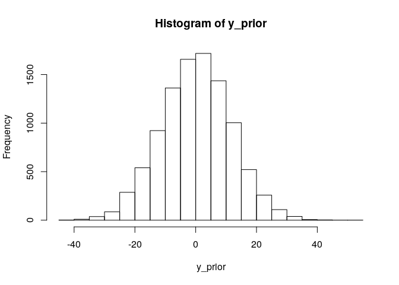
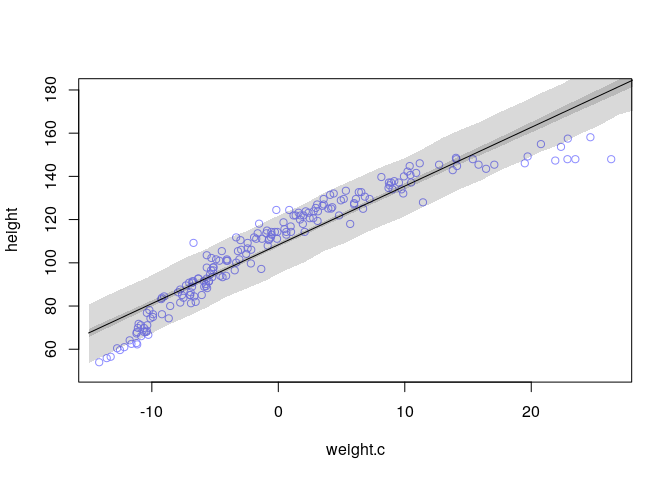
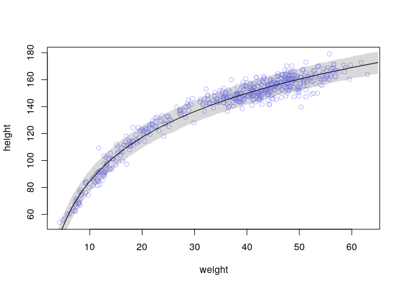

Chapter 4 exercise
================
Corrie
May 21, 2018

Chapter 4 - Exercises
=====================

These are my solutions to the practice questions of chapter 4, Linear Models, of the book "Statistical Rethinking" by Richard McElreath.

Easy Questions.
---------------

**4E1.** In the model definition below, which line is the likelihood:

 & \text{This is the likelihood}\\
\mu &\sim \text{Normal}(0, 10) \\
\sigma &\sim \text{Normal}(0,10)
\end{align*} ")

**4E2.** In the model definition just above, how many parameters are in the posterior distribution?

There are **2** parameters,  and .

**4E3.** Write down the appropriate form of Bayes' theorem that includes the proper likelihood and priors.

 &\propto \text{Likelihood } \times \text{ Prior probability} \\
\\
P(\mu, \sigma| y_i) &= \frac{\prod_i \text{Normal}(y_i|\mu, \sigma) \times 
\text{Normal}(\mu| 0,10) \times \text{Normal}(\sigma|0,10) }
{\int \prod_i \text{Normal}(y_i|\mu, \sigma) \times 
\text{Normal}(\mu| 0,10) \times \text{Normal}(\sigma|0,10) \text{ d}\mu\text{d}\sigma} 
\end{align*}")

 where

 = \frac{1}{\sqrt{2\pi \sigma^2} }\exp(- \frac{(x-\mu)^2}{2\sigma^2})")

.

**4E4.** In the model definition below, which line is the linear model?

 \\
\mu_i &= \alpha + \beta x_i & \text{This is the linear model}\\
\alpha &\sim \text{Normal}(0,10) \\
\beta &\sim \text{Normal}(0,1) \\
\sigma &\sim \text{Uniform}(0,10)
\end{align*}")

**4E5.** In the model definition just above, how many parameters are in the posterior distribution?

There are **3** parameters in the posterior distribution, , , and .

Medium questions.
-----------------

**4M1.** For the model definition below, simulate observed heights from the prior (not the posterior).

 \\
\mu &\sim \text{Normal}(0, 10) \\
\sigma &\sim \text{Uniform}(0,10)
\end{align*}")

``` r
n <- 10000
mu <- rnorm(n, 0, 10)
sigma <- runif(n, 0, 10)
y_prior <- rnorm(n, mu, sigma)
hist(y_prior)
```



**4M2.** Translate the model just above into a `map` formula.

``` r
flist <- alist(
            y ~ dnorm(mu, sigma),
            mu ~ dnorm(0, 10),
            sigma ~ dunif(0,10)
          ) 
```

**4M3.** Translate the `map` formula below into a mathematical model definition.

``` r
flist <- alist(
  y ~ dnorm( mu, sigma ),
  mu <- a + b*x,
  a ~ dnorm( 0, 50 ),
  b ~ dnorm( 0, 10 ),
  sigma ~ dunif( 0, 50 )
)
```

The mathematical definition:

 \\
\mu_i &= \alpha + \beta x_i \\
\alpha &\sim \text{Normal}(0,50) \\
\beta &\sim  \text{Uniform}(0,10) \\
\sigma &\sim \text{Uniform}(0,50) 
\end{align*}")

**4M4.** A sample of students is measured for height each year for three years. You want to fit a linear regression, using year as a prediction. Write down the mathematical model definition.

 \\
\mu_i &= \alpha + \beta t_i \\
\alpha &\sim \text{Normal}(160, 50) \\
\beta &\sim \text{Normal}(0, 10) \\
\sigma &\sim \text{Uniform}(0, 50)
\end{align*}")

 Here,  is the height and  is the year of the th observation. Since  is the average height of a student at year zero, I picked a normal distribution with mean 160 (assuming an average height of 160cm) and standard deviation 50, this is relatively weak, leaving a wide range of possible heights. For , I picked a normal distribution with mean 0 and standard deviation 10, meaning on average, a person grows 0cm per year with standard deviation 10cm, since I don't expect many people to grow or shrink more than 20cm per year.

**4M5.** Now suppose, the average in the first year was 120cm and that every student got taller each year. I will change my priors as follows:

 \\
\beta &\sim \text{Uniform}(0, 20)
\end{align*}")

 I adjusted the mean for the average height accordingly and changed  to a uniform distribution, so that , the indicator for growth per year, is greater or equal than zero. I still don't expect people to grow more than 20cm per year.

**4M6.** Now suppose, the variance among heights for students of the same age is never more than 64cm. I thus change my priors as follows:

.")

Hard question.
--------------

**4H1.** !Kung census data: Provide predicted heights and 89% intervals (either HPDI or PI) for the following weights of individuals.

``` r
weights <- c(46.95, 43.72, 64.78, 32.59, 54.63)
```

For this, we first load the !Kung data from the `Howell1` data set and set up a model. I will use a linear model with priors as in the model definition given earlier in the chapter.

``` r
library(rethinking)
data(Howell1)
d <- Howell1
d2 <- d[ d$age >= 18, ]
d2$weight.c <- d2$weight - mean(d2$weight)    # centering the weights

# fit model
model <- map(
  alist(
    height ~ dnorm( mu, sigma) ,
    mu <- a + b*weight.c,   
    a ~ dnorm( 156, 100) ,   # average height with weak prior
    b ~ dnorm( 0, 10),       # fairly uninformative prior
    sigma ~ dunif( 0, 50)
  ), 
  data=d2
)

precis( model)
```

    ##         Mean StdDev   5.5%  94.5%
    ## a     154.60   0.27 154.17 155.03
    ## b       0.91   0.04   0.84   0.97
    ## sigma   5.07   0.19   4.77   5.38

How to interpret the model: Since we centered the weights such that the mean of `weight.c` is zero, `a` corresponds to the average height. The value 0.91 for `b` means that a person 1kg heavier is expected to be 0.90cm taller. The estimate for , `sigma` tells us about the width of the distribution of heights around the mean. Let's now use the model to predict the heights for the weight values given above. For this, we simulate heights for each given weight value. We do this by first obtaining a sample from the posterior distribution and then use this sample to draw samples from a Gaussian distribution. Note that we also need to center the given weights now.

``` r
weights.c <- weights - mean(d2$weight)
post <- extract.samples(model)
sim.height <- sapply( weights.c, function(weight) {
  rnorm(
    n = nrow(post),
    mean = post$a + post$b*weight,
    sd = post$sigma
  )
})

height.PI <- apply(sim.height, 2, PI, prob=0.89)
height.HPDI <- apply(sim.height, 2, HPDI, prob=0.89)
height.mean <- apply(sim.height, 2, mean)

pred_df <- data.frame("individual"=1:5, "weight"=weights, "exptected_height"=height.mean, 
                      "PI_89_lower"=height.PI[1,], "PI_89_upper"=height.PI[2,])
pred_df
```

    ##   individual weight exptected_height PI_89_lower PI_89_upper
    ## 1          1  46.95         156.3494    148.1657    164.5174
    ## 2          2  43.72         153.3438    145.0099    161.6660
    ## 3          3  64.78         172.4697    164.2334    180.7199
    ## 4          4  32.59         143.3905    135.3294    151.5512
    ## 5          5  54.63         163.3429    155.2578    171.5821

**4H2.** Select the rows from the `Howell1` data with age below 18 years.

1.  Fit a linear regression to these data, using `map`. I will use the same model as above.

``` r
d18 <- d[ d$age < 18, ]
d18$weight.c <- d18$weight - mean(d18$weight)   # centering the data

# fit the model

model18 <- map(
  alist(
    height ~ dnorm( mu, sigma) ,
    mu <- a + b*weight.c ,
    a ~ dnorm( 156, 100) ,
    b ~ dnorm( 0, 10) ,
    sigma ~ dunif(0, 50)
  ),
  data=d18
)
precis(model18)
```

    ##         Mean StdDev   5.5%  94.5%
    ## a     108.32   0.61 107.35 109.29
    ## b       2.72   0.07   2.61   2.83
    ## sigma   8.44   0.43   7.75   9.13

As above, since we centered the weights, the intercept `a` corresponds to the average height, which is here 108.3. This is much lower than in the model above (but expected since the individuals in this data set are younger). The slope `b` is interpreted such that for every 10kg heavier, an individual is expected to be 27cm taller. The standard deviation `sigma` in this model is higher than in the one above, suggesting a higher uncertainty in the predictions.

1.  Plot the raw data and superimpose the MAP regression line and 89% HPDI for the mean and for the predicted height. We first compute the regression line by generating a sequence over the whole range of (centered) weights for which we then sample from the posterior distribution to compute a sample of mu, of which we can then compute the mean and the 89% HPDI. We similarly compute the 89% HPDI for the predicted height (as also done in the question before).

``` r
weight.seq <- seq(from=-15, to=30, length.out = 30)             # generate weights (centered) over the whole range
post <- extract.samples(model18)                                # extract a posterior sample
# compute mu
mu.link <- function(weight.c) post$a + post$b*weight.c           # the function to compute mu, using the sample above
mu <- sapply(weight.seq, mu.link)
mu.mean <- apply(mu, 2, mean)
mu.HPDI <- apply(mu, 2, HPDI, prob=0.89)

# compute predicted height
sim.height <- sapply( weight.seq, function(weight) {
  rnorm(
    n = nrow(post),
    mean = post$a + post$b*weight,
    sd = post$sigma
  )
})

height.HPDI <- apply(sim.height, 2, HPDI, prob=0.89)
height.mean <- apply(sim.height, 2, mean)

# plot everything
plot(height ~ weight.c, data=d18, col=col.alpha(rangi2, 0.9), ylim=c(50, 180))   # the raw data
lines(weight.seq, mu.mean)                                      # the MAP regression line
shade( mu.HPDI, weight.seq)                                     # draw HPDI region around the regression line
shade( height.HPDI, weight.seq)                                 # draw HPDI region for the simulated heights
```



1.  What aspects of the model fit concern you? The linear model doesn't seem to be a very good fit for the data. It performs very poorly for the lower and higher values of weight. One possibility to improve the model could be to use a polynomial model (e.g. of 2nd order) instead.

**4H3.** A colleague exclaims: "Only the *logarithm* of body weight scales with height!" Let's try this out.

1.  Use the entire `Howell1` data frame using the following model:

     \\
    \mu_i &= \alpha + \beta \log(w_i) \\
    \alpha &\sim \text{Normal}(178, 100) \\
    \beta &\sim \text{Normal}(0, 100) \\
    \sigma &\sim \text{Uniform}(0, 50)
    \end{align*}")

     Here the model description in R:

``` r
d <- Howell1
# fit the model

model.l <- map(
  alist(
    height ~ dnorm( mu, sigma) ,
    mu <- a + b*log(weight) ,
    a ~ dnorm( 178, 100) ,
    b ~ dnorm( 0, 100) ,                
    sigma ~ dunif(0, 50)
  ),
  data=d
)
precis(model.l)
```

    ##         Mean StdDev   5.5%  94.5%
    ## a     -23.79   1.34 -25.92 -21.66
    ## b      47.08   0.38  46.47  47.69
    ## sigma   5.13   0.16   4.89   5.38

Interpreting these results is a bit more difficult since we transformed the weights using the logarithm. Furthermore, the data is not centralized as before, so the intercept `a` corresponds to the average height of someone whose log weight is zero, i.e. whose weight is 1kg. How to interpret the `b` value? If we raise the weight by one unit, we get the following expression for mu:

 
\end{align*}")

 Using some rules for logarithms, we get:

 + \beta \log(1 + \frac{1}{\text{weight}})
\end{align*}")

 That is, an increase of one unit in the weight variable is associated with an increase of the mean  of "). I personally find that not very intuitive, so let's have a look at some plots as well.

``` r
weight.seq <- seq(from=2, to=65, length.out = 70)             # generate weights over the whole range
                                                              # min(d$weight) = 4.25, max(d$weight) = 62.99
post <- extract.samples(model.l)                              # extract a posterior sample
# compute mu
mu.link <- function(weight) post$a + post$b*log(weight)       # the function to compute mu, using the sample above
mu <- sapply(weight.seq, mu.link)
mu.mean <- apply(mu, 2, mean)
mu.HPDI <- apply(mu, 2, HPDI, prob=0.89)

# compute predicted height
sim.height <- sapply( weight.seq, function(weight) {
  rnorm(
    n = nrow(post),
    mean = post$a + post$b*log(weight),
    sd = post$sigma
  )
})

height.HPDI <- apply(sim.height, 2, HPDI, prob=0.89)
height.mean <- apply(sim.height, 2, mean)

# the plot
plot(height ~ log(weight), data=d, col=col.alpha(rangi2, 0.6))
lines(log(weight.seq), mu.mean)                                      # the MAP regression line
shade( mu.HPDI, log(weight.seq))                                     # draw HPDI region around the regression line
shade( height.HPDI, log(weight.seq))                                 # draw HPDI region for the simulated heights
```


Compared to the model above fit to only the children and also compared to the models earlier in the chapter using the full data set with polynomial regression, this model seems to perform quite well on the data.

1.  Let's make the same plot without using the logarithmic scale.

``` r
plot(height ~ weight, data=d, col=col.alpha(rangi2, 0.6))
lines(weight.seq, mu.mean)
shade(mu.HPDI, weight.seq)
shade( height.HPDI, weight.seq)
```



Given the last two plots, I'd say the colleague was right: The logarithm of body weight scales very well with height.
